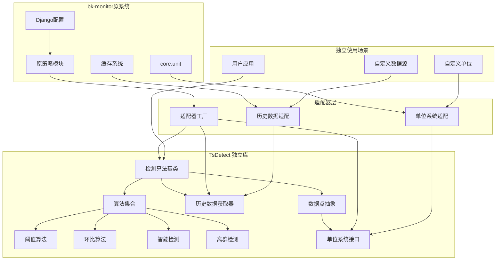
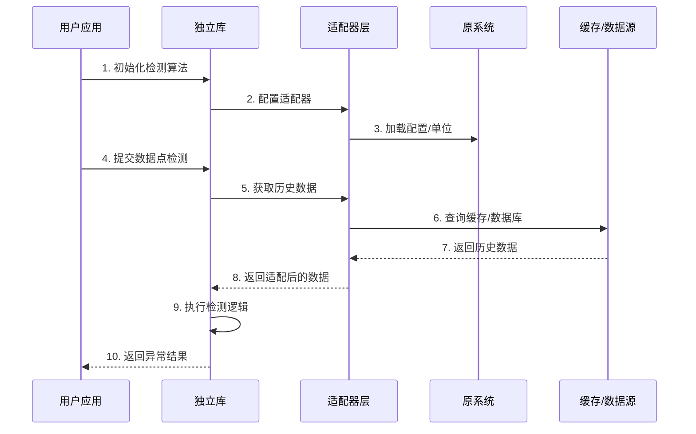
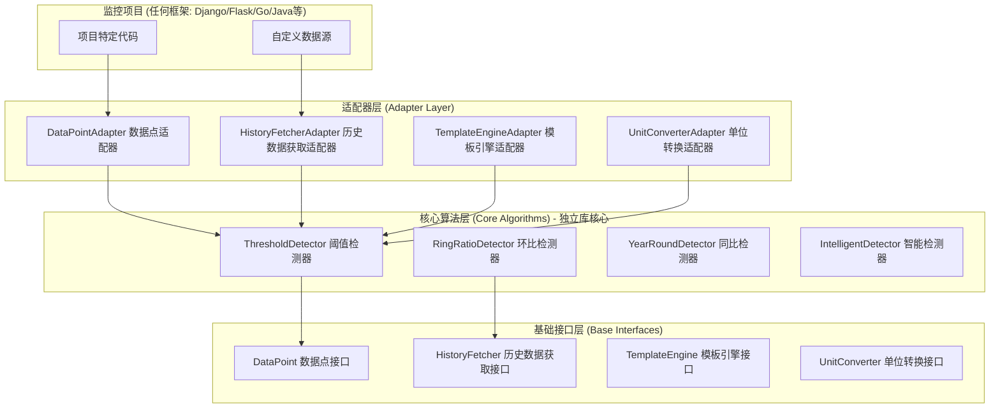

## 产品概述

将 bk-monitor 中的检测策略模块（`bkmonitor/alarm_backends/service/detect/strategy`）提取为通用时序检测库 **TsDetect**。该库提供多种时序数据异常检测算法，包括静态阈值检测、同比/环比检测、智能检测、离群检测等，支持独立使用和与现有 bk-monitor 系统集成。

## 核心功能

- **算法抽象层**：定义统一的检测算法基类和接口，支持算法扩展
- **检测算法实现**：提取并独立化多种检测算法（阈值、环比、智能检测等）
- **历史数据获取**：提供可配置的历史数据获取机制
- **配置验证**：支持算法配置序列化和验证
- **异常结果输出**：统一的异常数据点输出格式
- **适配器层**：保持与原系统的向后兼容性
- **单位系统**：可插拔的单位转换系统
- **消息模板**：支持异常消息模板化

## 技术栈

- **核心语言**：Python 3.10+
- **包管理**：使用pyproject.toml，遵循现有项目配置
- **代码规范**：遵循Black、isort、flake8、ruff等工具规范
- **测试框架**：pytest（与现有项目保持一致）
- **文档工具**：使用Markdown和docstrings

## 技术架构

### 系统架构

采用混合模式架构，核心算法独立为库，通过适配器层与原系统集成。



### 模块划分

**1. 核心抽象模块 (tsdetect/core)**

- 职责：定义核心数据结构和抽象接口
- 主要类：
- `BaseDataPoint`: 数据点基类（提取自DataPoint）
- `BaseAnomalyPoint`: 异常数据点基类（提取自AnomalyDataPoint）
- `BaseAlgorithm`: 检测算法基类（提取自Algorithms）
- `BaseAlgorithmCollection`: 算法集合基类（提取自BasicAlgorithmsCollection）
- `BaseHistoryFetcher`: 历史数据获取基类（提取自HistoryPointFetcher）
- 依赖：无（完全独立）

**2. 算法实现模块 (tsdetect/algorithms)**

- 职责：实现各种检测算法
- 主要类：
- `ThresholdAlgorithm`: 阈值检测算法
- `SimpleRingRatio`: 简易环比算法
- `IntelligentDetect`: 智能检测算法（提供SDK接口）
- `AbnormalCluster`: 离群检测算法
- 其他算法类
- 依赖：core模块

**3. 单位系统模块 (tsdetect/units)**

- 职责：提供可插拔的单位转换系统
- 主要类：
- `BaseUnitConverter`: 单位转换器基类
- `SimpleUnitConverter`: 简单位转换实现
- 依赖：无

**4. 适配器模块 (bkmonitor/alarm_backends/service/detect/strategy/adapter)**

- 职责：提供与原系统的适配层，保持向后兼容
- 主要类：
- `DataPointAdapter`: DataPoint适配器（继承BaseDataPoint）
- `UnitConverterAdapter`: 单位转换适配器
- `HistoryFetcherAdapter`: 历史数据获取适配器（继承BaseHistoryFetcher）
- 依赖：独立库 + 原系统模块

**5. 原策略模块重构 (bkmonitor/alarm_backends/service/detect/strategy)**

- 职责：通过适配器重用原有接口，保持兼容性
- 修改策略：
- `Algorithms` 继承自 `BaseAlgorithm`
- `BasicAlgorithmsCollection` 继承自 `BaseAlgorithmCollection`
- `HistoryPointFetcher` 继承自 `BaseHistoryFetcher`
- 通过适配器注入依赖
- 依赖：适配器模块

### 数据流



## 实现细节

### 核心目录结构

**新增独立库目录**：

```
tsdetect/
├── __init__.py
├── core/
│   ├── __init__.py
│   ├── base.py              # 基类定义（BaseDataPoint, BaseAlgorithm等）
│   ├── exceptions.py        # 库专用异常定义
│   └── interfaces.py        # 抽象接口定义
├── algorithms/
│   ├── __init__.py
│   ├── threshold.py         # 阈值检测算法
│   ├── ring_ratio.py        # 环比算法
│   ├── intelligent.py       # 智能检测算法
│   ├── outlier.py           # 离群检测算法
│   └── ...
├── units/
│   ├── __init__.py
│   ├── base.py              # 单位转换基类
│   └── converters.py        # 内置转换器实现
├── adapters/
│   ├── __init__.py
│   ├── interfaces.py        # 适配器接口
│   └── defaults.py          # 默认适配器实现
├── utils/
│   ├── __init__.py
│   ├── expression.py        # 表达式处理工具
│   └── validators.py        # 配置验证工具
├── examples/
│   ├── basic_usage.py       # 基本使用示例
│   └── advanced_usage.py    # 高级用法示例
├── tests/
│   ├── __init__.py
│   ├── test_base.py          # 基类测试
│   ├── test_algorithms.py   # 算法测试
│   └── test_integration.py  # 集成测试
├── pyproject.toml           # 包配置
├── setup.py                 # 安装脚本（可选）
└── README.md                # 库文档
```

**修改原系统目录**：

```
bkmonitor/alarm_backends/service/detect/
├── detect/
│   ├── core.py              # 保持不变（DataPoint, AnomalyDataPoint）
│   └── ...
├── strategy/
│   ├── __init__.py          # 修改：导入适配器，重构类定义
│   ├── adapter/
│   │   ├── __init__.py      # 新增：适配器实现
│   │   ├── data_point.py    # 新增：DataPoint适配器
│   │   ├── history_fetcher.py  # 新增：历史数据获取适配器
│   │   └── unit_converter.py  # 新增：单位转换适配器
│   ├── threshold.py         # 修改：调整导入，使用适配器
│   ├── simple_ring_ratio.py  # 修改：调整导入
│   ├── intelligent_detect.py # 修改：调整导入，适配SDK调用
│   └── ...                  # 其他算法文件相应调整
```

### 关键代码结构

**1. BaseDataPoint 接口定义**：

```python
class BaseDataPoint(ABC):
    """数据点基类，定义检测所需的最小接口"""
    
    @abstractmethod
    def get_value(self) -> float:
        """获取数据点值"""
        pass
    
    @abstractmethod
    def get_timestamp(self) -> int:
        """获取时间戳"""
        pass
    
    @abstractmethod
    def get_unit(self) -> str:
        """获取单位"""
        pass
    
    @abstractmethod
    def get_record_id(self) -> str:
        """获取记录ID"""
        pass
    
    @abstractmethod
    def to_dict(self) -> dict:
        """转换为字典"""
        pass
```

**2. BaseAlgorithm 接口定义**：

```python
class BaseAlgorithm(ABC):
    """检测算法基类"""
    
    def __init__(self, config: dict, **kwargs):
        self.config = config
        self.validated_config = None
        self._validate_config(config)
    
    @abstractmethod
    def _validate_config(self, config: dict):
        """验证配置"""
        pass
    
    @abstractmethod
    def detect(self, data_point: BaseDataPoint) -> Optional[BaseAnomalyPoint]:
        """执行检测"""
        pass
    
    @abstractmethod
    def format_message(self, data_point: BaseDataPoint) -> str:
        """格式化异常消息"""
        pass
```

**3. BaseHistoryFetcher 接口定义**：

```python
class BaseHistoryFetcher(ABC):
    """历史数据获取器基类"""
    
    @abstractmethod
    def fetch_history_point(
        self, 
        item: Any, 
        current_point: BaseDataPoint, 
        history_timestamp: int
    ) -> Optional[BaseDataPoint]:
        """获取历史数据点"""
        pass
    
    @abstractmethod
    def query_history_points(self, data_points: List[BaseDataPoint]):
        """批量查询历史数据"""
        pass
    
    @abstractmethod
    def get_history_offsets(self, item: Any) -> List[int]:
        """获取历史数据偏移量"""
        pass
```

**4. 适配器示例**：

```python
class DataPointAdapter(BaseDataPoint):
    """适配器：将原DataPoint适配为BaseDataPoint接口"""
    
    def __init__(self, data_point):
        self._data_point = data_point
    
    def get_value(self) -> float:
        return self._data_point.value
    
    def get_timestamp(self) -> int:
        return self._data_point.timestamp
    
    def get_unit(self) -> str:
        return self._data_point.unit
    
    def get_record_id(self) -> str:
        return self._data_point.record_id
    
    def to_dict(self) -> dict:
        return self._data_point.as_dict()
    
    @property
    def original(self):
        """访问原始DataPoint"""
        return self._data_point
```

**5. 原算法类重构**：

```python
# 原strategy/__init__.py修改
from tsdetect import BaseAlgorithm, BaseHistoryFetcher
from .adapter.data_point import DataPointAdapter
from .adapter.history_fetcher import HistoryFetcherAdapter

class Algorithms(BaseAlgorithm):
    """原算法类，继承独立库的BaseAlgorithm"""
    
    def __init__(self, *args, **kwargs):
        super().__init__(*args, **kwargs)
        # 保持原有的额外逻辑
        self.expr = self.gen_expr()
        self.byte_code = compile(self.expr, "<string>", "eval")
    
    def detect(self, data_point):
        # 将DataPoint适配为库所需接口
        adapted_point = DataPointAdapter(data_point)
        return super().detect(adapted_point)
    
    # ... 其他原有方法保持不变
```

### 技术实现计划

**1. 核心库抽取**

- **问题**：从原代码中提取核心类，去除Django和项目特定依赖
- **解决方案**：
- 识别最小依赖集，定义抽象基类
- 将配置验证逻辑抽取到独立库
- 表达式执行逻辑保持，但通过适配器提供上下文
- **关键步骤**：

1. 定义BaseDataPoint、BaseAlgorithm等基类
2. 提取算法核心逻辑到独立库
3. 定义单位转换抽象接口
4. 提供默认实现

- **测试策略**：单元测试覆盖核心算法逻辑

**2. 适配器层实现**

- **问题**：保持向后兼容，支持原系统无缝使用
- **解决方案**：
- 创建适配器类，桥接原系统和独立库
- 保持原有接口签名不变
- 通过适配器注入依赖
- **关键步骤**：

1. 实现DataPoint适配器
2. 实现HistoryFetcher适配器（集成缓存系统）
3. 实现UnitConverter适配器（集成core.unit）
4. 调整原有算法类继承关系

- **测试策略**：集成测试确保原系统功能不变

**3. 依赖解耦**

- **问题**：原代码依赖Django模板、翻译、prometheus等
- **解决方案**：
- 消息模板支持多种后端（Django模板、Jinja2、字符串格式化）
- 国际化支持通过适配器提供接口
- Prometheus指标通过回调函数注入
- **关键步骤**：

1. 定义消息渲染接口
2. 实现Django模板适配器
3. 实现国际化接口适配器
4. 提供指标回调接口

- **测试策略**：多种后端兼容性测试

**4. SDK集成适配**

- **问题**：智能检测依赖AIOPS SDK调用
- **解决方案**：
- SDK调用通过抽象接口定义
- 原系统提供SDK实现
- 独立使用时可提供mock实现
- **关键步骤**：

1. 定义SDK预测接口
2. 原系统实现SDK适配器
3. 提供mock实现用于独立场景

- **测试策略**：Mock测试和真实SDK测试

### 集成点

**1. 与原系统的集成**：

- 数据格式：保持DataPoint和AnomalyDataPoint格式不变
- 配置序列化：继续使用原系统的序列化器
- 缓存系统：通过适配器集成Redis缓存
- 单位系统：通过适配器集成core.unit
- 配置加载：继续使用Django settings

**2. 独立使用场景**：

- 数据源：自定义数据获取逻辑
- 单位：自定义单位转换逻辑
- 消息格式：支持字符串格式化或自定义模板
- SDK：可选集成，不强制依赖

**3. 扩展点**：

- 自定义算法：继承BaseAlgorithm
- 自定义数据点：继承BaseDataPoint
- 自定义历史获取：继承BaseHistoryFetcher
- 自定义单位转换：继承BaseUnitConverter

## 可移植性分析

### 概述

本独立库经过良好的接口设计，可以在其他类似的监控项目中**相对容易地集成**。通过分层架构设计，将 bk-monitor 特定依赖隔离在适配器层，核心算法层保持框架无关，从而实现高可移植性。

**可移植性评级**: ⭐⭐⭐⭐☆ (4/5)

### 架构分层设计保证可移植性



### 核心设计原则

**1. 最小化依赖，框架无关**

核心算法层完全不依赖 Django，只依赖：

- 标准库 (`datetime`, `logging`, `typing`, `abc`)
- 科学计算库 (`numpy`, optional)
- 轻量工具库 (`arrow` 或 `pandas`, optional)

**2. 标准化接口定义**

```python
# 标准化的 DataPoint 接口（不依赖 Django）
class DataPoint(ABC):
    """数据点抽象接口，所有监控系统必须实现"""

    @abstractmethod
    @property
    def value(self) -> float:
        """数据点值"""
        pass

    @abstractmethod
    @property
    def timestamp(self) -> int:
        """Unix时间戳"""
        pass

    @abstractmethod
    @property
    def unit(self) -> str:
        """单位（可为空字符串）"""
        pass

    @abstractmethod
    @property
    def dimensions(self) -> dict:
        """维度信息（标签、主机名等）"""
        pass

# 标准化的历史数据获取接口
class HistoryFetcher(ABC):
    """历史数据获取器抽象接口"""

    @abstractmethod
    def fetch(
        self,
        data_point: DataPoint,
        offsets: List[int]
    ) -> List[DataPoint]:
        """
        获取历史数据点
        :param data_point: 当前数据点
        :param offsets: 时间偏移量列表（秒）
        :return: 历史数据点列表
        """
        pass

# 标准化的单位转换接口
class UnitConverter(ABC):
    """单位转换器抽象接口"""

    @abstractmethod
    def convert(
        self,
        value: float,
        from_unit: str,
        to_unit: str
    ) -> float:
        """
        单位转换
        :param value: 原始值
        :param from_unit: 原始单位
        :param to_unit: 目标单位
        :return: 转换后的值
        """
        pass
```

**3. 插件化的适配器设计**

其他监控项目只需实现适配器接口：

```python
# 示例：在 Prometheus 监控项目中集成
class PrometheusDataPoint(DataPoint):
    """Prometheus 数据点适配器"""

    def __init__(self, prometheus_sample):
        self._sample = prometheus_sample

    @property
    def value(self) -> float:
        return float(self._sample.value)

    @property
    def timestamp(self) -> int:
        return int(self._sample.timestamp.timestamp())

    @property
    def unit(self) -> str:
        return ""  # Prometheus 默认无单位

    @property
    def dimensions(self) -> dict:
        return dict(self._sample.metric)

class PrometheusHistoryFetcher(HistoryFetcher):
    """Prometheus 历史数据获取适配器"""

    def __init__(self, prometheus_client):
        self.client = prometheus_client

    def fetch(
        self,
        data_point: DataPoint,
        offsets: List[int]
    ) -> List[DataPoint]:
        # 调用 Prometheus API 获取历史数据
        query = self._build_query(data_point.dimensions, offsets)
        result = self.client.query_range(query, ...)
        return [PrometheusDataPoint(sample) for sample in result]
```

### 不同监控系统的集成示例

#### 场景1：Prometheus/Grafana 生态

**集成难度**: ⭐⭐☆☆☆ (低)
**代码量**: 约 100-200 行

```python
from tsdetect import ThresholdDetector, RingRatioDetector

# 1. 实现 DataPoint 适配器
class GrafanaDataPoint(DataPoint):
    def __init__(self, time_series_value):
        self._value = time_series_value

    @property
    def value(self) -> float:
        return self._value.value

    @property
    def timestamp(self) -> int:
        return self._value.timestamp // 1000  # ms to s

    @property
    def unit(self) -> str:
        return self._value.unit or ""

    @property
    def dimensions(self) -> dict:
        return self._value.labels

# 2. 实现 HistoryFetcher 适配器
class PrometheusHistoryFetcher(HistoryFetcher):
    def fetch(self, data_point, offsets):
        # 调用 Prometheus HTTP API
        # 实现 PromQL 查询逻辑
        return [...]

# 3. 使用检测器
detector = ThresholdDetector(threshold=100, method=">")
anomalies = detector.detect(
    data_point=grafana_point,
    history_fetcher=PrometheusHistoryFetcher(client)
)
```

#### 场景2：Zabbix 监控系统

**集成难度**: ⭐⭐⭐☆☆ (中等)
**代码量**: 约 150-250 行

```python
class ZabbixDataPoint(DataPoint):
    def __init__(self, zabbix_item_value):
        self._item = zabbix_item_value

    @property
    def value(self) -> float:
        return float(self._item.value)

    @property
    def timestamp(self) -> int:
        return self._item.clock

    @property
    def unit(self) -> str:
        return self._item.units

    @property
    def dimensions(self) -> dict:
        return {"host": self._item.host, "key": self._item.key}

class ZabbixHistoryFetcher(HistoryFetcher):
    def fetch(self, data_point, offsets):
        # 调用 Zabbix API history.get
        # 处理不同数据类型（numeric, float, log等）
        return [...]

# 使用
detector = RingRatioDetector(floor=20, ceil=20)
anomalies = detector.detect(zabbix_point, ZabbixHistoryFetcher(api))
```

#### 场景3：InfluxDB 监控

**集成难度**: ⭐⭐☆☆☆ (低)
**代码量**: 约 100-150 行

```python
from influxdb_client import InfluxDBClient

class InfluxDBDataPoint(DataPoint):
    def __init__(self, record):
        self._record = record

    @property
    def value(self) -> float:
        return self._record.get_value()

    @property
    def timestamp(self) -> int:
        return int(self._record.get_time().timestamp())

    @property
    def unit(self) -> str:
        return ""  # InfluxDB 通常通过字段名区分

    @property
    def dimensions(self) -> dict:
        return dict(self._record.values)

class InfluxDBHistoryFetcher(HistoryFetcher):
    def __init__(self, client: InfluxDBClient, bucket: str, org: str):
        self.client = client
        self.bucket = bucket
        self.org = org

    def fetch(self, data_point, offsets):
        query = self._build_flux_query(data_point, offsets)
        result = self.client.query_api().query(query, self.org)
        return [InfluxDBDataPoint(record) for table in result for record in table.records]
```

#### 场景4：自定义监控系统（非 Python）

**集成难度**: ⭐⭐☆☆☆ (低，但需要搭建服务)
**代码量**: 约 300-500 行

```python
# 方案A：独立库作为微服务
# 1. 将独立库封装为 HTTP API 服务
from fastapi import FastAPI
from pydantic import BaseModel

app = FastAPI()

class DetectRequest(BaseModel):
    value: float
    timestamp: int
    unit: str
    dimensions: dict
    algorithm: str
    config: dict

@app.post("/api/detect")
async def detect(request: DetectRequest):
    from tsdetect import create_detector

    detector = create_detector(request.algorithm, request.config)
    data_point = CustomDataPoint(request)
    result = detector.detect(data_point, history_fetcher)
    return result.to_dict()

# 2. 其他系统通过 HTTP 调用
# Go/Java/Node.js 系统发送 HTTP POST 请求

# 方案B：通过消息队列集成
# 监控系统 → Kafka → 独立库(消费者) → 告警系统
```

### 集成挑战和解决方案

#### 挑战1：单位系统的适配

**问题**: 不同监控系统可能没有单位系统，或者单位定义不同

**解决方案**:

```python
# 方案A：简化版 - 不使用单位转换
class NoOpUnitConverter(UnitConverter):
    """无操作单位转换器"""

    def convert(self, value, from_unit, to_unit):
        return value  # 直接返回，不做转换

# 方案B：映射型 - 提供单位映射表
class MappedUnitConverter(UnitConverter):
    """映射型单位转换器"""

    UNIT_MAP = {
        "percent": "%",
        "bytes": "B",
        "kilobytes": "KB",
        # ... 更多映射
    }

    def convert(self, value, from_unit, to_unit):
        # 实现自定义转换逻辑
        pass
```

#### 挑战2：历史数据获取的适配

**问题**: 不同监控系统的历史数据获取方式差异很大（API、数据库、消息队列等）

**解决方案**:

```python
# 提供多种开箱即用的实现
class InMemoryHistoryFetcher(HistoryFetcher):
    """从内存数组获取（测试用）"""
    def __init__(self, data: List[DataPoint]):
        self.data = data

class FileHistoryFetcher(HistoryFetcher):
    """从文件读取"""
    def __init__(self, file_path: str):
        self.file_path = file_path

class RedisHistoryFetcher(HistoryFetcher):
    """从 Redis 读取"""
    def __init__(self, redis_client, key_pattern: str):
        self.client = redis_client
        self.key_pattern = key_pattern

class HTTPHistoryFetcher(HistoryFetcher):
    """通过 HTTP API 获取"""
    def __init__(self, endpoint_url: str, auth: Optional[dict] = None):
        self.endpoint = endpoint_url
        self.auth = auth
```

#### 挑战3：告警消息格式

**问题**: 不同系统的告警消息格式需求不同

**解决方案**:

```python
# 方案A：内置模板支持
from tsdetect import ThresholdDetector

detector = ThresholdDetector(
    threshold=100,
    message_template="Value {value} exceeds threshold {threshold}"  # 使用 Jinja2
)

# 方案B：完全自定义消息处理
detector = ThresholdDetector(...)
anomalies = detector.detect(data_point, history_fetcher)
for anomaly in anomalies:
    custom_message = format_custom_message(anomaly)  # 自定义格式化

# 方案C：多语言消息模板
detector = ThresholdDetector(
    threshold=100,
    message_templates={
        'en': "Value {value} exceeds threshold {threshold}",
        'zh': "值 {value} 超过阈值 {threshold}",
    },
    default_language='zh'
)
```

### 集成成本评估

| 监控系统类型 | 集成代码量 | 开发时间 | 技术难度 | 维护成本 |
| --- | --- | --- | --- | --- |
| **Python 监控系统** | 100-300 行 | 1-2 天 | ⭐⭐☆☆☆ | 低 |
| **Prometheus 生态** | 100-200 行 | 0.5-1 天 | ⭐⭐☆☆☆ | 低 |
| **Zabbix** | 150-250 行 | 1-2 天 | ⭐⭐⭐☆☆ | 中 |
| **InfluxDB** | 100-150 行 | 0.5-1 天 | ⭐⭐☆☆☆ | 低 |
| **自定义 Python 系统** | 200-400 行 | 2-3 天 | ⭐⭐☆☆☆ | 中 |
| **非 Python 系统** (Go/Java) | 300-500 行 | 3-5 天 | ⭐⭐⭐☆☆ | 中 |


**说明**: 集成成本主要取决于：

1. 是否需要实现完整的适配器层（数据点、历史数据获取、单位转换）
2. 是否需要深度集成（如告警路由、模板渲染）
3. 团队对检测算法库 API 的熟悉程度
4. 监控系统的复杂度和数据源多样性

### 提高可移植性的设计建议

#### 建议1：提供开箱即用的适配器

```python
# 在独立库中预置常见适配器
tsdetect/
  adapters/
    __init__.py
    prometheus/        # Prometheus 适配器
      __init__.py
      data_point.py
      history_fetcher.py
    zabbix/            # Zabbix 适配器
      __init__.py
      data_point.py
      history_fetcher.py
    influxdb/          # InfluxDB 适配器
      __init__.py
      data_point.py
      history_fetcher.py
    custom/            # 通用适配器（基于 dict）
      __init__.py
      dict_data_point.py
      in_memory_fetcher.py
```

#### 建议2：提供多种集成方式

```python
# 方式1: 直接调用
detector = ThresholdDetector(threshold=100, method=">")
anomalies = detector.detect(data_point, history_fetcher)

# 方式2: 流式处理
for data_point in data_stream:
    if detector.is_anomaly(data_point, history_fetcher):
        # 处理异常
        handle_anomaly(data_point)

# 方式3: 批量检测
anomalies = detector.batch_detect(data_points, history_fetcher)

# 方式4: HTTP API (需要搭建服务)
# 提供独立的服务端程序 (fastapi_server.py)
```

#### 建议3：提供丰富的示例和文档

```python
# 文档和示例目录结构
examples/
  prometheus_integration.py       # Prometheus 集成示例
  zabbix_integration.py           # Zabbix 集成示例
  influxdb_integration.py         # InfluxDB 集成示例
  custom_monitoring_system.py     # 自定义监控系统集成
  batch_detection_example.py      # 批量检测示例
  streaming_detection_example.py  # 流式检测示例

docs/
  portability_guide.md           # 可移植性指南
  adapter_development.md          # 适配器开发指南
  integration_patterns.md         # 集成模式
```

#### 建议4：支持配置文件驱动

```
# config.yaml
algorithms:
  - type: threshold
    config:
      threshold: 100
      method: ">"
      message_template: "Value {value} exceeds threshold {threshold}"

  - type: ring_ratio
    config:
      floor: 20
      ceil: 20
      message_template: "Ring ratio exceeds bounds"

history_fetcher:
  type: prometheus
  config:
    url: "http://localhost:9090"
    timeout: 30

unit_converter:
  type: simple
  config:
    enable_conversion: true
```

```python
# 代码中加载配置
from tsdetect import load_from_config
detector = load_from_config("config.yaml")
```

#### 建议5：提供 Docker 镜像

```
# Dockerfile
FROM python:3.10-slim

WORKDIR /app
COPY requirements.txt .
RUN pip install -r requirements.txt

COPY . .

EXPOSE 8000
CMD ["uvicorn", "tsdetect.api:app", "--host", "0.0.0.0"]
```

```
# 非 Python 系统通过 Docker 集成
docker run -p 8000:8000 tseries-detector:latest
```

### 需要权衡的设计决策

#### 决策1：是否保留表达式检测？

**选项A: 保留**

- ✅ 灵活性极高，支持任意逻辑
- ✅ 与 bk-monitor 完全兼容
- ❌ 安全性风险（需要限制 eval）
- ❌ 性能开销（每次编译表达式）

**选项B: 去除，改用配置化**

- ✅ 更安全，性能更好
- ✅ 更易移植，降低集成复杂度
- ❌ 灵活性降低
- ❌ 需要为每种场景提供配置

**建议**: 提供两种模式，可配置选择

```python
# 模式1: 表达式检测（灵活模式）
detector = ThresholdDetector(
    threshold=100,
    expression_mode=True,
    expression_template="value > threshold"
)

# 模式2: 配置化检测（安全模式）
detector = ThresholdDetector(
    threshold=100,
    expression_mode=False,
    method=">"
)
```

#### 决策2：单位系统的复杂度

**选项A: 完整的单位系统（像 bk-monitor）**

- ✅ 功能强大，支持复杂转换
- ✅ 满足专业监控需求
- ❌ 集成复杂度高
- ❌ 学习曲线陡峭

**选项B: 简化的单位转换**

- ✅ 易于集成，开箱即用
- ✅ 学习成本低
- ❌ 功能受限
- ❌ 不满足复杂场景

**建议**: 核心库提供简单版本，通过插件支持高级功能

```python
# 简单版本（核心库提供）
class SimpleUnitConverter(UnitConverter):
    """简单位转换器，支持常用单位"""

    def convert(self, value, from_unit, to_unit):
        # 只支持基本转换
        pass

# 高级版本（插件提供）
class AdvancedUnitConverter(UnitConverter):
    """高级单位转换器，完整功能"""

    def convert(self, value, from_unit, to_unit):
        # 支持完整转换逻辑
        pass
```

#### 决策3：是否保留 Django 模板？

**选项A: 保留 Django 模板**

- ✅ 与 bk-monitor 完全兼容
- ✅ 功能强大
- ❌ 依赖 Django，降低可移植性
- ❌ 增加 Python 生态外的依赖

**选项B: 改用 Jinja2**

- ✅ 更轻量，无框架依赖
- ✅ 更易移植
- ❌ 需要迁移工作
- ❌ 需要适配层兼容 Django 模板

**建议**: 抽象模板引擎接口，支持多种实现

```python
# 抽象接口
class TemplateEngine(ABC):
    @abstractmethod
    def render(self, template: str, context: dict) -> str:
        pass

# 多种实现
class DjangoTemplateEngine(TemplateEngine):
    """Django 模板引擎实现"""
    pass

class Jinja2TemplateEngine(TemplateEngine):
    """Jinja2 模板引擎实现"""
    pass

class StringTemplateEngine(TemplateEngine):
    """字符串格式化模板引擎实现"""
    pass

# 配置选择
template_engine = DjangoTemplateEngine()  # bk-monitor 使用
# 或
template_engine = Jinja2TemplateEngine()  # 独立库使用
```

### 商业价值和影响力

**1. 降低重复开发成本**

- 其他监控系统可以直接使用，无需重新实现检测算法
- 预计节省 30-50% 的开发时间
- 减少维护成本和 bug 修复工作量

**2. 生态建设潜力**

- 有望成为监控领域的通用检测库
- 吸引社区贡献，丰富算法库
- 建立技术标准和最佳实践

**3. 技术影响力提升**

- 提升 bk-monitor 的技术影响力和知名度
- 展示技术实力和架构设计能力
- 为开源社区提供价值

**4. 潜在商业机会**

- 企业版支持（SLA、定制化）
- 云服务集成（SaaS 检测服务）
- 咨询和培训服务

### 总结

自研独立库经过合理的接口设计和适配层实现，可以在其他监控项目中**相对容易地集成**。

**关键成功因素**:

1. ✅ 框架无关的核心算法层
2. ✅ 标准化的接口定义
3. ✅ 提供开箱即用的适配器
4. ✅ 详细的文档和示例
5. ✅ 灵活的配置方式
6. ✅ 多种集成方式支持
7. ✅ Docker 容器化部署

**集成工作量**:

- **Python 监控系统**: 1-2 天（实现 100-300 行适配代码）
- **其他语言系统**: 3-5 天（可能需要搭建微服务）

**可移植性优势**:

- 代码复用，减少重复开发
- 技术标准统一
- 易于维护和升级
- 支持多平台、多框架

## 技术考量

### 日志

- 独立库使用标准logging模块，不依赖原系统的logger配置
- 提供日志接口，允许注入自定义logger
- 保持与原系统一致的日志格式（通过适配器）

### 性能优化

- 历史数据批量查询缓存机制保留
- 表达式编译缓存（byte_code）保留
- SDK预检测结果缓存保留
- 提供异步检测接口（可选）

### 安全措施

- 表达式执行安全检查（AlgorithmsAST）
- 输入验证（配置验证）
- 防止代码注入（eval使用受限上下文）

### 可扩展性

- 插件化算法注册机制
- 支持自定义验证器
- 支持自定义消息渲染器
- 支持多种数据源

## 技术文档指南

- **独立库**：完整的技术架构设计，包含所有层次的实现细节
- **适配器层**：最小化设计，仅作为桥梁，不引入新的业务逻辑
- **原模块重构**：基于现有架构，通过适配器无缝集成，避免大规模重构
- **比例控制**：简单功能保持最小实现，复杂功能提供详细架构
- **重要**：所有Mermaid图必须使用正确的语法和显式的```mermaid标记
- 代码示例遵循最佳实践，保持类型提示和文档字符串
- 所有技术决策基于需求和实际场景

## 设计风格

本任务为后端算法库提取，不涉及UI设计。无需生成设计内容。

## Agent Extensions

### SubAgent

- **code-explorer**
- Purpose: 深度探索策略模块的依赖关系和调用链路，确保提取时不遗漏关键功能
- Expected outcome: 生成依赖分析报告，列出所有需要适配的模块和接口