# BCS 集群生命周期管理设计文档

## 概述

BCS 集群生命周期管理是蓝鲸监控平台 metadata 模块的核心子系统，负责容器集群的自动化接入、监控资源配置和数据采集链路管理。该系统通过元数据驱动的方式，将 Kubernetes 集群的监控能力标准化、可扩展化，为上层告警和可视化功能提供统一的数据基础。

### 系统定位

本系统在蓝鲸监控架构中处于**数据接入层**，承担以下职责：

- **元数据管理中枢**：维护集群、数据源、结果表等监控元数据，建立资源间的关联关系
- **数据采集网关**：通过 DataID 资源下发机制，控制 bk-collector 的采集行为
- **多租户隔离保障**：基于空间（Space）体系实现租户级数据隔离和权限控制
- **联邦拓扑协调器**：处理联邦集群的复杂拓扑关系，实现跨集群数据汇聚

### 核心价值

| 价值维度   | 具体体现                                     |
| ---------- | -------------------------------------------- |
| 自动化能力 | 集群自动发现、资源自动注册、状态自动同步     |
| 扩展性设计 | 支持自定义数据源、多级替换规则、插件化采集器 |
| 高可用保障 | 分布式锁防并发、事务保证一致性、失败自动重试 |
| 运维友好性 | 集群迁移零感知、云区域自动推断、监控指标完备 |

## 架构设计

### 分层架构

系统采用经典的三层架构，明确分离职责边界：

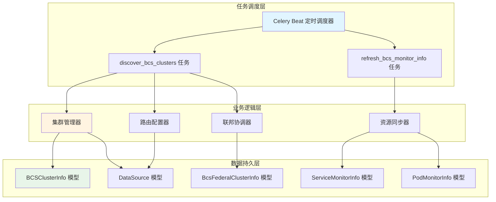
```mermaid
graph TB
    subgraph 任务调度层
        A[Celery Beat 定时调度器]
        B[discover_bcs_clusters 任务]
        C[refresh_bcs_monitor_info 任务]
    end
    
    subgraph 业务逻辑层
        D[集群管理器]
        E[资源同步器]
        F[路由配置器]
        G[联邦协调器]
    end
    
    subgraph 数据持久层
        H[BCSClusterInfo 模型]
        I[DataSource 模型]
        J[BcsFederalClusterInfo 模型]
        K[ServiceMonitorInfo 模型]
        L[PodMonitorInfo 模型]
    end
    
    A --> B
    A --> C
    B --> D
    B --> F
    B --> G
    C --> E
    D --> H
    D --> I
    E --> K
    E --> L
    F --> I
    G --> J
    
    style A fill:#e1f5ff
    style D fill:#fff4e1
    style H fill:#e8f5e9
```

### 外部系统集成

本系统与外部系统的集成关系如下：

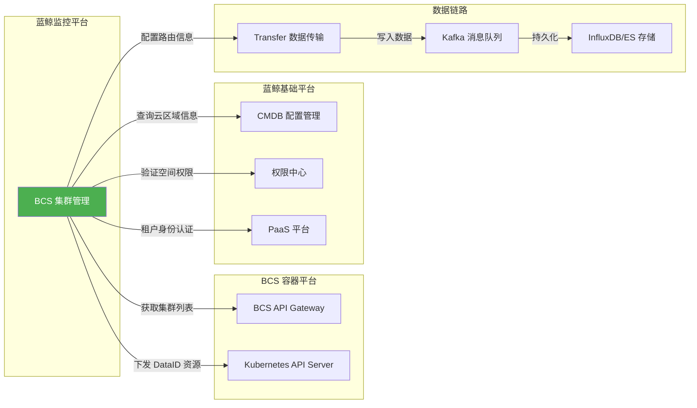
```mermaid
graph LR
    subgraph 蓝鲸监控平台
        A[BCS 集群管理]
    end
    
    subgraph BCS 容器平台
        B[BCS API Gateway]
        C[Kubernetes API Server]
    end
    
    subgraph 蓝鲸基础平台
        D[CMDB 配置管理]
        E[权限中心]
        F[PaaS 平台]
    end
    
    subgraph 数据链路
        G[Transfer 数据传输]
        H[Kafka 消息队列]
        I[InfluxDB/ES 存储]
    end
    
    A -->|获取集群列表| B
    A -->|下发 DataID 资源| C
    A -->|查询云区域信息| D
    A -->|验证空间权限| E
    A -->|租户身份认证| F
    A -->|配置路由信息| G
    G -->|写入数据| H
    H -->|持久化| I
    
    style A fill:#4CAF50,color:#fff
```

| 外部系统              | 集成方式              | 主要用途                           |
| --------------------- | --------------------- | ---------------------------------- |
| BCS API Gateway       | RESTful API           | 获取集群列表、节点信息、联邦拓扑   |
| Kubernetes API Server | Kubernetes Client SDK | 下发 DataID CRD 资源、管理集群配置 |
| CMDB                  | BK API                | 查询主机云区域信息、业务拓扑关系   |
| 权限中心              | BK IAM                | 验证数据源授权、空间访问控制       |
| Transfer 集群         | Consul 配置           | 注册数据源路由、MQ 集群配置        |
| Kafka 集群            | Kafka Admin API       | 创建 Topic、管理分区和副本         |

### 核心组件职责

#### 集群管理器（Cluster Manager）

负责集群的注册、更新和状态管理，是整个系统的核心组件。

| 职责       | 实现机制                                   |
| ---------- | ------------------------------------------ |
| 集群发现   | 调用 BCS API 获取租户下所有集群信息        |
| 集群注册   | 创建 BCSClusterInfo 记录，初始化数据源配置 |
| 状态同步   | 检测集群状态变更并更新数据库               |
| 迁移处理   | 检测业务 ID 变更并触发路由更新             |
| 初始化重试 | 对 INIT_FAILED 状态的集群自动重试          |

#### 资源同步器（Resource Synchronizer）

负责集群内监控资源（ServiceMonitor/PodMonitor）的发现和同步。

| 职责        | 实现机制                                    |
| ----------- | ------------------------------------------- |
| 资源发现    | 调用 Kubernetes API 获取 CRD 资源列表       |
| 资源注册    | 创建 ServiceMonitorInfo/PodMonitorInfo 记录 |
| 资源删除    | 清理数据库中不再存在的资源记录              |
| DataID 下发 | 为自定义 DataID 的资源下发配置              |

#### 路由配置器（Router Configurator）

处理集群迁移场景下的数据路由变更。

| 职责       | 实现机制                           |
| ---------- | ---------------------------------- |
| 结果表路由 | 更新 ResultTable 的 bk_biz_id 字段 |
| 数据源空间 | 更新 DataSource 的 space_uid 字段  |
| 授权关系   | 重建 SpaceDataSource 关联记录      |
| 事件组路由 | 单独处理 EventGroup 的业务归属     |

#### 联邦协调器（Federation Coordinator）

管理联邦集群的拓扑结构和数据汇聚配置。

| 职责         | 实现机制                                |
| ------------ | --------------------------------------- |
| 拓扑同步     | 维护 BcsFederalClusterInfo 中的关联关系 |
| 命名空间管理 | 跟踪子集群的命名空间归属                |
| 链路创建     | 异步创建联邦数据汇聚链路                |
| 记录清理     | 软删除不再存在的联邦关系                |

### 数据流设计

系统中的数据流转分为控制流和数据流两个层面：

#### 控制流（元数据管理）

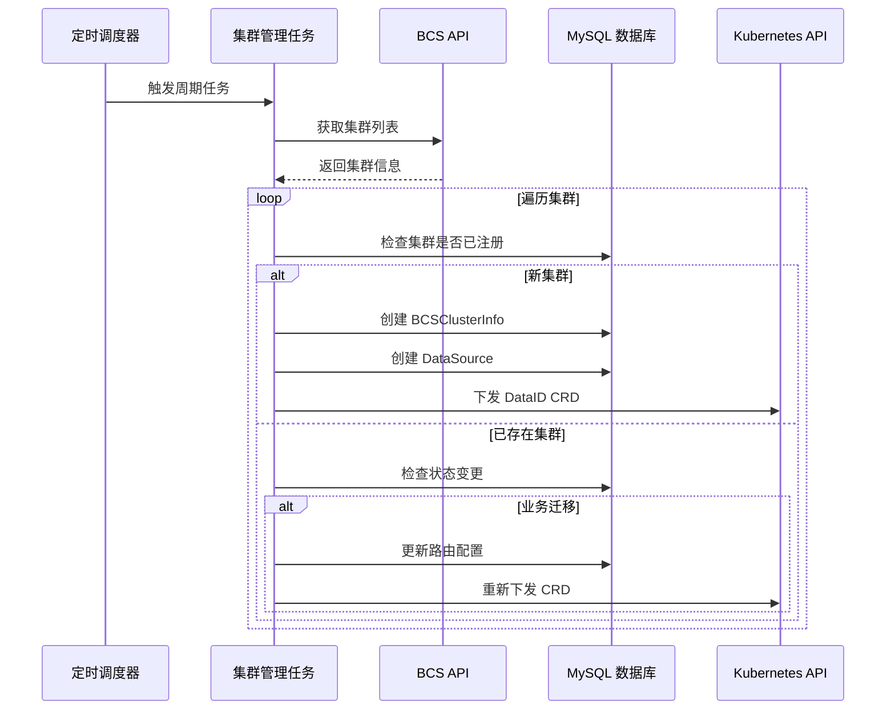
```mermaid
sequenceDiagram
    participant Scheduler as 定时调度器
    participant Task as 集群管理任务
    participant BCS as BCS API
    participant DB as MySQL 数据库
    participant K8s as Kubernetes API
    
    Scheduler->>Task: 触发周期任务
    Task->>BCS: 获取集群列表
    BCS-->>Task: 返回集群信息
    
    loop 遍历集群
        Task->>DB: 检查集群是否已注册
        alt 新集群
            Task->>DB: 创建 BCSClusterInfo
            Task->>DB: 创建 DataSource
            Task->>K8s: 下发 DataID CRD
        else 已存在集群
            Task->>DB: 检查状态变更
            alt 业务迁移
                Task->>DB: 更新路由配置
                Task->>K8s: 重新下发 CRD
            end
        end
    end
```

#### 数据流（监控数据采集）

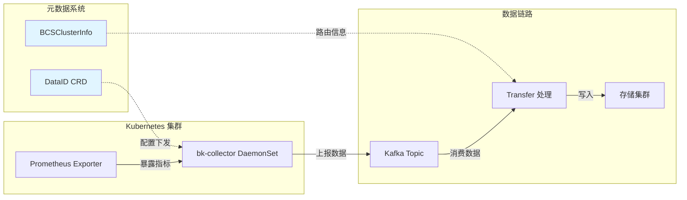
```mermaid
graph LR
    subgraph Kubernetes 集群
        A[Prometheus Exporter]
        B[bk-collector DaemonSet]
    end
    
    subgraph 数据链路
        C[Kafka Topic]
        D[Transfer 处理]
        E[存储集群]
    end
    
    subgraph 元数据系统
        F[DataID CRD]
        G[BCSClusterInfo]
    end
    
    F -."配置下发".-> B
    G -."路由信息".-> D
    A -->|暴露指标| B
    B -->|上报数据| C
    C -->|消费数据| D
    D -->|写入| E
    
    style F fill:#e1f5ff
    style G fill:#e1f5ff
```

## 核心数据模型

### 模型关系图

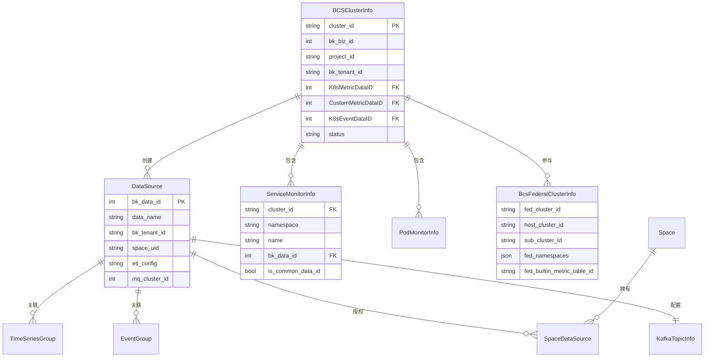
```mermaid
erDiagram
    BCSClusterInfo ||--o{ DataSource : "创建"
    BCSClusterInfo ||--o{ ServiceMonitorInfo : "包含"
    BCSClusterInfo ||--o{ PodMonitorInfo : "包含"
    BCSClusterInfo ||--o{ BcsFederalClusterInfo : "参与"
    DataSource ||--o{ TimeSeriesGroup : "关联"
    DataSource ||--o{ EventGroup : "关联"
    DataSource ||--o{ SpaceDataSource : "授权"
    DataSource ||--|| KafkaTopicInfo : "配置"
    Space ||--o{ SpaceDataSource : "拥有"
    
    BCSClusterInfo {
        string cluster_id PK
        int bk_biz_id
        string project_id
        string bk_tenant_id
        int K8sMetricDataID FK
        int CustomMetricDataID FK
        int K8sEventDataID FK
        string status
    }
    
    DataSource {
        int bk_data_id PK
        string data_name
        string bk_tenant_id
        string space_uid
        string etl_config
        int mq_cluster_id
    }
    
    ServiceMonitorInfo {
        string cluster_id FK
        string namespace
        string name
        int bk_data_id FK
        bool is_common_data_id
    }
    
    BcsFederalClusterInfo {
        string fed_cluster_id
        string host_cluster_id
        string sub_cluster_id
        json fed_namespaces
        string fed_builtin_metric_table_id
    }
```

### BCSClusterInfo - 集群信息模型

**模型定位**：集群的核心元数据模型，记录 Kubernetes 集群的基本信息和监控配置。

#### 关键字段设计

| 字段分类       | 字段名              | 类型    | 作用                            |
| -------------- | ------------------- | ------- | ------------------------------- |
| **身份标识**   | cluster_id          | String  | 集群唯一标识符，与 BCS 保持一致 |
|                | bk_tenant_id        | String  | 租户 ID，实现多租户隔离         |
|                | bk_biz_id           | Integer | 业务 ID，关联 CMDB 业务         |
|                | project_id          | String  | 项目 ID，关联 BCS 项目          |
| **连接配置**   | domain_name         | String  | BCS API Gateway 域名            |
|                | port                | Integer | API 端口号                      |
|                | api_key_content     | String  | 认证 Token                      |
|                | server_address_path | String  | API 路径前缀                    |
| **数据源映射** | K8sMetricDataID     | Integer | K8S 内置指标数据源 ID           |
|                | CustomMetricDataID  | Integer | 自定义指标数据源 ID             |
|                | K8sEventDataID      | Integer | K8S 事件数据源 ID               |
| **状态管理**   | status              | String  | 集群运行状态                    |
|                | bk_cloud_id         | Integer | 云区域 ID                       |

#### 核心方法

| 方法名                    | 职责                             | 返回值              |
| ------------------------- | -------------------------------- | ------------------- |
| register_cluster()        | 注册新集群，创建数据源和监控资源 | BCSClusterInfo 对象 |
| init_resource()           | 初始化集群资源，下发 DataID CRD  | bool                |
| refresh_common_resource() | 刷新公共 DataID 资源配置         | None                |
| create_datasource()       | 创建指定类型的数据源             | DataSource 对象     |

#### 数据源注册配置

**DATASOURCE_REGISTER_INFO** 常量定义了三种数据源类型：

| 数据源类型    | ETL 配置                   | 报告类          | 是否拆分 | 用途                  |
| ------------- | -------------------------- | --------------- | -------- | --------------------- |
| k8s_metric    | bk_standard_v2_time_series | TimeSeriesGroup | 是       | K8S 内置指标采集      |
| custom_metric | bk_standard_v2_time_series | TimeSeriesGroup | 是       | Prometheus 自定义指标 |
| k8s_event     | bk_standard_v2_event       | EventGroup      | 否       | K8S 事件采集          |

**设计理念**：通过配置化方式定义数据源类型，便于扩展新的数据源（如日志、Trace）。

### DataSource - 数据源模型

**模型定位**：数据采集的配置核心，定义数据如何从源头流向存储。

#### 关键字段设计

| 字段分类     | 字段名              | 类型    | 作用                                       |
| ------------ | ------------------- | ------- | ------------------------------------------ |
| **标识信息** | bk_data_id          | Integer | 数据源唯一 ID，自增主键                    |
|              | data_name           | String  | 数据源名称，格式：bcs_{cluster_id}_{usage} |
|              | bk_tenant_id        | String  | 租户 ID，与 data_name 构成联合唯一索引     |
| **空间关联** | space_uid           | String  | 空间 UID，格式：{space_type}__{space_id}   |
|              | space_type_id       | String  | 空间类型（bkcc/bcs/bksaas）                |
| **清洗配置** | etl_config          | String  | ETL 清洗模板名称                           |
|              | type_label          | String  | 数据类型标签（time_series/event/log）      |
|              | source_label        | String  | 数据源标签（bk_monitor/custom）            |
| **MQ 配置**  | mq_cluster_id       | Integer | Kafka 集群 ID                              |
|              | mq_config_id        | Integer | Kafka Topic 配置 ID                        |
| **路由配置** | transfer_cluster_id | String  | Transfer 集群 ID                           |
| **权限控制** | is_platform_data_id | Boolean | 是否为平台级 ID（全局可见）                |

#### 核心属性

| 属性名             | 类型        | 作用                  |
| ------------------ | ----------- | --------------------- |
| mq_cluster         | ClusterInfo | 返回 MQ 集群对象      |
| consul_config_path | String      | 返回 Consul 配置路径  |
| datalink_version   | String      | 数据链路版本（V3/V4） |

#### 设计亮点

**多租户隔离**：data_name + bk_tenant_id 联合唯一,实现租户级数据隔离。  
**空间授权**：通过 space_uid 关联 Space 模型，支持灵活的权限控制。  
**标签体系**：type_label + source_label 双维度标签，便于数据分类管理。

### BCSResource - 监控资源抽象模型

**模型定位**：ServiceMonitorInfo 和 PodMonitorInfo 的抽象基类，封装公共逻辑。

#### 关键字段设计

| 字段名             | 类型    | 作用                    |
| ------------------ | ------- | ----------------------- |
| cluster_id         | String  | 所属集群 ID             |
| namespace          | String  | Kubernetes 命名空间     |
| name               | String  | 资源名称                |
| bk_data_id         | Integer | 关联的数据源 ID         |
| is_common_data_id  | Boolean | 是否使用集群公共 DataID |
| is_custom_resource | Boolean | 是否为自定义资源        |

#### 核心方法

| 方法名                      | 职责                     | 适用场景              |
| --------------------------- | ------------------------ | --------------------- |
| refresh_resource()          | 刷新集群内资源列表       | 周期性同步任务        |
| refresh_custom_resource()   | 刷新自定义 DataID 资源   | 用户配置了独立 DataID |
| change_data_id()            | 修改资源使用的 DataID    | 资源隔离场景          |
| should_refresh_own_dataid() | 判断是否需要下发独立配置 | 决策逻辑              |

#### 配置生成机制

**config** 属性通过多级替换规则合并生成最终配置：

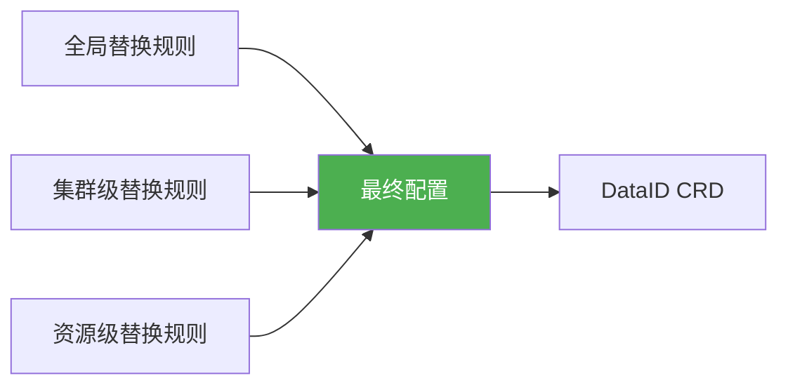
```mermaid
graph LR
    A[全局替换规则] --> D[最终配置]
    B[集群级替换规则] --> D
    C[资源级替换规则] --> D
    D --> E[DataID CRD]
    
    style D fill:#4CAF50,color:#fff
```

**优先级**：资源级 > 集群级 > 全局级

### ServiceMonitorInfo/PodMonitorInfo - 资源具体实现

**模型定位**：对应 Prometheus Operator 中的 ServiceMonitor 和 PodMonitor CRD。

| 模型               | PLURAL          | 作用                      |
| ------------------ | --------------- | ------------------------- |
| ServiceMonitorInfo | servicemonitors | 采集 Service 类型服务指标 |
| PodMonitorInfo     | podmonitors     | 采集 Pod 类型服务指标     |

**设计原理**：跟踪 Kubernetes 集群中的 ServiceMonitor/PodMonitor 资源，自动为其分配 DataID 并下发采集配置。

### BcsFederalClusterInfo - 联邦集群模型

**模型定位**：记录联邦集群的拓扑关系和命名空间归属。

#### 关键字段设计

| 字段名                      | 类型       | 作用                           |
| --------------------------- | ---------- | ------------------------------ |
| fed_cluster_id              | String     | 代理集群 ID（联邦集群入口）    |
| host_cluster_id             | String     | 主机集群 ID                    |
| sub_cluster_id              | String     | 子集群 ID                      |
| fed_namespaces              | JSON Array | 该子集群纳入联邦的命名空间列表 |
| fed_builtin_metric_table_id | String     | 联邦集群内置指标结果表 ID      |
| fed_builtin_event_table_id  | String     | 联邦集群内置事件结果表 ID      |
| is_deleted                  | Boolean    | 软删除标记                     |

#### 联邦集群拓扑结构

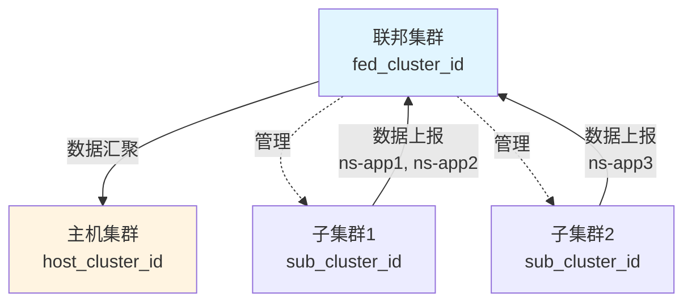
```mermaid
graph TB
    A[联邦集群<br/>fed_cluster_id] 
    B[主机集群<br/>host_cluster_id]
    C[子集群1<br/>sub_cluster_id]
    D[子集群2<br/>sub_cluster_id]
    
    A -->|数据汇聚| B
    A -.->|管理| C
    A -.->|管理| D
    
    C -->|数据上报<br/>ns-app1, ns-app2| A
    D -->|数据上报<br/>ns-app3| A
    
    style A fill:#e1f5ff
    style B fill:#fff4e1
```

**设计原理**：

- **代理集群**：作为联邦集群的入口，接收子集群数据
- **主机集群**：实际存储汇聚数据的集群
- **子集群**：将指定命名空间的数据上报至联邦集群

### 资源初始化阶段

资源初始化阶段负责向 Kubernetes 集群下发 DataID 资源配置，使 bk-collector 能够识别并采集监控数据。

#### 初始化流程

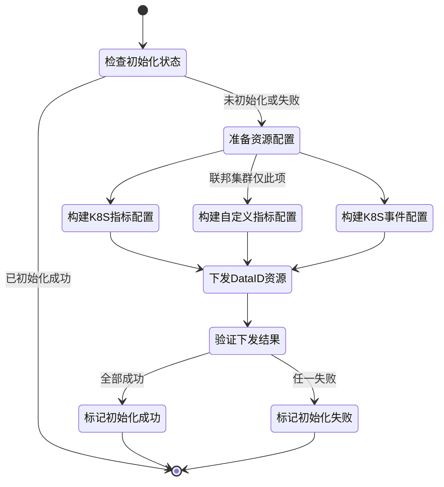
```mermaid
stateDiagram-v2
    [*] --> 检查初始化状态
    检查初始化状态 --> 准备资源配置: 未初始化或失败
    检查初始化状态 --> [*]: 已初始化成功
    
    准备资源配置 --> 构建K8S指标配置
    准备资源配置 --> 构建自定义指标配置: 联邦集群仅此项
    准备资源配置 --> 构建K8S事件配置
    
    构建K8S指标配置 --> 下发DataID资源
    构建自定义指标配置 --> 下发DataID资源
    构建K8S事件配置 --> 下发DataID资源
    
    下发DataID资源 --> 验证下发结果
    验证下发结果 --> 标记初始化成功: 全部成功
    验证下发结果 --> 标记初始化失败: 任一失败
    
    标记初始化成功 --> [*]
    标记初始化失败 --> [*]
```

#### DataID 资源配置结构

DataID 资源是符合 Kubernetes CRD 规范的自定义资源对象，包含以下核心字段：

| 字段路径                   | 说明           | 示例值                                    |
| -------------------------- | -------------- | ----------------------------------------- |
| apiVersion                 | API版本        | monitor.bkbcs.tencent.com/v1beta1         |
| kind                       | 资源类型       | DataID                                    |
| metadata.name              | 资源名称       | {bk_env}-k8smetricdataid-{cluster_id}-fed |
| metadata.labels.usage      | 数据用途       | metric/event                              |
| metadata.labels.isCommon   | 是否公共数据源 | true/false                                |
| metadata.labels.isSystem   | 是否系统数据源 | true/false                                |
| spec.dataID                | 数据源ID       | 1100001                                   |
| spec.labels.bcs_cluster_id | 集群ID         | BCS-K8S-00001                             |
| spec.labels.bk_biz_id      | 业务ID         | 2                                         |
| spec.metricReplace         | 指标替换规则   | {"kube_": "bkmonitor_"}                   |
| spec.dimensionReplace      | 维度替换规则   | {"pod": "pod_name"}                       |

#### 联邦集群特殊处理

联邦集群（Federation Cluster）在初始化时仅下发自定义指标数据源配置，跳过 K8S 内置指标和事件配置：

| 资源类型         | 普通集群 | 联邦集群 |
| ---------------- | -------- | -------- |
| K8S指标DataID    | 下发     | **跳过** |
| 自定义指标DataID | 下发     | 下发     |
| K8S事件DataID    | 下发     | **跳过** |

**设计原因**：联邦集群仅作为自定义指标的汇聚入口，K8S 内置指标和事件由子集群负责采集。

### 集群状态同步阶段

系统定期检查集群状态变更，处理集群迁移、状态更新和初始化重试等场景。

#### 状态同步决策矩阵

| 检测项     | 条件                                          | 执行操作         |
| ---------- | --------------------------------------------- | ---------------- |
| 集群状态   | status ≠ 数据库status 且 status ≠ INIT_FAILED | 更新状态字段     |
| API Token  | api_key_content ≠ BCS_API_GATEWAY_TOKEN       | 更新认证配置     |
| 业务ID     | bk_biz_id ≠ 数据库bk_biz_id                   | 触发路由变更流程 |
| 项目ID     | project_id ≠ 数据库project_id                 | 更新项目归属     |
| 初始化状态 | status = INIT_FAILED                          | 重试资源初始化   |
| 云区域ID   | bk_cloud_id = NULL                            | 触发云区域补全   |

#### 状态转换规则

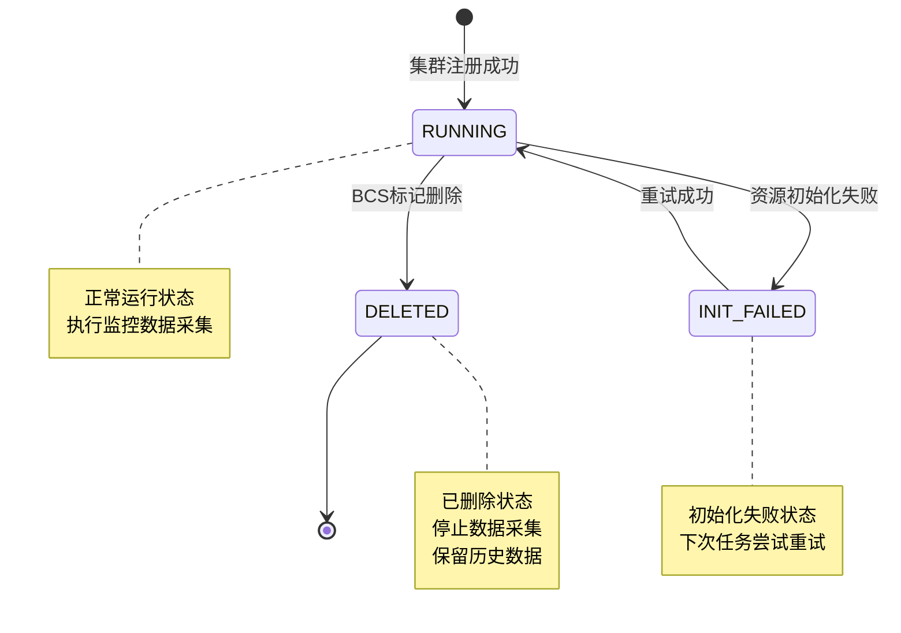
```mermaid
stateDiagram-v2
    [*] --> RUNNING: 集群注册成功
    RUNNING --> INIT_FAILED: 资源初始化失败
    RUNNING --> DELETED: BCS标记删除
    INIT_FAILED --> RUNNING: 重试成功
    DELETED --> [*]
    
    note right of RUNNING
        正常运行状态
        执行监控数据采集
    end note
    
    note right of INIT_FAILED
        初始化失败状态
        下次任务尝试重试
    end note
    
    note right of DELETED
        已删除状态
        停止数据采集
        保留历史数据
    end note
```

### 集群迁移处理

当检测到集群业务ID变更时，触发集群迁移流程，更新相关路由和权限配置。

#### 迁移场景分类

| 迁移类型     | 变更字段               | 处理策略         |
| ------------ | ---------------------- | ---------------- |
| 业务内迁移   | project_id             | 仅更新项目归属   |
| 跨业务迁移   | bk_biz_id              | 完整路由变更流程 |
| 跨业务跨项目 | bk_biz_id + project_id | 完整路由变更流程 |

#### 路由变更流程

```mermaid
flowchart LR
    A[检测到业务ID变更] --> B[更新ResultTable业务归属]
    B --> C[更新DataSource空间标识]
    C --> D[删除旧SpaceDataSource关系]
    D --> E[创建新SpaceDataSource关系]
    E --> F[更新EventGroup业务ID]
    F --> G[重新下发DataID资源]
    G --> H[迁移完成]
```

#### 路由变更涉及的数据模型

| 模型            | 更新字段               | 查询条件                          | 说明               |
| --------------- | ---------------------- | --------------------------------- | ------------------ |
| ResultTable     | bk_biz_id              | table_name_zh contains cluster_id | 结果表业务归属     |
| DataSource      | space_uid              | data_name contains cluster_id     | 数据源空间标识     |
| SpaceDataSource | 删除旧记录并创建新记录 | space_id + bk_data_id             | 空间数据源授权关系 |
| EventGroup      | bk_biz_id              | bk_data_id = K8sEventDataID       | K8S事件组业务归属  |

### 云区域自动补全

系统通过节点信息自动推断集群所属云区域，简化用户配置流程。

#### 补全流程设计

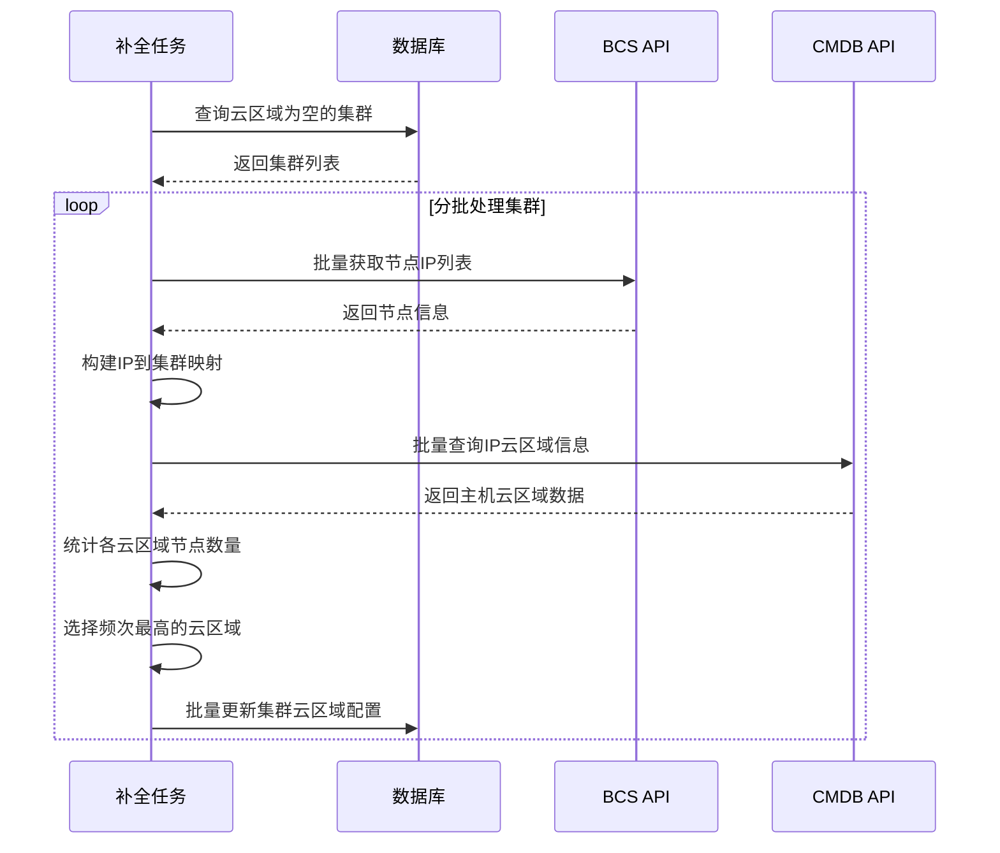
```mermaid
sequenceDiagram
    participant Task as 补全任务
    participant DB as 数据库
    participant BCS as BCS API
    participant CMDB as CMDB API

    Task->>DB: 查询云区域为空的集群
    DB-->>Task: 返回集群列表
    
    loop 分批处理集群
        Task->>BCS: 批量获取节点IP列表
        BCS-->>Task: 返回节点信息
        
        Task->>Task: 构建IP到集群映射
        Task->>CMDB: 批量查询IP云区域信息
        CMDB-->>Task: 返回主机云区域数据
        
        Task->>Task: 统计各云区域节点数量
        Task->>Task: 选择频次最高的云区域
        Task->>DB: 批量更新集群云区域配置
    end
```

#### 云区域推断规则

| 步骤 | 逻辑               | 说明                                   |
| ---- | ------------------ | -------------------------------------- |
| 1    | 获取集群节点IP列表 | 调用 BCS API 获取节点信息              |
| 2    | 限制IP数量         | 最多查询前100个节点IP，防止超限        |
| 3    | 查询云区域信息     | 通过 CMDB API 查询IP对应的云区域ID     |
| 4    | 统计云区域分布     | 使用 Counter 统计各云区域节点数量      |
| 5    | 选择最高频云区域   | 选择节点数量最多的云区域作为集群云区域 |
| 6    | 批量更新配置       | 更新数据库中的 bk_cloud_id 字段        |

#### 云区域补全的并发控制

为避免对 BCS 和 CMDB API 造成压力，系统采用分批处理策略：

| 参数                      | 值   | 说明                   |
| ------------------------- | ---- | ---------------------- |
| BCS_SYNC_SYNC_CONCURRENCY | 20   | 单批次处理的集群数量   |
| CMDB_IP_SEARCH_MAX_SIZE   | 100  | 单集群查询的最大IP数量 |

### 联邦集群同步

联邦集群是一种特殊的集群拓扑结构，其中代理集群（Federation Cluster）负责汇聚多个子集群的监控数据。

#### 联邦集群拓扑结构

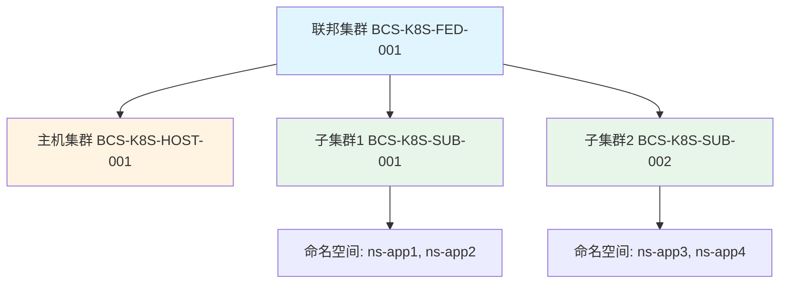
```mermaid
graph TB
    A[联邦集群 BCS-K8S-FED-001] --> B[主机集群 BCS-K8S-HOST-001]
    A --> C[子集群1 BCS-K8S-SUB-001]
    A --> D[子集群2 BCS-K8S-SUB-002]
    
    C --> E[命名空间: ns-app1, ns-app2]
    D --> F[命名空间: ns-app3, ns-app4]
    
    style A fill:#e1f5ff
    style B fill:#fff4e1
    style C fill:#e8f5e9
    style D fill:#e8f5e9
```

#### 联邦集群数据模型

| 字段                        | 说明               | 示例                        |
| --------------------------- | ------------------ | --------------------------- |
| fed_cluster_id              | 代理集群ID         | BCS-K8S-FED-001             |
| host_cluster_id             | 主机集群ID         | BCS-K8S-HOST-001            |
| sub_cluster_id              | 子集群ID           | BCS-K8S-SUB-001             |
| fed_namespaces              | 归属的命名空间列表 | ["ns-app1", "ns-app2"]      |
| fed_builtin_metric_table_id | 内置指标结果表     | 2_bkmonitor_time_series_... |
| fed_builtin_event_table_id  | 内置事件结果表     | 2_bkmonitor_event_...       |
| is_deleted                  | 是否已删除         | false                       |

#### 联邦集群同步流程

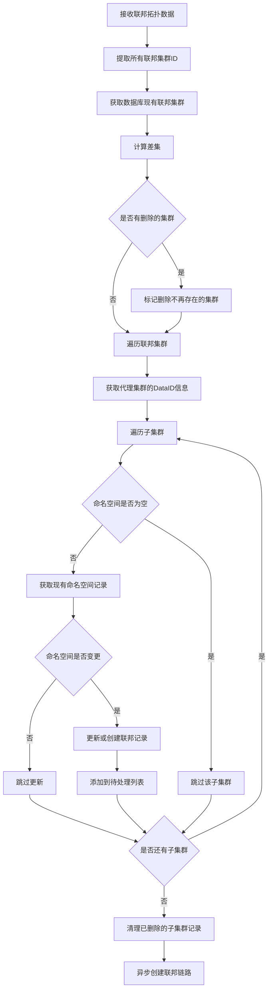
```mermaid
flowchart TD
    A[接收联邦拓扑数据] --> B[提取所有联邦集群ID]
    B --> C[获取数据库现有联邦集群]
    C --> D[计算差集]
    D --> E{是否有删除的集群}
    E -->|是| F[标记删除不再存在的集群]
    E -->|否| G[遍历联邦集群]
    F --> G
    
    G --> H[获取代理集群的DataID信息]
    H --> I[遍历子集群]
    I --> J{命名空间是否为空}
    J -->|是| K[跳过该子集群]
    J -->|否| L[获取现有命名空间记录]
    
    L --> M{命名空间是否变更}
    M -->|否| N[跳过更新]
    M -->|是| O[更新或创建联邦记录]
    
    O --> P[添加到待处理列表]
    N --> Q{是否还有子集群}
    P --> Q
    K --> Q
    Q -->|是| I
    Q -->|否| R[清理已删除的子集群记录]
    R --> S[异步创建联邦链路]
```

#### 联邦链路创建策略

联邦链路（Federation Data Link）负责将子集群的监控数据汇聚到联邦集群：

| 操作             | 时机               | 方式                      |
| ---------------- | ------------------ | ------------------------- |
| 批量收集子集群ID | 命名空间变更时     | 添加到待处理列表          |
| 异步创建链路     | 所有集群处理完毕后 | 调用 Celery 异步任务      |
| 去重处理         | 任务执行前         | 使用 set 去重子集群ID列表 |

### 集群清理阶段

系统定期清理已删除的集群记录，保持数据库整洁。

#### 清理策略

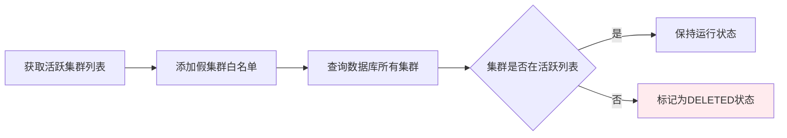
```mermaid
flowchart LR
    A[获取活跃集群列表] --> B[添加假集群白名单]
    B --> C[查询数据库所有集群]
    C --> D{集群是否在活跃列表}
    D -->|是| E[保持运行状态]
    D -->|否| F[标记为DELETED状态]
    
    style F fill:#ffebee
```

#### 假集群保护机制

为支持开发和测试场景，系统提供假集群保护机制：

| 配置项                                  | 说明                           | 示例                 |
| --------------------------------------- | ------------------------------ | -------------------- |
| ALWAYS_RUNNING_FAKE_BCS_CLUSTER_ID_LIST | 始终保持运行状态的假集群ID列表 | ["BCS-K8S-FAKE-001"] |

**作用**：配置在该列表中的集群即使不在 BCS API 返回的集群列表中，也不会被标记为删除状态。

## 监控指标与任务管理

### 任务执行监控

系统通过 Prometheus 指标监控任务执行状态和性能：

| 指标名称                        | 类型      | 标签              | 说明         |
| ------------------------------- | --------- | ----------------- | ------------ |
| METADATA_CRON_TASK_STATUS_TOTAL | Counter   | task_name, status | 任务状态计数 |
| METADATA_CRON_TASK_COST_SECONDS | Histogram | task_name         | 任务执行耗时 |

#### 任务状态标识

| 状态值                | 说明         |
| --------------------- | ------------ |
| TASK_STARTED          | 任务开始执行 |
| TASK_FINISHED_SUCCESS | 任务成功完成 |

### 周期任务配置

| 任务名称                  | 执行周期 | 锁定TTL | 说明           |
| ------------------------- | -------- | ------- | -------------- |
| discover_bcs_clusters     | 用户配置 | 3600秒  | 集群发现与同步 |
| refresh_bcs_monitor_info  | 用户配置 | 默认TTL | 监控资源刷新   |
| refresh_bcs_metrics_label | 用户配置 | 默认TTL | 指标标签刷新   |

#### 分布式锁机制

为防止任务重复执行，系统使用 `share_lock` 装饰器实现分布式锁：

| 参数     | 说明               | 示例值                       |
| -------- | ------------------ | ---------------------------- |
| ttl      | 锁的生存时间（秒） | 3600                         |
| identify | 锁的唯一标识符     | metadata_discoverBCSClusters |

## 异常处理与容错设计

### 异常场景分类

| 场景             | 处理策略                                         | 影响范围     |
| ---------------- | ------------------------------------------------ | ------------ |
| BCS API调用失败  | 记录错误日志，终止当前租户处理，继续处理下一租户 | 单个租户     |
| 集群注册失败     | 抛出异常，事务回滚，跳过当前集群                 | 单个集群     |
| 资源初始化失败   | 标记状态为INIT_FAILED，下次任务重试              | 单个集群     |
| 联邦拓扑获取失败 | 记录警告日志，跳过联邦集群处理                   | 联邦集群功能 |
| 云区域查询失败   | 记录异常日志，云区域保持为NULL                   | 云区域功能   |

### 重试机制

#### 资源初始化重试

当集群状态为 `INIT_FAILED` 时，下次任务执行时自动重试：

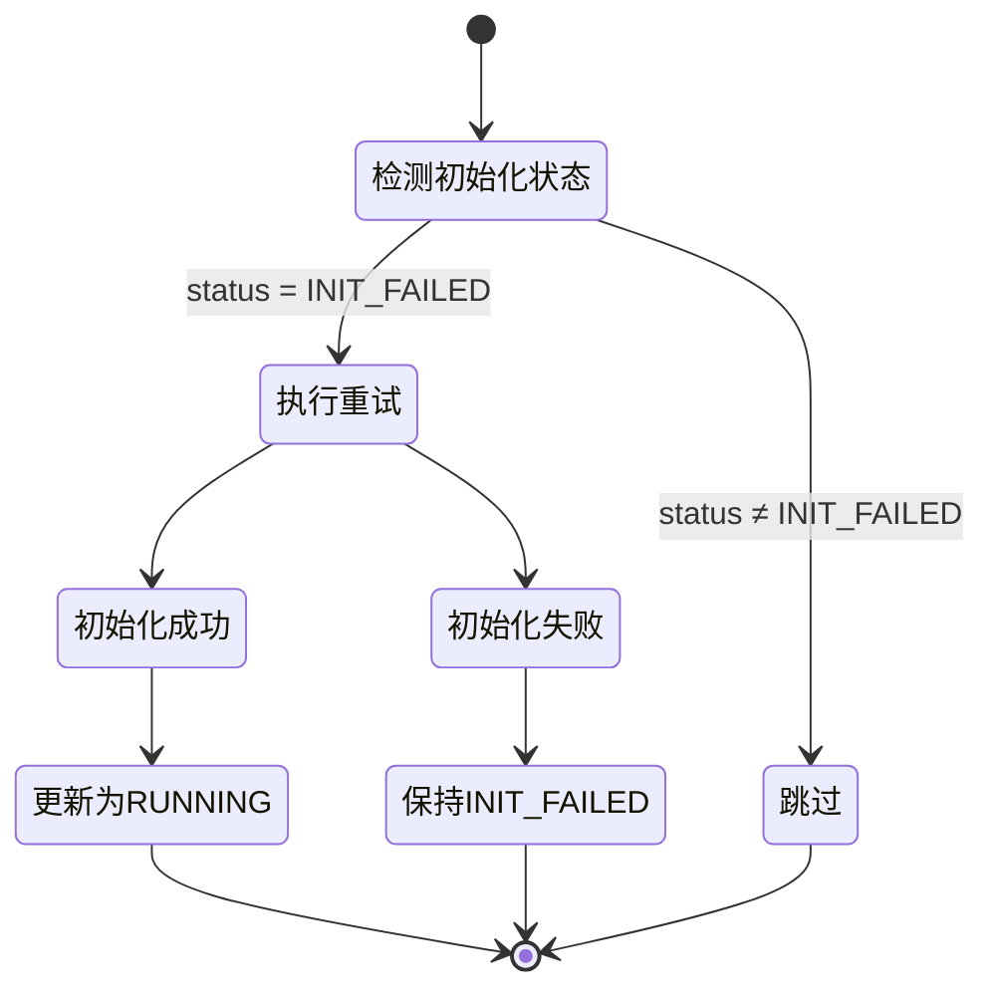
```mermaid
stateDiagram-v2
    [*] --> 检测初始化状态
    检测初始化状态 --> 执行重试: status = INIT_FAILED
    检测初始化状态 --> 跳过: status ≠ INIT_FAILED
    
    执行重试 --> 初始化成功
    执行重试 --> 初始化失败
    
    初始化成功 --> 更新为RUNNING
    初始化失败 --> 保持INIT_FAILED
    
    更新为RUNNING --> [*]
    保持INIT_FAILED --> [*]
    跳过 --> [*]
```

### 日志记录策略

| 日志级别 | 使用场景         | 示例                             |
| -------- | ---------------- | -------------------------------- |
| INFO     | 正常流程关键步骤 | 集群注册成功、资源初始化完成     |
| WARNING  | 可恢复的异常     | 联邦拓扑获取失败、云区域查询失败 |
| ERROR    | 不可恢复的错误   | 集群注册失败、数据源创建失败     |
| DEBUG    | 详细执行信息     | 中间处理步骤、配置细节           |

## 性能优化策略

### 并发控制

| 优化点       | 策略                   | 参数配置                       |
| ------------ | ---------------------- | ------------------------------ |
| 集群并发处理 | 串行处理，避免资源竞争 | N/A                            |
| 节点信息获取 | 分批并发请求           | BCS_SYNC_SYNC_CONCURRENCY = 20 |
| CMDB查询     | 批量请求接口           | 单批次最多20个集群             |
| IP查询限制   | 限制单集群IP数量       | CMDB_IP_SEARCH_MAX_SIZE = 100  |

### 数据库优化

| 优化措施 | 说明                                 |
| -------- | ------------------------------------ |
| 索引利用 | cluster_id、bk_biz_id 字段建立索引   |
| 批量更新 | 使用 QuerySet.update() 批量更新状态  |
| 事务控制 | 集群注册使用原子事务，确保数据一致性 |
| 字段过滤 | 仅查询必要字段，减少数据传输量       |

### 外部API调用优化

| API类型        | 优化策略                   | 说明             |
| -------------- | -------------------------- | ---------------- |
| BCS API        | 租户级并发，集群级串行     | 避免超出API限流  |
| CMDB API       | 批量请求，限制单批次IP数量 | 防止请求超时     |
| Kubernetes API | 集群级串行，资源级串行     | 保证配置下发顺序 |

## 测试策略

### 单元测试覆盖

| 测试对象     | 测试场景     | 验证点                   |
| ------------ | ------------ | ------------------------ |
| 集群注册     | 新集群注册   | 数据源创建、关联关系建立 |
| 集群注册     | 重复注册     | 抛出异常，防止重复接入   |
| 状态同步     | 状态变更     | 数据库状态正确更新       |
| 状态同步     | 业务迁移     | 路由配置正确变更         |
| 路由变更     | 跨业务迁移   | 所有关联表业务ID更新     |
| 云区域补全   | 多云区域节点 | 选择频次最高的云区域     |
| 联邦集群同步 | 命名空间变更 | 记录正确更新             |
| 联邦集群同步 | 集群删除     | 软删除标记设置           |

### 集成测试场景

| 场景           | 前置条件              | 验证点                               |
| -------------- | --------------------- | ------------------------------------ |
| 新集群接入     | BCS API返回新集群     | 完整注册流程执行，DataID资源下发成功 |
| 集群迁移       | 集群业务ID变更        | 路由配置更新，空间授权关系变更       |
| 联邦集群汇聚   | 存在联邦拓扑          | 联邦记录创建，链路异步创建触发       |
| 集群下线       | BCS API不再返回集群   | 状态标记为DELETED                    |
| 初始化失败重试 | 集群状态为INIT_FAILED | 下次任务执行时重试成功               |

## 关键技术特性

### DataID CRD 资源机制

**技术背景**：Kubernetes 集群内的 bk-collector 需要知道采集哪些指标以及如何上报数据。传统方式需要手动配置，难以维护。

**设计方案**：通过 Kubernetes CRD(Custom Resource Definition)机制，将 DataID 配置以原生 Kubernetes 资源形式存储。

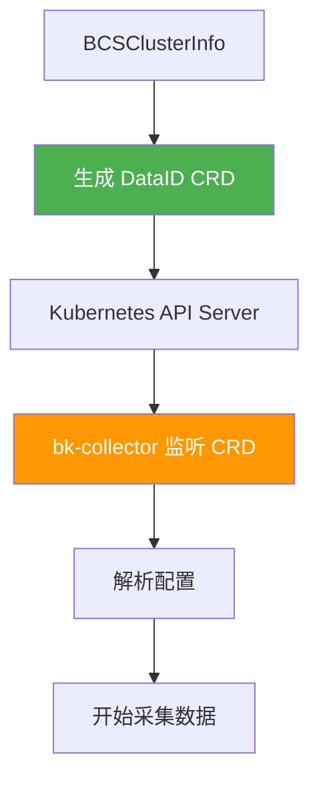
```mermaid
graph TB
    A[BCSClusterInfo] --> B[生成 DataID CRD]
    B --> C[Kubernetes API Server]
    C --> D[bk-collector 监听 CRD]
    D --> E[解析配置]
    E --> F[开始采集数据]
    
    style B fill:#4CAF50,color:#fff
    style D fill:#FF9800,color:#fff
```

### 多级替换规则机制

**业务问题**：Prometheus 采集的原始指标名可能不符合蓝鲸规范，需要统一转换。

**设计方案**：采用三级配置体系，支持全局、集群和资源级别的替换规则。

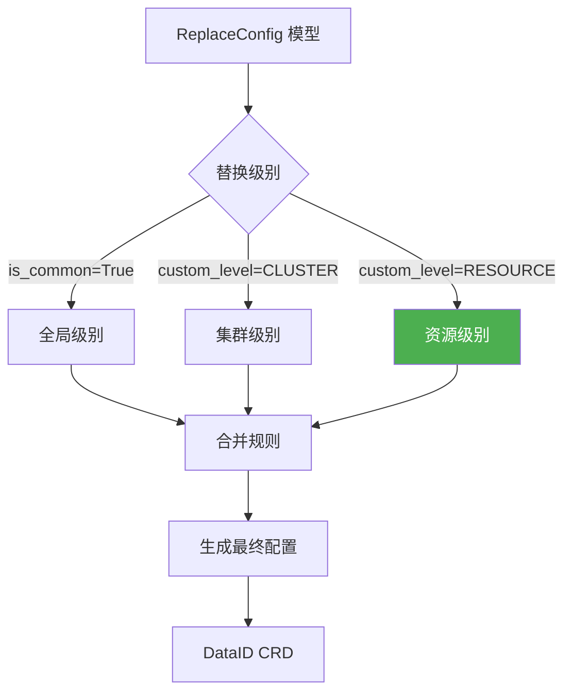
```mermaid
graph TD
    A[ReplaceConfig 模型] --> B{替换级别}
    B -->|is_common=True| C[全局级别]
    B -->|custom_level=CLUSTER| D[集群级别]
    B -->|custom_level=RESOURCE| E[资源级别]
    
    C --> F[合并规则]
    D --> F
    E --> F
    
    F --> G[生成最终配置]
    G --> H[DataID CRD]
    
    style E fill:#4CAF50,color:#fff
```

**优先级规则**：

| 级别   | 范围                           | 优先级 | 应用场景             |
| ------ | ------------------------------ | ------ | -------------------- |
| 资源级 | 单个 ServiceMonitor/PodMonitor | 最高   | 特定资源的个性化配置 |
| 集群级 | 单个 Kubernetes 集群           | 中     | 集群统一规范         |
| 全局级 | 所有集群                       | 最低   | 平台级规范           |

### 联邦集群数据汇聚

**业务场景**：大规模企业可能有多个 Kubernetes 集群，需要将部分集群的数据汇总到统一的联邦集群进行分析。

**架构设计**：

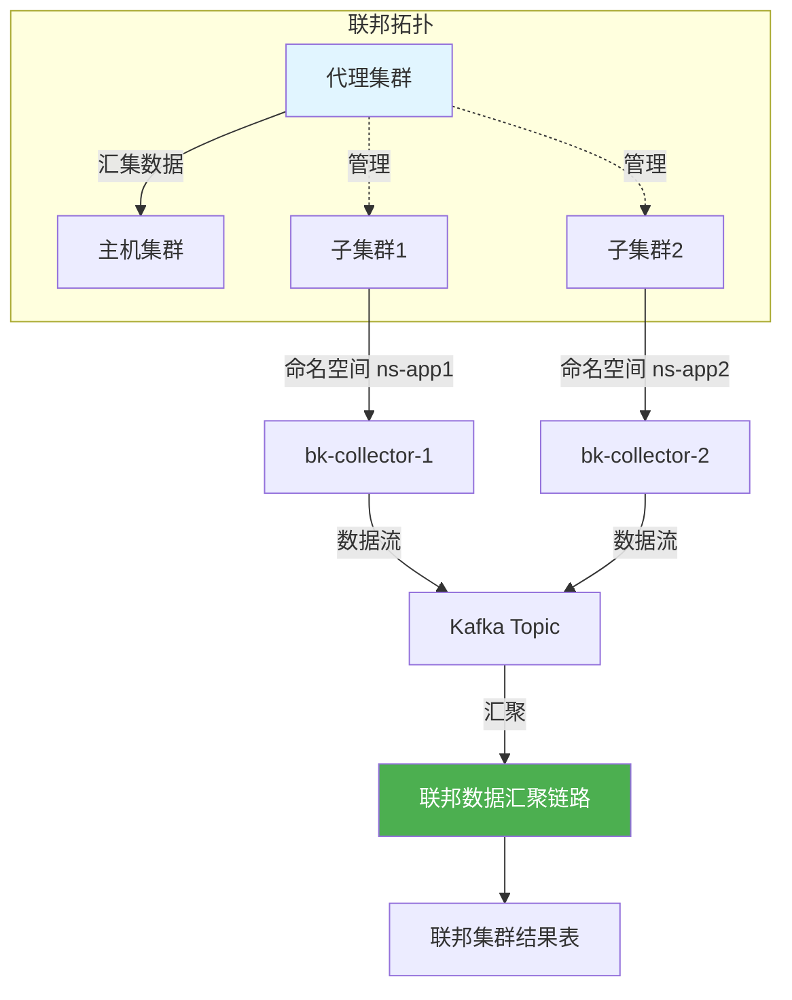
```mermaid
graph TB
    subgraph 联邦拓扑
        A[代理集群]
        B[主机集群]
        C[子集群1]
        D[子集群2]
    end
    
    C -->|命名空间 ns-app1| E[bk-collector-1]
    D -->|命名空间 ns-app2| F[bk-collector-2]
    
    E -->|数据流| G[Kafka Topic]
    F -->|数据流| G
    
    G -->|汇聚| H[联邦数据汇聚链路]
    H --> I[联邦集群结果表]
    
    A -.->|管理| C
    A -.->|管理| D
    A -->|汇集数据| B
    
    style A fill:#e1f5ff
    style H fill:#4CAF50,color:#fff
```

**关键特性**：

| 特性         | 实现机制                           |
| ------------ | ---------------------------------- |
| 命名空间隔离 | 每个子集群仅上报指定命名空间的数据 |
| 数据标记     | 汇聚数据带有原始集群信息           |
| 联邦识别     | 代理集群仅下发 CustomMetricDataID  |
| 链路创建     | 异步创建，避免阻塞主流程           |

### 集群迁移零停机

**业务问题**：集群可能在不同业务或项目间迁移，需要保证数据不丢失。

**设计方案**：

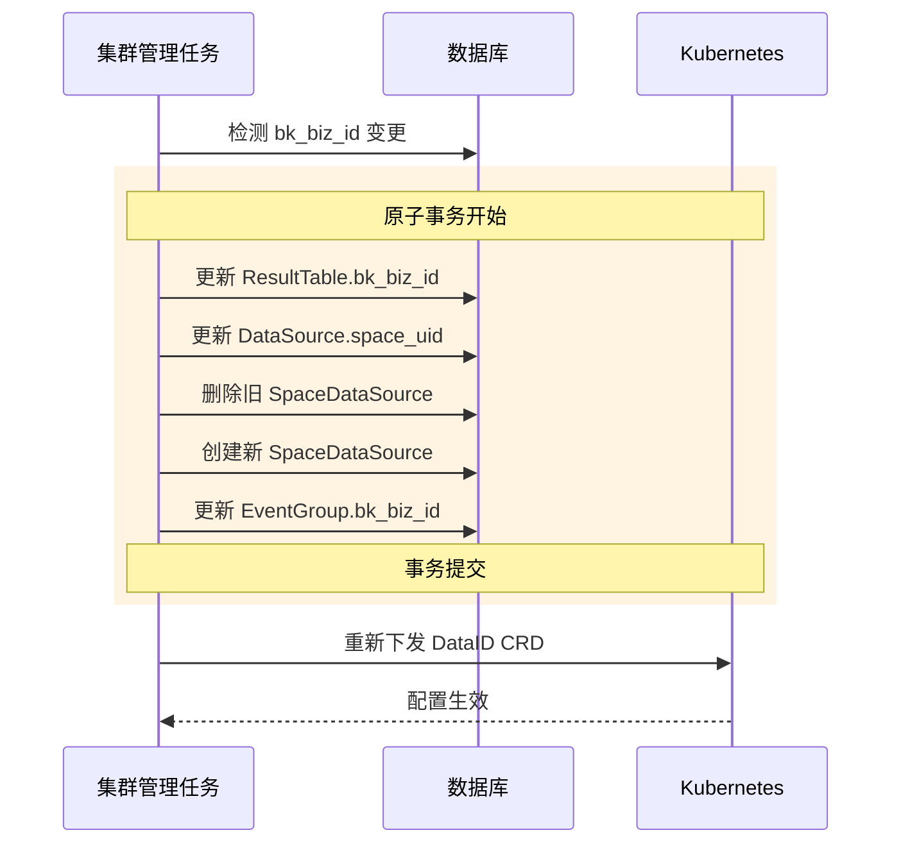
```mermaid
sequenceDiagram
    participant Task as 集群管理任务
    participant DB as 数据库
    participant K8s as Kubernetes
    
    Task->>DB: 检测 bk_biz_id 变更
    
    rect rgb(255, 244, 225)
    Note over Task,K8s: 原子事务开始
    Task->>DB: 更新 ResultTable.bk_biz_id
    Task->>DB: 更新 DataSource.space_uid
    Task->>DB: 删除旧 SpaceDataSource
    Task->>DB: 创建新 SpaceDataSource
    Task->>DB: 更新 EventGroup.bk_biz_id
    Note over Task,K8s: 事务提交
    end
    
    Task->>K8s: 重新下发 DataID CRD
    K8s-->>Task: 配置生效
```

**零停机保证**：

- **数据库事务**：所有路由变更在一个事务中完成
- **CRD 更新**：bk-collector 无需重启，自动感知配置变更
- **数据连续性**：Kafka Topic 和 DataID 不变，仅路由元数据变更

### 云区域智能推断

**业务背景**：集群节点可能分布在不同云区域，需要自动识别主要区域。

**算法设计**：

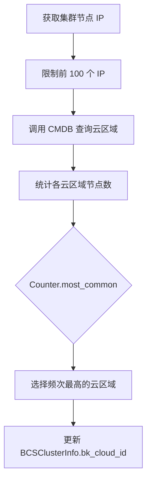
```mermaid
flowchart TD
    A[获取集群节点 IP] --> B[限制前 100 个 IP]
    B --> C[调用 CMDB 查询云区域]
    C --> D[统计各云区域节点数]
    D --> E{Counter.most_common}
    E --> F[选择频次最高的云区域]
    F --> G[更新 BCSClusterInfo.bk_cloud_id]
```

**优化策略**：

| 优化点      | 实现方案                 | 效果          |
| ----------- | ------------------------ | ------------- |
| 并发控制    | 分批处理，每批 20 个集群 | 避免 API 限流 |
| IP 数量限制 | 最多查询 100 个节点      | 防止请求超时  |
| 批量查询    | bulk_request 批量调用    | 降低网络开销  |
| IPv6 支持   | 同时处理 IPv4 和 IPv6    | 兼容性        |