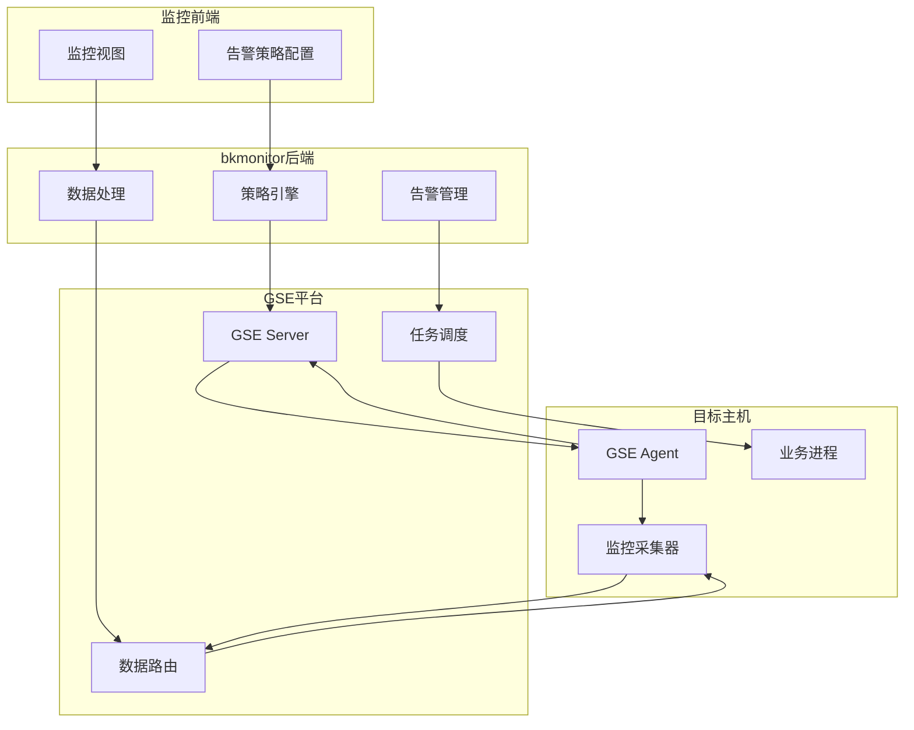

### **关于腾讯蓝鲸（BlueKing）体系中GSE（通用服务引擎）角色的深度研究报告**

**报告日期：** 2025年8月26日
**研究员：** 智能研究助手

---

### **报告摘要**

本报告旨在深入剖析腾讯蓝鲸（Tencent BlueKing）运维体系中的核心组件——GSE（General Service Engine，通用服务引擎）的具体功能、技术定位、架构组成及应用场景。研究基于截至当前日期的公开信息与搜索数据，进行系统性梳理与深度分析。

研究核心发现如下：首先，GSE在蓝鲸体系中并非独立产品，而是作为底层“管控平台”的核心，为上层应用（如作业平台、日志平台）提供高并发、分布式的任务执行、文件传输和节点管理能力，是整个蓝鲸自动化运维体系的基石。其次，GSE在蓝鲸体系中的全称为“通用服务引擎”，需与腾讯云的“游戏服务器引擎（Game Server Engine, GSE）”及网络技术领域的“全调度以太网（Global Switching Engine, GSE）”等同名概念严格区分。再者，GSE通过其部署在业务主机上的Agent代理程序，与后端的Server集群（包括TaskServer、FileServer等）协同工作，构筑起一条稳定高效的“命令管道”。

然而，本次研究也揭示了一个显著的信息空白：尽管GSE的核心功能和组件构成有据可查，但关于其内部组件间详细的通信协议设计、性能基准测试的具体指标数据、以及官方发布的深度技术白皮书或架构文档等信息极为匮乏。这表明，GSE的深度技术细节可能被视为腾讯内部核心知识产权，未对外进行详尽披露。本报告将在现有信息基础上，对GSE进行尽可能全面的解读。

---

### **1. 引言与背景**

#### **1.1. 研究目的与日期**

本研究于2025年8月26日进行，目标是全面、准确地阐述腾讯蓝鲸体系中的GSE组件是用来做什么的。报告将整合分析现有资料，厘清其定义，明确其功能，并探讨其在整个蓝鲸生态中的战略地位。

#### **1.2. 关键术语澄清：GSE的多重含义**

在研究初期，我们发现“GSE”这一缩写在不同技术语境下存在多种截然不同的含义，为避免混淆，特此澄清：

*   **蓝鲸体系中的GSE（General Service Engine）** ：这是本报告的核心研究对象，即“通用服务引擎”，在蓝鲸体系内被称为“蓝鲸管控平台系统”。它是蓝鲸实现自动化运维能力的基础设施层。
*   **腾讯云游戏服务器引擎（Game Server Engine）** ：这是腾讯云提供的一项面向游戏开发者的云服务，用于游戏服务器的部署、扩缩容和管理 。搜索结果明确指出，此GSE与“蓝鲸”体系无直接关联 。
*   **全调度以太网（Global Switching Engine/Global Scheduling Ethernet）** ：这是一种由中国移动研究院等机构提出的、旨在解决智算中心网络瓶颈的新型以太网架构技术 。它有自身的技术白皮书，但与腾讯蓝鲸的GSE是两个完全不同的技术概念 。
*   **其他含义**：搜索结果中还零星出现了GSE作为Go语言分词库 地面军事系统  等指代，均与本报告主题无关。

本报告后续所有“GSE”的论述，均特指蓝鲸体系内的“通用服务引擎”。

#### **1.3. 腾讯蓝鲸体系概览**

腾讯蓝鲸智云（Tencent BlueKing）是腾讯公司自研的一套企业级研发运营一体化（DevOps）PaaS平台 。它旨在通过提供一系列原子平台和场景化SaaS应用，帮助企业构建自己的运维体系，提升运维效率和自动化水平 。蓝鲸体系包含配置平台（CMDB）、作业平台（Job）、管控平台（GSE）、数据平台（Data）等多个核心模块，它们相互协作，共同构成了蓝鲸强大的运维能力 。而GSE，正是支撑这一切自动化流程的底层动力引擎。

### **2. GSE在蓝鲸体系中的核心定位与功能**

#### **2.1. GSE的定义：通用服务引擎**

GSE，全称General Service Engine，是蓝鲸管控平台的系统简称 。它并非一个用户直接操作的前端产品，而是一个底层的、基础性的服务引擎。其核心设计理念是提供一个稳定、高效、可大规模并发的跨网络、跨云的分布式任务执行通道。蓝鲸平台许多核心功能的实现，都依赖于GSE提供的底层能力 。

#### **2.2. 核心作用：分布式管控与任务执行的基石**

GSE在蓝鲸体系中的战略定位是“基石”。具体来说，它是上层原子平台——尤其是“作业平台（Job）”——的直接基础 。作业平台负责编排和执行各种运维任务，如脚本执行、文件分发等，而这些任务的最终下发和结果回收，都必须通过GSE构建的管控通道来完成。可以将其理解为蓝鲸的“神经网络”，连接着控制中心和遍布在各个业务服务器上的“神经末梢”（GSE Agent），实现指令的精确传达和状态的实时反馈。

#### **2.3. 主要功能详述**

基于现有搜索结果的分析，GSE的核心功能可细分为以下几个方面：

*   **命令与脚本执行**：这是GSE最基础也是最核心的功能。蓝鲸平台实现的核心原理便是基于GSE构建的“命令管道”来远程执行各类Shell、Python等脚本 。这使得管理员可以在管控端对成千上万台服务器进行批量的命令操作，是实现自动化运维的基础。

*   **文件分发与传输**：GSE具备强大的文件分发能力，能够将文件、安装包、配置文件等从源服务器高效地传输到大量目标服务器上 。这一功能由其内部的`BK FileServer`等组件支持 。这对于批量部署软件、更新配置等场景至关重要。

*   **Agent节点管理**：GSE的功能实现依赖于一个部署在每台受管服务器上的代理程序——`GSE Agent` 。GSE平台本身，以及蓝鲸体系中的`bk-nodeman`（节点管理器）模块，提供了对这些Agent的完整生命周期管理能力，包括：
    *   **状态查询与健康检查**：实时监控Agent的存活状态和健康状况 。
    *   **版本更新与配置管理**：能够对Agent进行远程升级和配置变更 。
    *   **进程管理**：对Agent自身的进程进行管理，确保其稳定运行 。

*   **为上层SaaS提供基础能力**：除了支撑作业平台，GSE也为蓝鲸生态中的其他组件提供服务。例如，蓝鲸日志平台的数据采集器便是基于GSE的采集框架进行开发的，利用GSE的通道能力实现日志数据的可靠传输 。

### **3. GSE的技术架构与组件分析**

#### **3.1. 已知的核心组件**

尽管完整的架构图缺失，但通过对各方信息的拼凑，我们可以识别出GSE系统的几个关键组成部分：

*   **GSE Agent**：客户端代理。这是一个必须预先安装在所有受管服务器上的轻量级代理程序 。它负责接收来自GSE Server的指令（如执行脚本、传输文件），执行任务，并将结果上报。它是GSE管控能力的延伸触角。

*   **GSE Server (后台)** ：服务端集群。这是GSE的控制中枢，以集群形式部署以保证高可用和高并发处理能力。它至少包含以下子组件：
    *   **TaskServer (`BK TaskServer`)**: 任务处理服务器，负责接收、解析和调度来自上层平台（如作业平台）的任务请求 。
    *   **FileServer (`BK FileServer`)**: 文件服务，专门处理文件分发任务，管理文件的中转和存储 。
    *   **其他后台服务**: 还可能包括与Agent维持长连接、管理Agent状态、处理数据中转等功能的其他微服务。

*   **bk-nodeman (节点管理器)** ：这是一个专门用于管理GSE Agent的蓝鲸官方SaaS应用 。用户可以通过节点管理器的界面，方便地对所有主机上的Agent进行安装、卸载、升级、配置等操作，极大地简化了Agent的部署和维护工作。

*   **依赖组件**：GSE的稳定运行还依赖于一些基础中间件，如使用ZooKeeper进行服务发现和分布式协调，使用Redis进行数据缓存等 。

#### **3.2. 组件交互与通信协议：公开信息的缺失**

**这是本次研究的一个关键发现：关于GSE内部组件之间如何交互，以及它们使用的具体通信协议，几乎没有公开的详细文档。**

针对“GSE组件交互和通信协议”的多次查询，均未返回有效结果 (Query: 腾讯蓝鲸GSE模块的组件交互和通信协议设计是什么？, Query: 腾讯蓝鲸GSE模块内部组件交互的详细设计文档是什么？, Query: Tencent BlueKing GSE component communication protocol specifications are described in which documents??)。搜索结果仅提供了通用的网络协议概念（如TCP/IP）或不相关的协议标准（如DVB领域的GSE协议） 。

基于其功能特性，我们可以做出如下**合理推断**：
1.  **Agent与Server的通信**：GSE Agent与GSE Server之间很可能采用基于TCP的、加密的、持久化的长连接。这种设计可以保证指令下发的低延迟和实时性，并能及时感知Agent的掉线。
2.  **协议设计**：通信协议是私有的、自定义的二进制协议，以实现高效的数据序列化和传输。报文内容会包含任务ID、指令类型、加密荷载、校验信息等字段。
3.  **高可用设计**：Agent在连接GSE Server时，可能会通过某种服务发现机制（如轮询DNS或从Zookeeper获取地址列表）连接到可用的Server节点，从而实现服务端的负载均衡和故障转移。

然而，必须强调，以上均为基于系统功能的逆向推测，缺乏官方文档的直接证实。这种信息缺失表明，GSE的底层通信机制是蓝鲸平台的核心技术秘密之一。

### **4. 性能、用例与发展趋势分析**

#### **4.1. 性能基准与优化策略：研究空白**

与通信协议类似，**关于GSE的官方性能基准测试报告、具体性能指标（如最大并发任务数、文件分发速度、单Agent资源消耗等）以及相关的性能优化案例，在公开渠道中完全缺失。**

针对此方向的多次查询，结果要么是关于性能测试的通用方法论 要么是关于不相关产品（如云硬盘、深度学习模型）的性能数据 要么是嘉为蓝鲸等合作伙伴的应用案例分享，但均未涉及GSE本身的性能细节 。

这再次印证了GSE作为底层基础平台的特性——其性能直接影响上层业务，但其自身的性能调优细节和极限数据并未作为公开信息提供给普通用户或开发者。

#### **4.2. 典型应用场景与用例**

综合GSE的功能，其在企业运维中的典型应用场景非常明确：

1.  **大规模运维自动化**：作为作业平台的基础，支撑企业实现对数万甚至数十万台服务器的自动化管理，包括批量执行健康检查、系统初始化、安全基线加固等。
2.  **跨云、多环境主机统一管控**：GSE的设计要求其能够穿越复杂的网络环境。蓝鲸部署文档中提及，GSE部署的机器需要具备跨云的网络条件 这表明它可以统一纳管公有云、私有云、混合云以及物理服务器，实现统一的指令和文件通道。
3.  **应用发布与配置变更**：通过其高效的文件分发和脚本执行能力，GSE是实现DevOps流程中持续部署（CD）环节的关键工具，可用于自动化部署应用、更新服务配置。
4.  **实时数据采集通道**：作为蓝鲸日志平台等数据采集工具的底层传输框架，为AIOps（智能运维）提供稳定、可靠的数据源。

#### **4.3. 2025年发展趋势展望：基于现有信息的推断**

尽管没有找到2025年关于GSE的官方发布说明或更新日志 (Query: 2025年腾讯蓝鲸GSE的官方发布说明和更新日志是什么？)，但基于蓝鲸整体向“智能化运维”演进的大趋势 ，我们可以对GSE的未来发展做出推断：

*   **更高的性能与可伸缩性**：随着AIOps场景下数据采集和实时控制需求的增加，GSE需要支持更高的并发连接数和更大的数据吞吐量。
*   **增强的安全性**：作为核心管控通道，GSE的安全性至关重要。未来可能会引入更强的加密算法、更灵活的访问控制策略以及对通道的异常行为检测能力。
*   **更智能的调度**：GSE的任务调度可能会与CMDB中更丰富的资源、业务拓扑信息深度结合，实现更智能、更低风险的任务调度和灰度执行策略。
*   **云原生与容器化支持**：为更好地适应云原生生态，GSE Agent可能会提供更轻量级的容器化版本，并与Kubernetes等容器编排平台进行更深度的集成。

### **5. 结论**

本研究报告对腾讯蓝鲸体系中的GSE（通用服务引擎）进行了系统性的分析。结论如下：

1.  **核心定位**：GSE是蓝鲸的“通用服务引擎”，定位为底层的分布式管控平台，是实现大规模自动化运维的神经中枢和命令管道，为作业平台等上层应用提供能力支撑。
2.  **核心功能**：其主要功能包括跨网络的命令与脚本执行、高并发的文件分发、以及对部署在节点上的Agent进行全面的生命周期管理。
3.  **信息壁垒**：研究明确指出，GSE的内部架构、组件间通信协议、性能基准等深度技术细节缺乏公开文档。这反映了其作为腾讯核心技术资产的保密性，同时也为外部研究者和深度用户带来了挑战。
4.  **战略价值**：GSE是腾讯蓝鲸区别于其他运维工具的核心竞争力之一，其稳定性和高效性直接决定了整个蓝鲸平台的运维能力上限。展望未来，GSE必将随着AIOps和云原生的浪潮，向着更智能、更安全、更高效的方向持续演进。

---

## GSE在bkmonitor项目中的核心作用

GSE（General Service Engine，通用服务引擎）是腾讯蓝鲸体系中的**底层管控平台**，在bkmonitor项目中扮演着至关重要的基础设施角色：

### 1. **数据采集的基础通道**

- **监控数据传输**：GSE为bkmonitor提供稳定、高效的数据传输通道，将各个主机上的监控数据实时传输到监控平台
- **Agent管理**：通过GSE Agent部署在被监控的主机上，实现监控数据的自动采集和上报
- **多数据源支持**：支持时序数据、日志数据、事件数据等多种监控数据类型的采集

### 2. **告警处理的执行引擎**

- **告警动作执行**：当监控策略触发告警时，GSE负责执行相应的处理动作，如执行修复脚本、重启服务等
- **批量操作**：支持对大量主机同时执行告警处理操作，实现大规模运维自动化
- **跨网络执行**：能够在复杂的网络环境中（跨云、混合云）执行监控和告警相关的操作

### 3. **监控配置的自动化部署**

- **配置分发**：将监控配置文件、采集器配置等批量分发到目标主机
- **服务部署**：自动化部署监控相关的服务和组件
- **版本管理**：对监控Agent和相关组件进行版本升级和管理

## 总结

根据提供的文档和项目代码分析，GSE平台在bkmonitor项目中发挥着**核心基础设施**的作用，具体包括：

### 🔧 **核心功能**

#### 1. **监控数据采集通道**

- **Agent心跳监控**：GSE Agent定期向GSE Server发送心跳数据，bkmonitor通过[GetAgentStatus](file://d:\projects\bk-monitor\bkmonitor\api\gse\default.py#L410-L426) API实时监控主机状态
- **进程状态监控**：通过[GetProcStatus](file://d:\projects\bk-monitor\bkmonitor\api\gse\default.py#L429-L455) API获取主机上进程的运行状态
- **系统事件收集**：收集诸如主机重启、进程异常、网络状态等系统级事件

#### 2. **告警处理执行引擎**

- **自动化响应**：当监控策略触发告警时，GSE负责执行预定义的处理动作
- **批量操作**：支持对大量主机同时执行修复脚本、服务重启等操作
- **跨网络执行**：能够在复杂网络环境（跨云、混合云）中执行运维操作

#### 3. **配置管理与部署**

- **监控配置分发**：将监控策略、采集器配置等批量分发到目标主机
- **Agent管理**：通过[AddStreamTo](file://d:\projects\bk-monitor\bkmonitor\api\gse\default.py#L51-L108)、[UpdateRoute](file://d:\projects\bk-monitor\bkmonitor\api\gse\default.py#L288-L353)等API管理数据流路由和传输配置

### 🏗️ **在bkmonitor架构中的位置**

### 💡 **具体应用场景**

1. **主机状态监控**：通过`agent-gse`事件监控主机Agent的心跳状态，及时发现主机离线
2. **进程监控**：监控关键业务进程的运行状态，实现故障自动恢复
3. **资源监控**：收集CPU、内存、磁盘等系统资源使用情况
4. **网络监控**：通过`ping-gse`事件监控网络连通性
5. **日志采集**：基于GSE的数据传输通道实现日志的可靠采集和传输

### 🔄 **数据流转过程**

1. **数据采集**：GSE Agent在各主机上采集监控数据
2. **数据传输**：通过GSE的数据路由系统将数据传输到bkmonitor
3. **数据处理**：bkmonitor对收到的数据进行清洗、聚合和分析
4. **告警生成**：基于预设策略生成告警事件
5. **动作执行**：通过GSE执行相应的处理动作

简而言之，**GSE是bkmonitor系统的"神经系统"**，它连接着监控中心和各个被监控节点，实现了监控数据的双向流通和自动化运维操作的精确执行，是整个监控平台能够正常运行的基础支撑。

