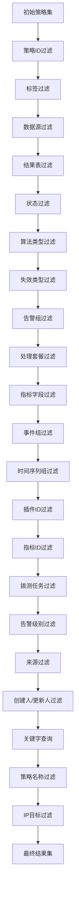
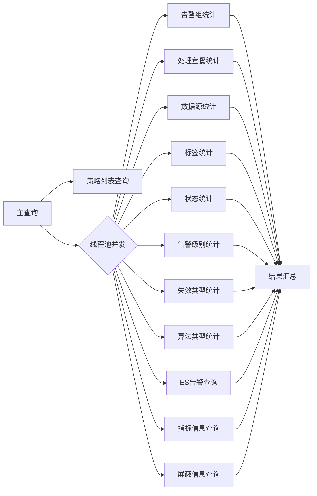

# GetStrategyListV2Resource 策略列表查询接口文档

## 概览

`GetStrategyListV2Resource` 是蓝鲸监控平台提供的策略列表查询资源类，支持复杂的多条件过滤、分页查询和统计聚合功能。该接口返回策略列表及各维度统计信息，为前端提供完整的策略数据视图。

### 核心功能

- 多维度条件过滤查询
- 分页数据返回
- 策略告警状态统计
- 数据源分类统计
- 告警组和处理套餐关联
- 监控目标详情补充

## 接口定义

### 请求参数

| 参数名称 | 类型 | 必填 | 默认值 | 说明 |
|---------|------|------|--------|------|
| bk_biz_id | Integer | 是 | - | 业务ID |
| scenario | String | 否 | - | 监控场景（用于二次过滤） |
| conditions | List[Dict] | 否 | [] | 过滤条件列表 |
| page | Integer | 否 | 1 | 页码 |
| page_size | Integer | 否 | 10 | 每页数量 |
| with_user_group | Boolean | 否 | false | 是否补充告警组信息 |
| with_user_group_detail | Boolean | 否 | false | 是否补充告警组详细信息 |
| convert_dashboard | Boolean | 否 | true | 是否转换仪表盘格式 |

### 返回数据结构

```json
{
  "scenario_list": [],           // 监控场景列表及策略数量统计
  "strategy_config_list": [],    // 策略配置列表（已分页）
  "data_source_list": [],        // 数据源列表及策略数量统计
  "strategy_label_list": [],     // 策略标签列表及策略数量统计
  "strategy_status_list": [],    // 策略状态列表及策略数量统计
  "user_group_list": [],         // 告警组列表及策略数量统计
  "action_config_list": [],      // 处理套餐列表及策略数量统计
  "alert_level_list": [],        // 告警级别列表及策略数量统计
  "invalid_type_list": [],       // 失效类型列表及策略数量统计
  "algorithm_type_list": [],     // 算法类型列表及策略数量统计
  "total": 0                     // 策略总数（未分页）
}
```

## Conditions 参数详解

### 基本格式

每个条件是包含 `key` 和 `value` 字段的字典对象：

```python
{
    "key": "字段名",
    "value": "过滤值"  # 可以是字符串、数字或列表
}
```

### 值格式说明

- **单值**：字符串或数字，如 `"test_strategy"` 或 `123`
- **多值列表**：数组格式，如 `["value1", "value2"]`
- **管道分隔**：单个字符串中使用 `|` 分隔，如 `"123|456"`，会自动拆分为 `["123", "456"]`

### 支持的过滤条件类型

#### 1. 策略基础信息过滤

##### 1.1 策略ID（id / strategy_id）

按策略ID精确匹配

| 字段名 | 别名 | 类型 | 说明 |
|-------|------|------|------|
| id | strategy_id | Integer / List[Integer] | 策略ID |

**示例**：
```python
# 单个策略ID
{"key": "id", "value": 123}

# 多个策略ID
{"key": "strategy_id", "value": [123, 456]}

# 管道分隔
{"key": "id", "value": "123|456"}
```

##### 1.2 策略名称（name / strategy_name）

按策略名称模糊匹配（使用 `ICONTAINS` 查询）

| 字段名 | 别名 | 类型 | 说明 |
|-------|------|------|------|
| name | strategy_name | String / List[String] | 策略名称 |

**示例**：
```python
# 单个名称模糊匹配
{"key": "name", "value": "CPU使用率"}

# 多个名称模糊匹配（OR关系）
{"key": "strategy_name", "value": ["CPU", "内存"]}
```

##### 1.3 创建人（create_user / creators）

按创建人精确匹配

| 字段名 | 别名 | 类型 | 说明 |
|-------|------|------|------|
| create_user | creators | String / List[String] | 创建人用户名 |

**示例**：
```python
{"key": "create_user", "value": ["admin", "user01"]}
```

##### 1.4 更新人（update_user / updaters）

按更新人精确匹配

| 字段名 | 别名 | 类型 | 说明 |
|-------|------|------|------|
| update_user | updaters | String / List[String] | 更新人用户名 |

**示例**：
```python
{"key": "updaters", "value": "admin"}
```

#### 2. 策略状态过滤

##### 2.1 策略状态（strategy_status）

按策略运行状态过滤

| 状态值 | 说明 |
|--------|------|
| ALERT | 告警中（从ES查询有异常告警的策略） |
| INVALID | 策略已失效 |
| SHIELDED | 屏蔽中（从屏蔽表和ES查询） |
| ON | 已启用 |
| OFF | 已停用 |

**示例**：
```python
# 查询告警中的策略
{"key": "strategy_status", "value": ["ALERT"]}

# 查询已启用或已停用的策略
{"key": "strategy_status", "value": ["ON", "OFF"]}
```

#### 3. 数据源相关过滤

##### 3.1 数据源类型（data_source / data_source_list）

按数据源类型过滤

| 字段名 | 别名 | 类型 | 说明 |
|-------|------|------|------|
| data_source | data_source_list | String / List[String] | 数据源类型标识 |

**常见数据源类型**：
- `bk_monitor_time_series` - 监控采集指标
- `bk_monitor_log` - 日志关键字
- `bk_log_search` - 日志平台
- `custom_time_series` - 自定义指标
- `custom_event` - 自定义事件
- `bk_data` - 计算平台

**示例**：
```python
{"key": "data_source", "value": ["bk_monitor_time_series", "custom_time_series"]}
```

##### 3.2 结果表ID（result_table_id）

按结果表ID精确匹配

| 字段名 | 类型 | 说明 |
|-------|------|------|
| result_table_id | String / List[String] | 结果表ID |

**示例**：
```python
{"key": "result_table_id", "value": "system.cpu_summary"}
```

#### 4. 指标相关过滤

##### 4.1 指标字段（metric_field / metric_name）

按指标字段名称过滤

| 字段名 | 别名 | 类型 | 说明 |
|-------|------|------|------|
| metric_field | metric_name | String / List[String] | 指标字段名 |

**示例**：
```python
{"key": "metric_field", "value": ["cpu_usage", "mem_usage"]}
```

##### 4.2 指标别名（metric_field_name / metric_alias）

按指标别名过滤

| 字段名 | 别名 | 类型 | 说明 |
|-------|------|------|------|
| metric_field_name | metric_alias | String / List[String] | 指标中文名称 |

**示例**：
```python
{"key": "metric_alias", "value": ["CPU使用率"]}
```

##### 4.3 指标ID（metric_id）

按指标ID精确匹配

| 字段名 | 类型 | 说明 |
|-------|------|------|
| metric_id | String / List[String] | 指标唯一标识 |

**示例**：
```python
{"key": "metric_id", "value": "bk_monitor.system.cpu_summary.usage"}
```

#### 5. 监控场景过滤

##### 5.1 监控场景（scenario）

按监控场景过滤

| 字段名 | 类型 | 说明 |
|-------|------|------|
| scenario | String / List[String] | 监控场景标识 |

**常见监控场景**：
- `os` - 主机监控
- `host_process` - 进程监控
- `service_module` - 服务模块
- `component` - 组件监控
- `uptimecheck` - 拨测
- `kubernetes` - K8S容器

**示例**：
```python
{"key": "scenario", "value": ["os", "kubernetes"]}
```

#### 6. 标签过滤

##### 6.1 策略标签（label / label_name）

按策略标签过滤

| 字段名 | 别名 | 类型 | 说明 |
|-------|------|------|------|
| label | label_name | String / List[String] | 标签名称 |

**示例**：
```python
{"key": "label", "value": ["/核心业务/", "/测试/"]}
```

#### 7. 算法类型过滤

##### 7.1 算法类型（algorithm_type）

按检测算法类型过滤

| 字段名 | 类型 | 说明 |
|-------|------|------|
| algorithm_type | String / List[String] | 算法类型标识 |

**常见算法类型**：
- `Threshold` - 静态阈值
- `SimpleRingRatio` - 简单环比
- `AdvancedRingRatio` - 高级环比
- `YearRound` - 同比策略
- `IntelligentDetect` - 智能检测
- `TimeSeriesForecasting` - 时序预测

**示例**：
```python
{"key": "algorithm_type", "value": ["Threshold", "IntelligentDetect"]}
```

#### 8. 失效类型过滤

##### 8.1 失效类型（invalid_type）

按策略失效原因类型过滤

| 字段名 | 类型 | 说明 |
|-------|------|------|
| invalid_type | String / List[String] | 失效类型标识 |

**示例**：
```python
{"key": "invalid_type", "value": ["delete_rt"]}
```

#### 9. 告警组过滤

##### 9.1 告警组ID（user_group_id）

按告警组ID过滤

| 字段名 | 类型 | 说明 |
|-------|------|------|
| user_group_id | Integer / List[Integer] | 告警组ID |

**示例**：
```python
{"key": "user_group_id", "value": [10, 20]}
```

##### 9.2 告警组名称（user_group_name）

按告警组名称模糊匹配

| 字段名 | 类型 | 说明 |
|-------|------|------|
| user_group_name | String / List[String] | 告警组名称 |

**示例**：
```python
{"key": "user_group_name", "value": ["运维组"]}
```

#### 10. 处理套餐过滤

##### 10.1 处理套餐ID（action_id）

按处理套餐ID过滤

| 字段名 | 类型 | 说明 |
|-------|------|------|
| action_id | Integer / List[Integer] | 处理套餐ID，0表示未配置 |

**示例**：
```python
# 查询未配置处理套餐的策略
{"key": "action_id", "value": [0]}

# 查询指定处理套餐的策略
{"key": "action_id", "value": [100, 200]}
```

##### 10.2 处理套餐名称（action_name）

按处理套餐名称模糊匹配

| 字段名 | 类型 | 说明 |
|-------|------|------|
| action_name | String / List[String] | 处理套餐名称，空字符串表示未配置 |

**示例**：
```python
# 查询未配置处理套餐的策略
{"key": "action_name", "value": [""]}

# 按名称模糊匹配
{"key": "action_name", "value": ["自愈套餐"]}
```

#### 11. 自定义事件相关过滤

##### 11.1 自定义事件组ID（custom_event_group_id / bk_event_group_id）

按自定义事件组ID过滤

| 字段名 | 别名 | 类型 | 说明 |
|-------|------|------|------|
| custom_event_group_id | bk_event_group_id | Integer / List[Integer] | 事件组ID |

**示例**：
```python
{"key": "custom_event_group_id", "value": [1001, 1002]}
```

#### 12. 自定义指标相关过滤

##### 12.1 时间序列组ID（time_series_group_id）

按自定义时间序列组ID过滤

| 字段名 | 类型 | 说明 |
|-------|------|------|
| time_series_group_id | Integer / List[Integer] | 时间序列组ID |

**示例**：
```python
{"key": "time_series_group_id", "value": [2001]}
```

#### 13. 插件相关过滤

##### 13.1 插件ID（plugin_id）

按采集插件ID过滤

| 字段名 | 类型 | 说明 |
|-------|------|------|
| plugin_id | String / List[String] | 插件ID |

**示例**：
```python
{"key": "plugin_id", "value": ["bk-collector", "exporter_dbm_redis"]}
```

#### 14. 拨测相关过滤

##### 14.1 拨测任务ID（uptime_check_task_id / task_id）

按拨测任务ID过滤

| 字段名 | 别名 | 类型 | 说明 |
|-------|------|------|------|
| uptime_check_task_id | task_id | Integer / List[Integer] | 拨测任务ID |

**示例**：
```python
{"key": "task_id", "value": [3001, 3002]}
```

#### 15. 告警级别过滤

##### 15.1 告警级别（level）

按告警级别过滤

| 级别值 | 说明 |
|--------|------|
| 1 | 致命 |
| 2 | 预警 |
| 3 | 提醒 |

**示例**：
```python
{"key": "level", "value": [1, 2]}
```

#### 16. 来源过滤

##### 16.1 策略来源（source / source__in / source__neq）

按策略来源过滤

| 字段名 | 操作符 | 说明 |
|-------|--------|------|
| source | in | 包含指定来源 |
| source__in | in | 包含指定来源（显式） |
| source__neq | not in | 排除指定来源 |

**示例**：
```python
# 包含来源
{"key": "source", "value": ["bk_monitorv3", "fta"]}

# 排除来源
{"key": "source__neq", "value": ["bk_monitorv3"]}
```

#### 17. 监控目标过滤

##### 17.1 IP地址（ip）

按监控目标IP地址过滤（需配合 bk_cloud_id 使用）

| 字段名 | 类型 | 说明 |
|-------|------|------|
| ip | String / List[String] | IP地址 |

**示例**：
```python
{"key": "ip", "value": ["10.0.0.1", "10.0.0.2"]}
```

##### 17.2 云区域ID（bk_cloud_id）

配合IP使用，指定云区域

| 字段名 | 类型 | 说明 |
|-------|------|------|
| bk_cloud_id | Integer / List[Integer] | 云区域ID |

**示例**：
```python
# 与IP配合使用
[
    {"key": "ip", "value": ["10.0.0.1"]},
    {"key": "bk_cloud_id", "value": [0]}
]
```

#### 18. 关键字查询（query）

跨字段模糊查询（支持策略名称、策略ID、结果表ID）

| 字段名 | 类型 | 说明 |
|-------|------|------|
| query | String / List[String] | 关键字 |

**查询范围**：
- 策略名称（模糊匹配）
- 策略ID（精确匹配，自动转换为整数）
- 结果表ID（精确匹配）

**示例**：
```python
# 综合查询
{"key": "query", "value": ["CPU", "123"]}
# 会匹配：
# - 名称包含"CPU"的策略
# - ID为123的策略
# - 结果表ID为"CPU"或"123"的策略
```

## 使用示例

### 示例1：基础查询

查询业务下所有启用的策略，按更新时间倒序，分页返回：

```python
params = {
    "bk_biz_id": 2,
    "page": 1,
    "page_size": 20
}
```

### 示例2：单条件过滤

查询告警中的策略：

```python
params = {
    "bk_biz_id": 2,
    "conditions": [
        {"key": "strategy_status", "value": ["ALERT"]}
    ]
}
```

### 示例3：多条件组合

查询主机监控场景下、使用静态阈值算法、且告警级别为致命的策略：

```python
params = {
    "bk_biz_id": 2,
    "conditions": [
        {"key": "scenario", "value": "os"},
        {"key": "algorithm_type", "value": ["Threshold"]},
        {"key": "level", "value": [1]}
    ],
    "page": 1,
    "page_size": 50
}
```

### 示例4：告警组关联查询

查询关联了特定告警组的策略：

```python
params = {
    "bk_biz_id": 2,
    "conditions": [
        {"key": "user_group_name", "value": ["运维组", "DBA组"]}
    ],
    "with_user_group": True,
    "with_user_group_detail": True
}
```

### 示例5：未配置处理套餐查询

查询未配置处理套餐的策略：

```python
params = {
    "bk_biz_id": 2,
    "conditions": [
        {"key": "action_id", "value": [0]}
    ]
}
```

### 示例6：指标过滤

查询监控CPU或内存的策略：

```python
params = {
    "bk_biz_id": 2,
    "conditions": [
        {"key": "metric_field", "value": ["usage", "pct_used"]}
    ]
}
```

### 示例7：复杂综合查询

查询主机场景下、由admin创建、使用智能检测算法、当前告警中且未被屏蔽的策略：

```python
params = {
    "bk_biz_id": 2,
    "conditions": [
        {"key": "scenario", "value": "os"},
        {"key": "create_user", "value": ["admin"]},
        {"key": "algorithm_type", "value": ["IntelligentDetect"]},
        {"key": "strategy_status", "value": ["ALERT"]}
    ],
    "page": 1,
    "page_size": 100,
    "with_user_group": True
}
```

### 示例8：关键字搜索

使用关键字模糊查询策略：

```python
params = {
    "bk_biz_id": 2,
    "conditions": [
        {"key": "query", "value": ["CPU使用率", "123"]}
    ]
}
```

### 示例9：IP目标过滤

查询监控特定IP的策略：

```python
params = {
    "bk_biz_id": 2,
    "conditions": [
        {"key": "ip", "value": ["10.0.0.1", "10.0.0.2"]},
        {"key": "bk_cloud_id", "value": [0]}
    ]
}
```

### 示例10：排除特定来源

查询非AsCode配置的策略：

```python
params = {
    "bk_biz_id": 2,
    "conditions": [
        {"key": "source__neq", "value": ["bk_monitorv3"]}
    ]
}
```

## 过滤逻辑说明

### 条件组合规则

1. **同一条件内多值**：OR关系
   ```python
   {"key": "level", "value": [1, 2]}  # level=1 OR level=2
   ```

2. **不同条件间**：AND关系
   ```python
   [
       {"key": "scenario", "value": "os"},
       {"key": "level", "value": [1]}
   ]  # scenario=os AND level=1
   ```

3. **特殊字段（query）**：内部OR，外部AND
   ```python
   {"key": "query", "value": ["CPU", "123"]}
   # (name LIKE '%CPU%' OR id=123 OR result_table_id='CPU') OR
   # (name LIKE '%123%' OR result_table_id='123')
   ```

### 过滤执行顺序

过滤操作按以下顺序执行，采用交集策略逐步缩小结果集：



### 字段映射关系

前端传入字段会自动映射到数据库字段：

| 前端字段 | 数据库字段 |
|---------|-----------|
| strategy_id | id |
| strategy_name | name |
| task_id | uptime_check_task_id |
| metric_alias | metric_field_name |
| metric_name | metric_field |
| creators | create_user |
| updaters | update_user |
| data_source_list | data_source |
| label_name | label |

## 性能优化建议

### 查询优化

1. **尽量使用精确匹配**：如策略ID、指标ID等
2. **避免过度使用模糊查询**：如关键字搜索会触发多表关联
3. **合理设置分页大小**：建议不超过100

### 并发查询设计

接口内部使用线程池并发执行统计查询，提升响应速度：



### 缓存机制

- 指标信息从 `MetricListCache` 表查询，已经过缓存优化
- 可配合 `RefreshMetricListResource` 定期刷新指标缓存

## 注意事项

1. **业务ID必填**：所有查询必须指定 `bk_biz_id`
2. **IP过滤限制**：仅支持特定监控场景（os、host_process、service_module、component、service_process）
3. **插件ID过滤**：需要有效的 `bk_biz_id`，会查询业务级和全局插件
4. **空值语义**：
   - `action_id` 为 0：表示未配置处理套餐
   - `action_name` 为空字符串：表示未配置处理套餐
5. **状态查询数据源**：
   - ALERT、SHIELDED 状态从ES查询
   - INVALID、ON、OFF 状态从数据库查询
6. **条件组合为AND关系**：多个条件会逐步缩小结果集
7. **分页在过滤后执行**：total返回过滤后的总数

## 错误处理

### 常见错误

1. **业务ID不存在**：返回空结果
2. **无效的过滤值**：自动忽略（如ID转换失败）
3. **不支持的字段**：被忽略，不影响其他过滤条件
4. **ES查询失败**：告警统计数据为空，不影响策略列表返回

## 扩展说明

### 告警统计逻辑

策略告警数量从ES的 `AlertDocument` 索引查询：

- 查询条件：业务ID + 策略ID列表 + 状态为ABNORMAL
- 聚合维度：按策略ID和屏蔽状态分组
- 返回字段：
  - `alert_count`：未屏蔽告警数
  - `shield_alert_count`：已屏蔽告警数

### 屏蔽状态判断

策略屏蔽状态综合判断：

1. 从屏蔽配置表查询屏蔽规则
2. 从ES查询当前是否有被屏蔽的告警
3. 返回 `shield_info` 包含屏蔽状态详情

### 目标策略映射

根据数据源和监控场景判断是否允许增删监控目标：

- 多变量异常检测算法：允许增删目标
- 特定数据源类型：根据 `DataTargetMapping` 配置判断


