# bk-monitor 微服务架构设计文档

## 概述

蓝鲸监控平台（bk-monitor）是一个基于混合架构模式的企业级监控系统，采用 Django MVC 架构结合微服务架构特点，实现了模块化、高可扩展性和高可维护性的监控解决方案。系统致力于提供丰富的数据采集能力、大规模数据处理能力、智能化监控能力，并依托蓝鲸 PaaS 平台形成完整的监控闭环。

## 微服务组件清单

### 核心服务层

| 服务组件           | 职责范围                                                     | 服务类型     |
| ------------------ | ------------------------------------------------------------ | ------------ |
| **alarm_backends** | 告警后端引擎，负责告警检测、收敛、触发、通知、恢复等核心告警处理流程 | 后台服务集群 |
| **apm**            | 应用性能监控服务，提供应用拓扑、性能指标、分布式追踪能力     | 业务服务     |
| **apm_ebpf**       | 基于 eBPF 技术的性能监控扩展服务                             | 业务服务     |
| **metadata**       | 元数据管理服务，管理数据源、结果表、存储集群等元信息         | 业务服务     |
| **query_api**      | 统一查询服务，支持 SQL、ES DSL 等多种查询语言                | 查询服务     |
| **kernel_api**     | 核心 API 网关服务，对外提供标准化的 REST API 接口            | API 网关     |

### 业务功能层

| 服务组件                 | 职责范围                                                     | 服务类型 |
| ------------------------ | ------------------------------------------------------------ | -------- |
| **bkmonitor (核心模块)** | 监控平台核心业务逻辑，包含策略管理、数据源、数据流、动作管理等 | 业务服务 |
| **monitor_web**          | Web 前端服务，提供用户界面和前端交互逻辑                     | Web 服务 |
| **monitor_api**          | 监控 API 服务，提供监控数据查询和配置接口                    | API 服务 |
| **fta_web**              | 故障自愈 Web 服务，提供自动化处理套餐管理                    | Web 服务 |
| **apm_web**              | APM Web 服务，提供应用性能监控的可视化界面                   | Web 服务 |

### 平台集成层

| 服务组件          | 职责范围                                             | 服务类型   |
| ----------------- | ---------------------------------------------------- | ---------- |
| **bk_dataview**   | Grafana 数据可视化集成服务，提供统一的数据可视化能力 | 可视化服务 |
| **bkm_ipchooser** | IP 选择器服务，提供主机、容器等资源选择能力          | 工具服务   |
| **bkm_space**     | 空间管理服务，提供多租户空间隔离能力                 | 业务服务   |
| **calendars**     | 日历服务，提供值班日历、节假日管理能力               | 工具服务   |

### 扩展功能层

| 服务组件      | 职责范围                                 | 服务类型     |
| ------------- | ---------------------------------------- | ------------ |
| **ai_agents** | AI 智能体服务，提供智能化监控能力        | AI 服务      |
| **ai_whale**  | AI Whale 功能服务，提供 AI 辅助分析能力  | AI 服务      |
| **audit**     | 审计服务，记录用户操作日志和系统审计信息 | 审计服务     |
| **healthz**   | 健康检查服务，提供服务健康状态监控       | 健康检查服务 |

### 外部 API 集成层

| API 模块        | 集成目标        | 用途                                 |
| --------------- | --------------- | ------------------------------------ |
| **cmdb**        | 配置管理数据库  | 获取主机、业务、模块等 CMDB 资源信息 |
| **gse**         | 管控平台        | 数据采集、任务下发、进程管理         |
| **job**         | 作业平台        | 执行脚本、文件分发等自动化任务       |
| **iam**         | 权限中心        | 用户权限校验、资源授权管理           |
| **bkdata**      | 数据平台        | 数据流处理、数据清洗、数据计算       |
| **sops**        | 标准运维        | 流程编排、任务执行                   |
| **itsm**        | 流程服务        | 工单流转、审批管理                   |
| **node_man**    | 节点管理        | Agent 管理、插件管理                 |
| **log_search**  | 日志平台        | 日志查询、日志检索                   |
| **bcs**         | 容器管理平台    | 容器集群管理、容器监控               |
| **kubernetes**  | Kubernetes 集群 | K8s 资源管理、容器编排               |
| **grafana**     | Grafana 服务    | 数据可视化、仪表盘管理               |
| **unify_query** | 统一查询服务    | 跨数据源统一查询                     |

## 系统架构图

### 整体架构视图

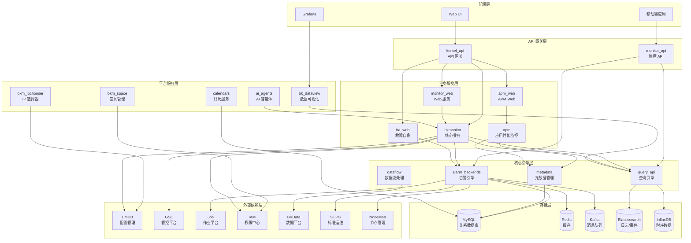

### alarm_backends 告警引擎架构

alarm_backends 是监控系统的核心告警引擎，采用微服务架构设计，由多个独立的服务进程组成，每个服务负责告警处理流程中的特定环节。

#### 告警引擎服务组件

| 服务名称        | 职责描述                                                     | 进程类型   |
| --------------- | ------------------------------------------------------------ | ---------- |
| **access**      | 数据接入服务，负责从不同数据源拉取原始数据、事件数据、告警数据，进行维度补充和范围过滤 | 数据接入   |
| **detect**      | 检测服务，负责对接入的数据进行算法检测，包括阈值检测、多指标计算、异常检测等，输出异常点 | 检测引擎   |
| **trigger**     | 触发服务，负责根据检测结果和策略配置判断是否触发告警事件     | 触发引擎   |
| **alert**       | 告警处理服务，负责告警事件的关联分析和处理                   | 事件处理   |
| **converge**    | 收敛服务，负责告警收敛，按照收敛维度和时间窗口进行告警聚合   | 收敛引擎   |
| **fta_action**  | 故障自愈动作服务，负责执行告警处理动作，包括通知、自愈套餐执行等 | 动作执行   |
| **nodata**      | 无数据检测服务，负责检测数据源是否正常上报数据               | 无数据检测 |
| **recovery**    | 恢复检测服务，负责检测告警是否恢复正常，触发恢复通知         | 恢复检测   |
| **composite**   | 复合策略服务，负责处理多指标关联、组合检测等复杂策略         | 复合检测   |
| **scheduler**   | 调度服务，负责策略的定时调度和任务分发                       | 任务调度   |
| **selfmonitor** | 自监控服务，负责监控告警引擎自身的运行状态和性能指标         | 自监控     |
| **preparation** | 准备服务，负责策略配置的预处理和缓存更新                     | 配置管理   |
| **new_report**  | 报表服务，负责生成监控报表和统计数据                         | 报表生成   |

#### 告警处理数据流

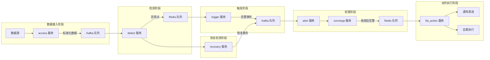

#### 告警引擎核心模块

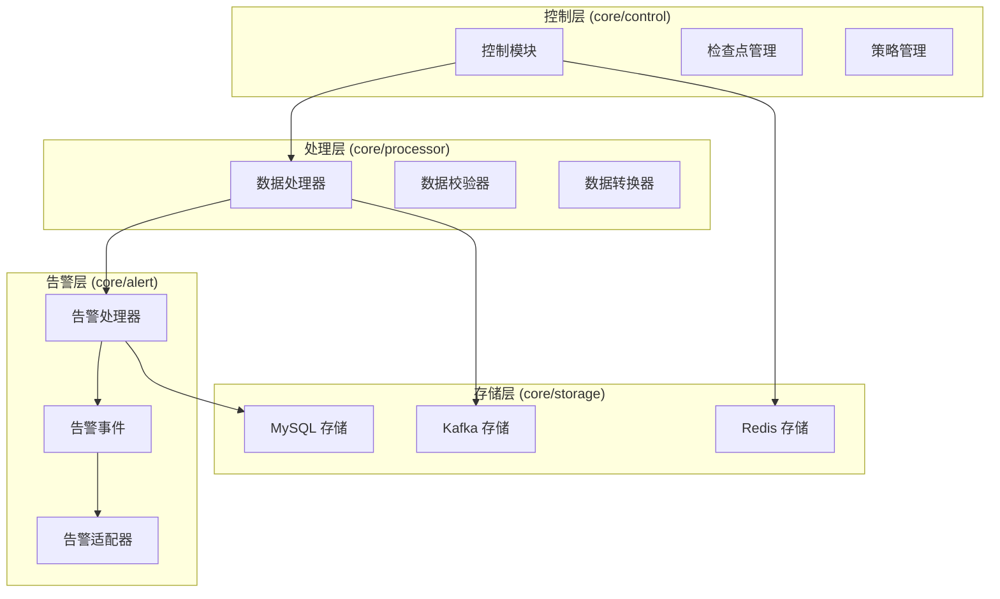

## bkmonitor 核心业务模块

bkmonitor 是监控平台的核心业务模块，包含了策略管理、数据源管理、数据流处理、告警动作等核心功能。

### 核心子模块

| 子模块             | 功能描述                                                     |
| ------------------ | ------------------------------------------------------------ |
| **strategy**       | 策略管理，包括策略配置、策略表达式解析、策略执行引擎、策略生命周期管理 |
| **data_source**    | 数据源管理，支持时序数据、日志数据、事件数据等多种数据源类型的接入和管理 |
| **dataflow**       | 数据流处理，负责数据清洗、聚合、降采样等数据处理任务         |
| **action**         | 告警动作管理，包括通知动作、自愈动作、自定义动作等           |
| **aiops**          | 智能运维，提供智能异常检测、根因分析等 AI 能力               |
| **iam**            | 权限管理，对接蓝鲸权限中心，实现资源授权和权限校验           |
| **models**         | 数据模型，定义监控系统的核心数据库模型                       |
| **utils**          | 工具模块，提供通用的工具函数和帮助类                         |
| **as_code**        | 配置即代码，支持通过代码方式管理监控配置                     |
| **event_plugin**   | 事件插件，支持自定义事件处理逻辑                             |
| **trace**          | 链路追踪，提供分布式追踪数据的查询和分析                     |
| **space**          | 空间管理，实现多租户空间隔离                                 |
| **query_template** | 查询模板，提供预定义的查询模板                               |
| **report**         | 报表管理，生成和管理监控报表                                 |
| **share**          | 共享管理，支持监控配置和仪表盘的分享                         |
| **documents**      | 文档管理，提供监控相关的文档和帮助信息                       |

## 数据流架构

### 数据采集与处理流程

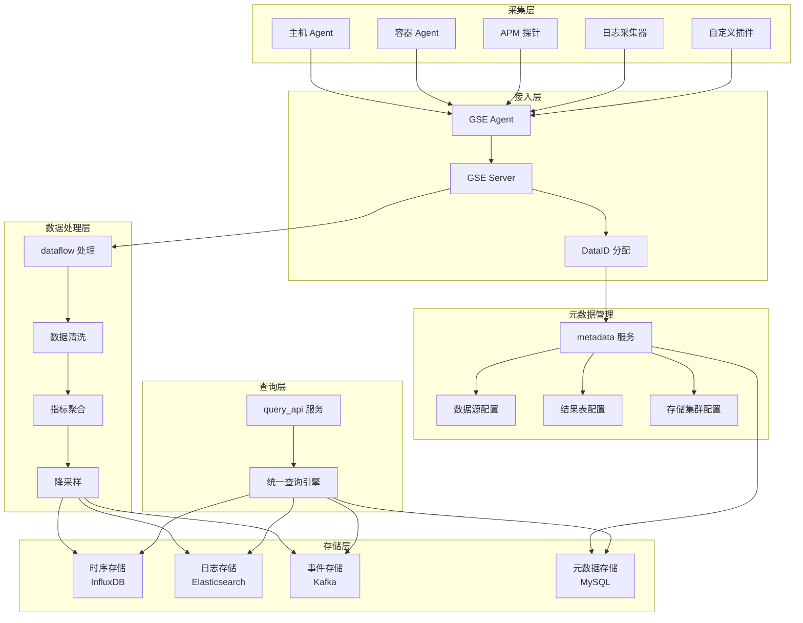

### 数据源类型与存储映射

| 数据源类型 | 数据特征                   | 存储引擎              | 查询方式     |
| ---------- | -------------------------- | --------------------- | ------------ |
| 时序数据   | 高频率、带时间戳的指标数据 | InfluxDB              | PromQL / SQL |
| 日志数据   | 非结构化文本数据           | Elasticsearch         | ES DSL / SQL |
| 事件数据   | 离散的事件信息             | Kafka / Elasticsearch | Event Query  |
| 追踪数据   | 分布式追踪 Span 数据       | Elasticsearch         | Trace Query  |
| 元数据     | 配置、策略、资源信息       | MySQL                 | SQL          |
| 缓存数据   | 临时数据、会话数据         | Redis                 | Key-Value    |

## 服务间交互关系

### 策略执行流程

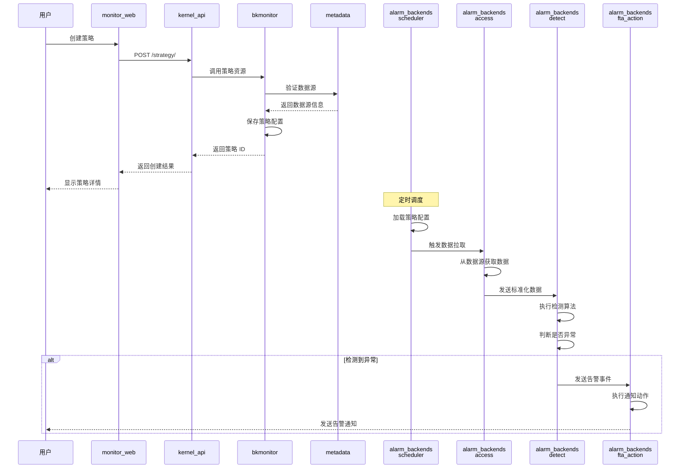

### 查询服务交互流程

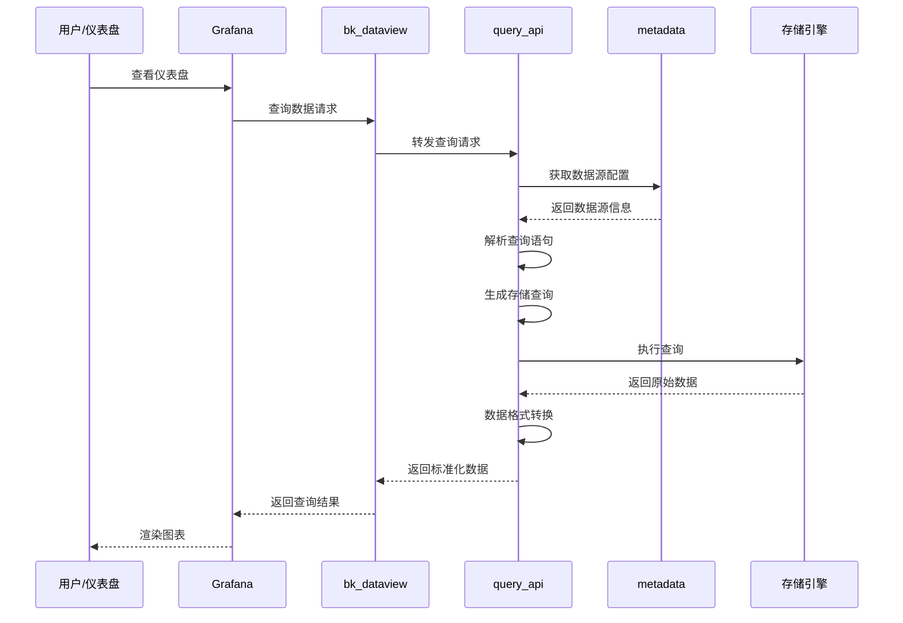

## 存储架构设计

### Redis 使用规范

#### Redis DB 分配策略

| DB 编号 | 用途                                  | 数据重要性 | 清理策略 |
| ------- | ------------------------------------- | ---------- | -------- |
| DB 7    | 日志相关数据                          | 低         | 可清理   |
| DB 8    | 配置缓存（CMDB 数据、策略、屏蔽配置） | 中         | 可清理   |
| DB 9    | 服务间队列、Celery Broker             | 高         | 不可清理 |
| DB 10   | 服务自身数据                          | 高         | 不可清理 |

#### Redis Key 命名规范

**命名格式**: `{app_code}.{platform}[.{env}].{service}.{type}.{identifier}`

**参数说明**:

- `app_code`: 应用代码，如 `bk_monitor`
- `platform`: 平台类型 (`ee` 企业版 / `ce` 社区版 / `te` 测试版)
- `env`: 环境标识（生产环境可省略）
- `service`: 服务名称 (`access`, `detect`, `trigger` 等)
- `type`: 数据类型 (`config`, `data`, `event`, `alert` 等)
- `identifier`: 具体标识（如 `strategy_1001`）

**示例**:

- 策略配置: `bk_monitor.ee.config.strategy_1001`
- 时序数据: `bk_monitor.ee.access.data.strategy_1001`
- 事件数据: `bk_monitor.ee.access.event.strategy_1001`
- 告警数据: `bk_monitor.ee.access.alert.strategy_1001`

#### Redis 使用要求

1. 所有 Key 必须带上标准前缀（第三方组件除外）
2. 所有 Key 必须设置过期时间，避免内存泄漏
3. 使用合适的数据结构（String / Hash / List / Set / ZSet）
4. 批量操作使用 Pipeline 提高性能

### MySQL 数据库架构

#### 数据库实例分配

| 数据库实例              | 用途                                               | 访问模式 |
| ----------------------- | -------------------------------------------------- | -------- |
| **backend_mysql**       | 告警后端数据库，存储告警事件、处理记录、策略配置等 | 读写     |
| **saas_mysql**          | SaaS 应用数据库，存储用户配置、权限信息等          | 读写     |
| **grafana_mysql**       | Grafana 数据库，存储仪表盘、数据源配置             | 读写     |
| **backend_alert_mysql** | 告警专用数据库，存储告警历史和统计数据             | 读写     |

#### 核心数据表分类

| 表分类     | 功能描述                                 | 所属模块           |
| ---------- | ---------------------------------------- | ------------------ |
| 策略配置表 | 存储监控策略、检测算法、触发条件等配置   | bkmonitor.strategy |
| 数据源表   | 存储数据源定义、结果表配置、存储集群信息 | metadata           |
| 告警事件表 | 存储告警事件、告警流水、处理记录         | alarm_backends     |
| 用户权限表 | 存储用户、角色、权限关系                 | bkmonitor.iam      |
| APM 配置表 | 存储 APM 应用、服务、追踪配置            | apm                |
| 日历表     | 存储值班日历、节假日配置                 | calendars          |
| 空间表     | 存储空间定义、资源关联关系               | bkm_space          |

### Kafka 消息队列架构

#### Topic 设计

| Topic 名称         | 用途             | 生产者          | 消费者                |
| ------------------ | ---------------- | --------------- | --------------------- |
| **data_access**    | 数据接入原始数据 | access 服务     | detect 服务           |
| **anomaly_detect** | 异常检测结果     | detect 服务     | trigger 服务          |
| **alert_event**    | 告警事件流       | trigger 服务    | alert / converge 服务 |
| **action_notice**  | 通知动作消息     | fta_action 服务 | 通知发送服务          |
| **recovery_event** | 恢复事件流       | recovery 服务   | alert 服务            |

#### 消息流转模式

- **数据接入**: access 服务将标准化数据写入 Kafka，保证数据可靠性
- **异步处理**: 各服务通过 Kafka 解耦，支持异步处理和削峰填谷
- **事件溯源**: Kafka 保留告警事件历史，支持事件回溯和审计
- **流式处理**: 支持流式数据处理和实时分析

### 时序数据存储

#### InfluxDB 存储策略

| 数据类型   | 保留策略 | 聚合策略     |
| ---------- | -------- | ------------ |
| 原始数据   | 7 天     | 无聚合       |
| 1 分钟聚合 | 30 天    | 1 分钟平均值 |
| 5 分钟聚合 | 90 天    | 5 分钟平均值 |
| 1 小时聚合 | 1 年     | 1 小时平均值 |
| 1 天聚合   | 永久     | 1 天平均值   |

#### 数据分片策略

- **按时间分片**: 数据按天或周进行分片，加速时间范围查询
- **按业务分片**: 不同业务的数据存储在不同的 Database
- **按数据源分片**: 高频数据源和低频数据源分离存储

## 扩展机制

### API 扩展机制

基于 Django REST Framework 的资源抽象机制，支持灵活的 API 扩展。

**核心组件**:

- **Resource 基类**: 定义统一的资源处理接口
- **Serializer**: 实现数据序列化和校验
- **Permission**: 实现细粒度的权限控制
- **Pagination**: 支持多种分页方式

**扩展方式**:

1. 继承 Resource 基类，实现 `perform_request` 方法
2. 定义 Serializer 进行参数校验和数据格式化
3. 配置 Permission 类进行权限控制
4. 注册路由到 kernel_api 或 monitor_api

### 插件系统

#### 采集插件

- **插件类型**: Script / Exporter / DataSource / Log / Process
- **插件管理**: 通过 node_man 进行插件分发和版本管理
- **配置管理**: 支持插件参数配置和模板管理

#### 通知插件

- **内置通知方式**: 微信、邮件、短信、电话、企业微信、钉钉
- **扩展通知方式**: 支持自定义通知渠道插件
- **通知模板**: 支持 Jinja2 模板自定义通知内容

#### 动作插件

- **内置动作**: 通知、自愈套餐、作业平台执行、标准运维流程
- **自定义动作**: 支持 HTTP 回调、Webhook、自定义脚本
- **动作编排**: 支持多个动作的串行和并行执行

### 权限模型扩展

#### 资源类型定义

| 资源类型           | 资源示例  | 操作权限                     |
| ------------------ | --------- | ---------------------------- |
| 业务 (biz)         | 业务 ID   | 查看、编辑                   |
| 策略 (strategy)    | 策略 ID   | 查看、创建、编辑、删除       |
| 仪表盘 (dashboard) | 仪表盘 ID | 查看、创建、编辑、删除、分享 |
| 告警 (alert)       | 告警 ID   | 查看、处理、屏蔽             |
| 空间 (space)       | 空间 ID   | 查看、管理                   |

#### 权限校验流程

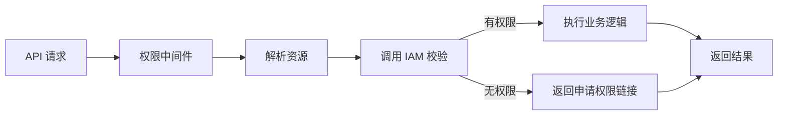

### 配置驱动扩展

#### 配置管理

- **环境配置**: 通过环境变量注入运行时配置
- **动态配置**: 支持通过数据库或配置中心动态更新配置
- **配置版本**: 支持配置版本管理和回滚

#### 模板引擎

- **通知模板**: 使用 Jinja2 模板渲染通知内容
- **查询模板**: 预定义常用查询模板
- **配置模板**: 支持策略、仪表盘等配置的模板化

#### 热更新机制

- **策略热更新**: scheduler 服务定期从数据库加载最新策略配置
- **配置缓存**: 使用 Redis 缓存配置，减少数据库访问
- **信号通知**: 配置变更时发送信号，通知相关服务更新缓存

## 服务部署架构

### 容器化部署

所有服务支持 Docker 容器化部署，通过环境变量和配置文件注入实现配置管理。

#### 服务角色分类

| 角色       | 服务列表                                               | 部署方式                  |
| ---------- | ------------------------------------------------------ | ------------------------- |
| **web**    | monitor_web, fta_web, apm_web, kernel_api, monitor_api | Web 容器，支持水平扩展    |
| **worker** | alarm_backends (所有服务)                              | Worker 容器，支持水平扩展 |
| **api**    | kernel_api, monitor_api                                | API 容器，支持水平扩展    |
| **celery** | Celery Worker, Celery Beat                             | 异步任务容器              |

#### 服务编排

使用 Supervisor 或 Kubernetes 进行服务编排和进程管理。

**Supervisor 配置生成**:

```
通过 manage.py gen_config 命令生成 supervisord.conf 配置文件，
配置文件位于 alarm_backends/conf/supervisord.conf
```

**Kubernetes 部署**:

- 每个服务对应一个 Deployment
- 使用 Service 暴露服务端口
- 使用 ConfigMap 管理配置
- 使用 Secret 管理敏感信息

### 服务依赖关系

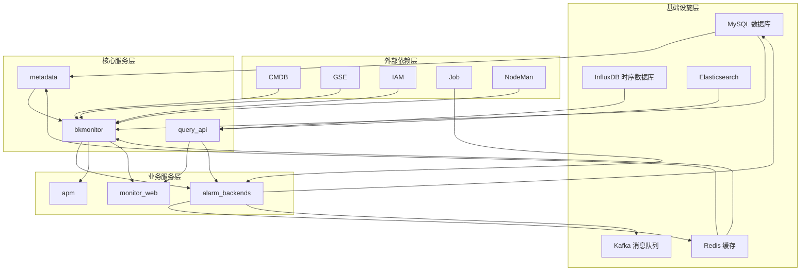

## 集群架构设计

### 集群部署模式

bk-monitor 支持多种集群部署模式，实现高可用、负载均衡和水平扩展能力。

#### 部署模式类型

| 部署模式     | 适用场景       | 特点                                             |
| ------------ | -------------- | ------------------------------------------------ |
| **单机模式** | 开发测试环境   | 所有服务运行在单一节点，资源占用低               |
| **容器模式** | 容器化部署     | 每个容器运行单一服务实例，通过容器编排实现高可用 |
| **集群模式** | 生产环境       | 多节点部署，支持负载均衡和故障转移               |
| **混合模式** | 大规模生产环境 | Web 服务和 Worker 服务分离部署，资源隔离         |

### 服务发现机制

#### Consul 服务注册与发现

系统使用 Consul 作为服务发现和配置中心，实现服务间的自动发现和配置同步。

**核心功能**:

- **服务注册**: 每个服务启动时向 Consul 注册自身信息
- **健康检查**: Consul 定期检查服务健康状态
- **服务发现**: 服务通过 Consul 发现其他服务的地址
- **配置管理**: 集中管理和分发配置信息
- **Leader 选举**: 支持主从节点选举机制

**Consul 配置路径规范**:

| 配置类型          | Consul 路径                               | 用途                                  |
| ----------------- | ----------------------------------------- | ------------------------------------- |
| 存储集群配置      | `/v1/metadata/unify-query/data/storage`   | 存储集群信息（InfluxDB、ES、Kafka等） |
| InfluxDB 集群     | `/v1/metadata/influxdb_info/cluster_info` | InfluxDB 集群配置                     |
| InfluxDB 主机     | `/v1/metadata/influxdb_info/host_info`    | InfluxDB 节点信息                     |
| InfluxDB 标签路由 | `/v1/metadata/influxdb_info/tag_info`     | 基于标签的数据路由配置                |
| 数据源配置        | `/v1/metadata/data_id`                    | 数据源元数据                          |
| 服务注册路径      | `/v1/service/{service_name}`              | 服务实例注册信息                      |

#### HashRing 一致性哈希机制

告警后端服务使用 HashRing 机制实现负载均衡和 Leader 选举。

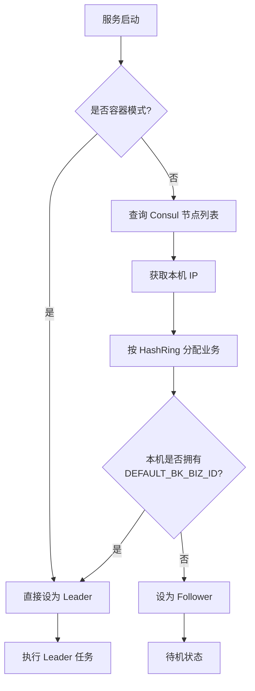

**HashRing 工作原理**:

1. 所有服务节点向 Consul 注册
2. 通过一致性哈希算法将业务 ID 分配到不同节点
3. 拥有 DEFAULT_BK_BIZ_ID 的节点成为 Leader
4. Leader 负责执行全局任务（如健康检查、定时调度）
5. Follower 节点处理分配给自己的业务

### 存储集群架构

#### 集群信息模型

**ClusterInfo 核心字段**:

| 字段                        | 类型                           | 说明                                                    |
| --------------------------- | ------------------------------ | ------------------------------------------------------- |
| cluster_id                  | AutoField                      | 集群唯一标识                                            |
| cluster_name                | CharField                      | 集群名称                                                |
| cluster_type                | CharField                      | 集群类型（influxdb/kafka/redis/elasticsearch/vm/doris） |
| domain_name                 | CharField                      | 集群域名                                                |
| port                        | IntegerField                   | 服务端口                                                |
| is_default_cluster          | BooleanField                   | 是否为默认集群                                          |
| username / password         | CharField / SymmetricTextField | 认证信息                                                |
| schema                      | CharField                      | 访问协议（http/https）                                  |
| is_ssl_verify               | BooleanField                   | 是否启用 SSL 验证                                       |
| ssl_certificate_authorities | TextField                      | CA 证书内容                                             |
| registered_system           | CharField                      | 注册来源系统                                            |
| label                       | CharField                      | 用途标签                                                |

#### InfluxDB 集群管理

**三层架构**:

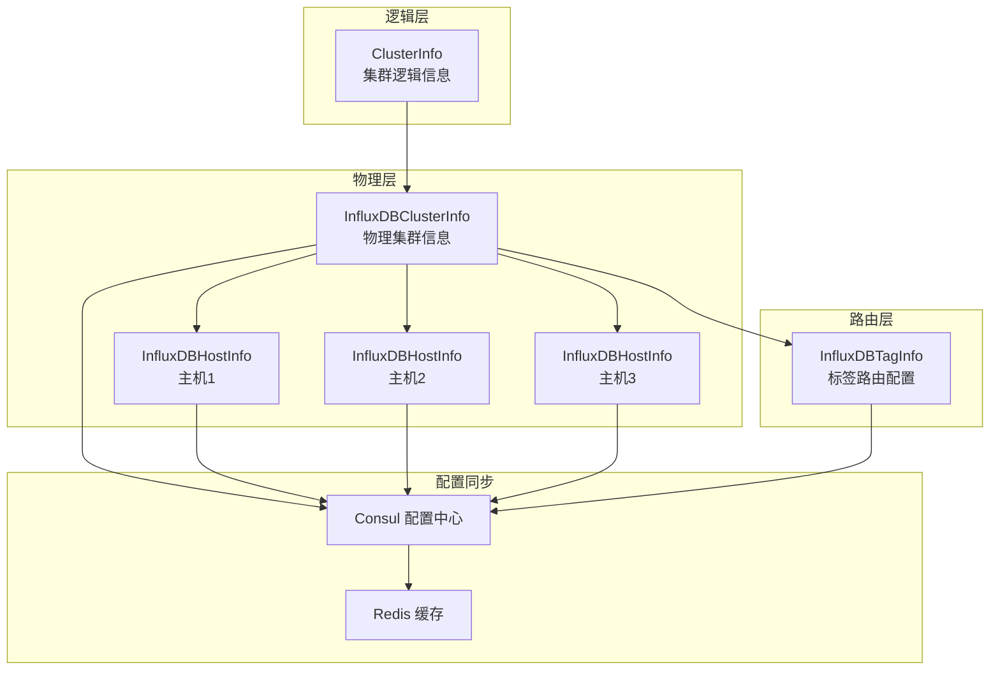

**InfluxDBClusterInfo 功能**:

- 管理物理 InfluxDB 集群配置
- 维护集群内主机列表
- 区分可读/不可读主机
- 同步配置到 Consul 和 Redis

**InfluxDBHostInfo 功能**:

- 存储单个 InfluxDB 实例的连接信息
- 支持主机级别的读写控制
- 管理默认 Retention Policy
- 提供健康检查接口

**InfluxDBTagInfo 功能**:

- 基于标签实现数据分片路由
- 支持按 database/measurement/tag 三级路由
- 配置数据写入和查询的目标主机
- 支持强制写入和手动不可读主机配置

#### Consul + Redis 双写机制

系统采用 Consul + Redis 双写架构，结合配置管理和高性能缓存的优势。

**设计目的**:

| 特性           | Consul   | Redis     | 互补作用                |
| -------------- | -------- | --------- | ----------------------- |
| **配置管理**   | ✅ 强项   | ❌ 不适合  | Consul 作为配置权威源   |
| **服务发现**   | ✅ 强项   | ❌ 不适合  | Consul 提供服务注册发现 |
| **高性能读取** | ⚠️ 一般   | ✅ 强项    | Redis 提供毫秒级查询    |
| **消息通知**   | ❌ 不支持 | ✅ Pub/Sub | Redis 实时推送配置变更  |
| **数据持久化** | ✅ 持久化 | ⚠️ 易丢失  | Consul 保证数据可靠性   |

**配置同步流程**:

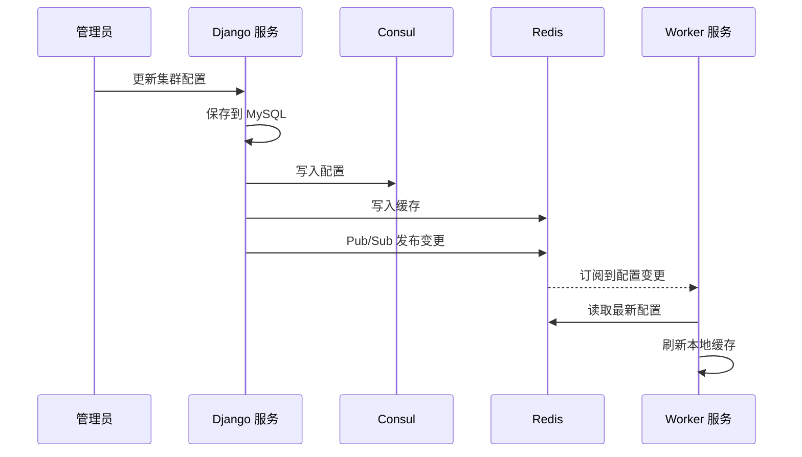

**应用场景**:

1. **UnifyQuery 路由查询**: 优先从 Redis 读取表路由信息，加速查询
2. **Transfer 数据写入**: 从 Redis 获取存储集群配置，减少 Consul 压力
3. **配置热更新**: 通过 Redis Pub/Sub 实时通知服务配置变更

### Redis 集群架构

#### 客户端分片架构

告警后端使用客户端分片（Client-side Sharding）实现 Redis 集群访问。

**核心组件**:

| 组件                  | 职责                                      |
| --------------------- | ----------------------------------------- |
| **RedisProxy**        | 代理所有 Redis 操作，实现路由和连接池管理 |
| **CacheNode**         | 存储 Redis 节点信息（主机、端口、密码）   |
| **CacheRouter**       | 存储路由规则（策略 ID 范围 -> 节点映射）  |
| **RedisNode**         | 普通 Redis 连接                           |
| **SentinelRedisNode** | Redis Sentinel 高可用连接                 |

**分片路由机制**:

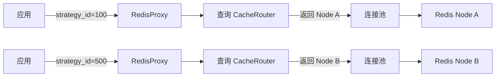

**路由规则**:

- CacheRouter 表存储路由规则：`(cluster_name, strategy_score, node)`
- 按 strategy_score 升序排列
- 查询时找到第一个 `strategy_score > strategy_id` 的记录
- 返回对应的 CacheNode
- 支持默认节点兜底（strategy_id = 0）

**支持的部署模式**:

| 模式         | 实现类            | 特点                 |
| ------------ | ----------------- | -------------------- |
| **单机模式** | RedisNode         | 直接连接 Redis 实例  |
| **哨兵模式** | SentinelRedisNode | 自动故障转移，高可用 |
| **集群模式** | RedisNode         | 客户端分片，水平扩展 |

#### Pipeline 批量操作

RedisProxy 支持 Pipeline 批量操作，提高性能。

**PipelineProxy 特性**:

- 自动按节点分组 Pipeline 命令
- 每个节点独立的 Pipeline 实例
- 执行时批量获取结果并按原始顺序返回
- 减少网络往返次数

### 告警引擎集群路由

#### 业务分片机制

告警引擎支持基于业务 ID 的集群路由，将不同业务的告警任务分配到不同集群。

**核心概念**:

| 概念            | 说明                                            |
| --------------- | ----------------------------------------------- |
| **Cluster**     | 集群定义，包含名称、编码、标签、路由规则        |
| **RoutingRule** | 路由规则，定义目标类型、匹配器、目标集群        |
| **TargetType**  | 目标类型（biz 业务 / alert_data_id 告警数据源） |
| **Matcher**     | 匹配器（true/false/condition 条件匹配）         |

**集群路由流程**:

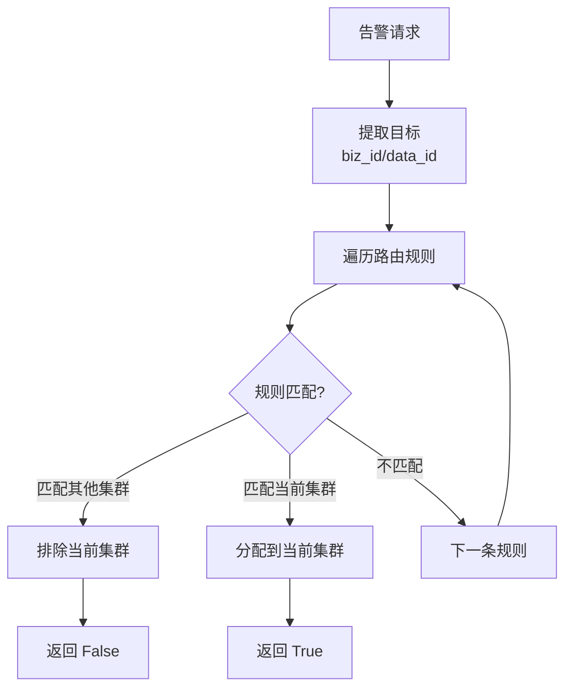

**匹配器类型**:

| 匹配器               | 说明                     | 配置示例                                                     |
| -------------------- | ------------------------ | ------------------------------------------------------------ |
| **TrueMatcher**      | 总是返回 True，兜底规则  | `{"matcher_type": "true"}`                                   |
| **FalseMatcher**     | 总是返回 False，排除规则 | `{"matcher_type": "false"}`                                  |
| **ConditionMatcher** | 条件表达式匹配           | `{"matcher_type": "condition", "matcher_config": [{"method": "gte", "value": 100}]}` |

**应用场景**:

1. 大业务独立集群：将大业务（如业务 ID 100）路由到专属集群
2. 灰度发布：将指定业务路由到新版本集群进行测试
3. 租户隔离：不同租户的告警数据路由到隔离的集群

### 集群高可用设计

#### 服务级高可用

| 高可用策略     | 实现方式                               | 故障恢复时间 |
| -------------- | -------------------------------------- | ------------ |
| **多实例部署** | 同一服务部署多个实例                   | 秒级         |
| **健康检查**   | Consul 定期检查服务健康                | 10-30秒      |
| **自动重启**   | Supervisor/Kubernetes 自动重启失败进程 | 秒级         |
| **负载均衡**   | 请求分散到多个实例                     | 无感知       |
| **熔断降级**   | 异常时自动切断故障服务                 | 毫秒级       |

#### 存储级高可用

| 存储类型          | 高可用方案          | 数据一致性       |
| ----------------- | ------------------- | ---------------- |
| **MySQL**         | 主从复制 + 读写分离 | 最终一致         |
| **Redis**         | Sentinel 哨兵模式   | 强一致（主节点） |
| **Kafka**         | 多副本机制          | 最终一致         |
| **InfluxDB**      | 多节点 + Proxy 路由 | 最终一致         |
| **Elasticsearch** | 集群模式 + 副本分片 | 最终一致         |

#### 故障转移机制

**自动故障转移流程**:

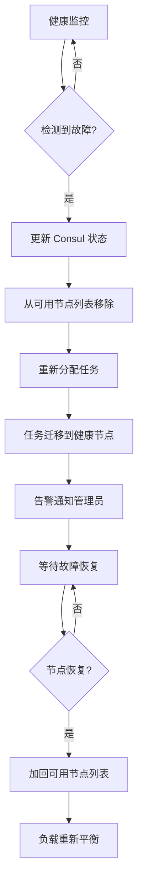

## 技术栈

### 后端技术栈

| 技术                  | 版本   | 用途          |
| --------------------- | ------ | ------------- |
| Python                | 3.6.15 | 主要编程语言  |
| Django                | 3.x    | Web 框架      |
| Django REST Framework | -      | REST API 框架 |
| Celery                | -      | 异步任务队列  |
| uv                    | latest | 依赖管理工具  |

### 前端技术栈

| 技术        | 版本    | 用途                |
| ----------- | ------- | ------------------- |
| Node.js     | 18.18.2 | JavaScript 运行环境 |
| npm / pnpm  | latest  | 包管理工具          |
| Vue / React | -       | 前端框架            |

### 存储技术栈

| 技术          | 用途                     |
| ------------- | ------------------------ |
| MySQL         | 关系数据存储             |
| Redis         | 缓存、队列               |
| Kafka         | 消息队列                 |
| InfluxDB      | 时序数据存储             |
| Elasticsearch | 日志、事件、追踪数据存储 |

### 运维技术栈

| 技术       | 用途             |
| ---------- | ---------------- |
| Docker     | 容器化           |
| Supervisor | 进程管理         |
| Grafana    | 数据可视化       |
| Prometheus | 指标采集（可选） |

## 数据 ID 分配规则

GSE 为监控平台分配的 DataID 范围: `[1048576, 2097151]`

### DataID 分段规则

| 范围              | 用途                     | 说明                       |
| ----------------- | ------------------------ | -------------------------- |
| 1048576 ~ 1099999 | 保留范围                 | 预留给系统内部使用         |
| 1100000 ~ 1199999 | 内置数据源 ID            | 系统预定义的数据源         |
| 1200000 ~ 1499999 | 用户自定义数据源 (V3.1)  | V3.1 版本用户创建的数据源  |
| 1500000 ~ 2097151 | 用户自定义数据源 (V3.2+) | V3.2+ 版本用户创建的数据源 |

### 内置数据源分配记录

| DataID  | 用途                               | 引入版本 |
| ------- | ---------------------------------- | -------- |
| 1100000 | 全业务字符型告警上报               | V3.0.x   |
| 1100001 | 全业务采集器任务心跳上报（全局）   | V3.2.x   |
| 1100002 | 全业务采集器任务心跳上报（单任务） | V3.2.x   |
| 1100003 | 全业务 ping 拨测上报               | V3.2.x   |
| 1100004 | bkmonitorproxy 心跳上报            | V3.2.x   |
| 1100005 | pingserver 数据上报                | V3.2.x   |