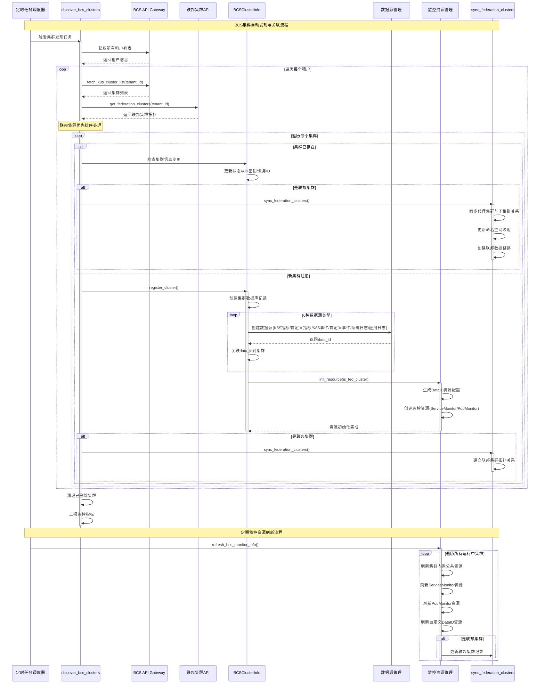
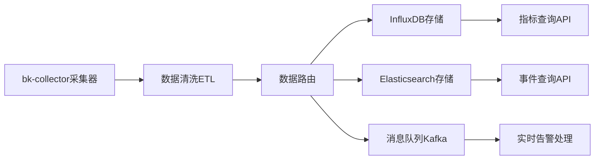
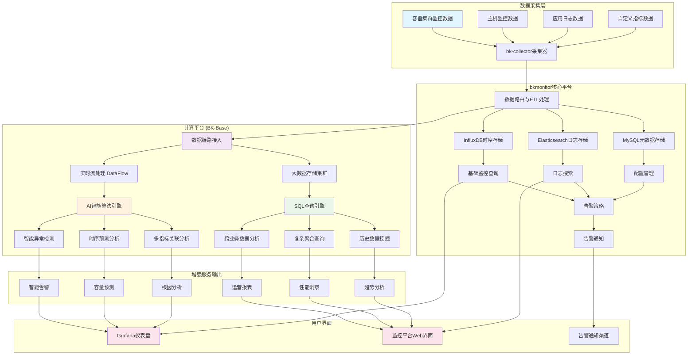
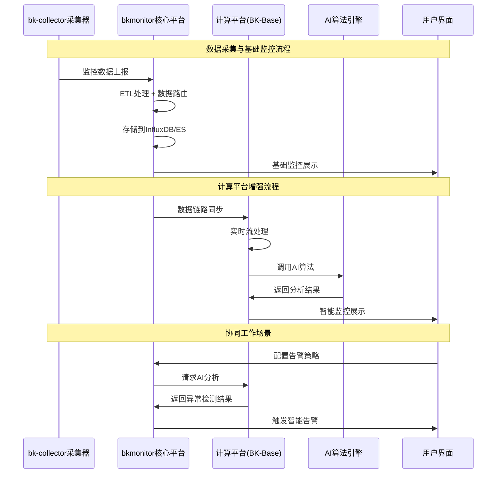
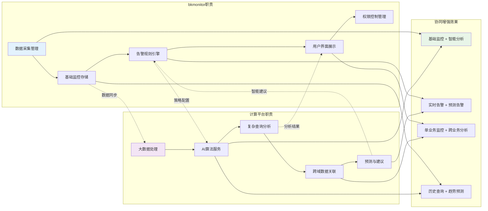
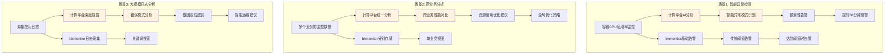

# 1、bkmonitor 项目是如何关联BCS集群的

基于之前对bkmonitor项目BCS集群关联机制的分析，我来为您绘制一个BCS集群自动发现与关联的时序图：



这个时序图展示了bkmonitor项目中BCS集群关联的完整流程，包括：

## 主要阶段

### 1. 集群发现阶段

- 定时任务触发集群发现
- 获取所有租户和集群信息
- 获取联邦集群拓扑关系

### 2. 集群处理阶段

- 联邦集群优先处理（满足数据链路依赖）
- 区分新集群注册和已有集群更新
- 自动创建6种类型的监控数据源

### 3. 资源初始化阶段

- 创建DataID资源配置
- 初始化ServiceMonitor和PodMonitor
- 建立联邦集群的拓扑关系和命名空间映射

### 4. 持续监控阶段

- 定期刷新监控资源配置
- 同步集群状态变更
- 维护联邦集群关系

## 关键特性

1. **自动化**：全程无需人工干预，自动发现和注册集群
2. **联邦支持**：完整支持BCS联邦集群架构
3. **多数据源**：每个集群自动创建完整的监控数据源体系
4. **实时同步**：定期同步集群状态和监控资源配置

这种设计确保了bkmonitor能够无缝集成到蓝鲸BCS生态中，为容器化环境提供完整的监控解决方案。


----

## 2、集群注册的核心作用

### 1. **监控数据源体系建设**

集群注册不仅仅是存储集群基本信息，更重要的是为每个集群创建完整的监控数据采集体系：

```python
# 从代码可以看到，每个集群注册时会创建6种数据源
DATASOURCE_REGISTER_INFO = {
    DATA_TYPE_K8S_METRIC: {          # K8S内置指标
        "etl_config": "bk_standard_v2_time_series",
        "is_system": True,
        "usage": "metric",
    },
    DATA_TYPE_CUSTOM_METRIC: {       # 自定义指标  
        "etl_config": "bk_standard_v2_time_series",
        "is_system": False,
        "usage": "metric",
    },
    DATA_TYPE_K8S_EVENT: {           # K8S事件
        "etl_config": "bk_standard_v2_event",
        "is_system": True,
        "usage": "event",
    },
    # ... 还有日志等其他类型
}
```

### 2. **数据采集链路建设**

注册过程中会为每种数据源：

- **创建DataID**：分配唯一的数据标识符
- **配置ETL处理**：设置数据清洗和转换规则
- **建立存储映射**：创建结果表和存储配置
- **设置路由规则**：配置数据传输和分发路径

### 3. **监控资源初始化**

```python
def init_resource(self, is_fed_cluster: bool | None = False) -> bool:
    # 为集群创建监控资源配置
    for usage, register_info in self.DATASOURCE_REGISTER_INFO.items():
        # 生成DataID资源配置并写入BCS集群
        dataid_config = self.make_config(register_info, usage=usage, is_fed_cluster=is_fed_cluster)
        # 确保监控资源在Kubernetes集群中存在
        ensure_data_id_resource(self.api_client, name, dataid_config)
```

这个过程会在BCS集群中创建：

- **DataID ConfigMap**：配置数据采集参数
- **ServiceMonitor CRD**：服务级监控配置
- **PodMonitor CRD**：Pod级监控配置

### 4. **联邦集群支持**

对于联邦集群架构，注册过程还会：

- **建立拓扑关系**：记录代理集群与子集群的关系
- **配置命名空间映射**：管理跨集群的命名空间访问
- **创建数据链路**：设置联邦集群的数据聚合路径

## 后续使用场景

### 1. **监控数据采集**

注册后的集群可以：

- 自动采集Pod、Node、Service等K8S资源指标
- 收集集群事件和日志
- 支持用户自定义指标上报

### 2. **告警规则配置**

- 基于注册的DataID创建告警策略
- 利用集群维度进行告警收敛
- 支持跨集群的告警关联分析

### 3. **数据查询和可视化**

- 通过统一的查询接口访问集群监控数据
- 在Grafana中展示集群监控大盘
- 支持多集群数据对比分析

### 4. **权限和空间管理**

- 基于业务ID和项目ID进行权限控制
- 支持多租户隔离的监控数据访问
- 实现空间级别的监控资源管理

## 为什么不能简单存储？

如果只是简单地将集群信息存到数据库：

❌ **缺少数据采集能力**：无法从集群获取监控数据
❌ **缺少监控配置**：无法创建告警规则和监控策略  
❌ **缺少数据处理**：无法进行指标聚合和事件关联
❌ **缺少权限控制**：无法实现多租户隔离访问
❌ **缺少联邦支持**：无法处理复杂的集群拓扑关系

## 总结

集群注册是一个**监控基础设施初始化**的过程，它将一个"裸"的集群信息转换为一个具备完整监控能力的监控目标。这个过程确保了：

1. **数据可采集**：建立了从集群到监控平台的数据通道
2. **数据可处理**：配置了数据清洗、聚合、存储的完整链路
3. **数据可使用**：提供了查询、告警、可视化的基础能力
4. **管理可控制**：实现了权限、租户、空间的统一管理

这就像买了一台新电脑，你不仅要把它搬回家（存储基本信息），还要安装操作系统、驱动程序、应用软件（注册初始化），才能真正使用它的功能。


---

# 3、注册集群后，怎么就可以从集群中获取到监控数据了

这是一个很好的问题！让我详细解释注册集群后，监控数据是如何从集群中获取的整个流程：

## 监控数据获取的完整链路

### 1. **集群注册时创建的关键组件**

当集群注册完成后，系统会在BCS集群中创建以下关键的监控组件：

```python
def init_resource(self, is_fed_cluster: bool | None = False) -> bool:
    # 为每种数据源创建Kubernetes CRD资源
    for usage, register_info in self.DATASOURCE_REGISTER_INFO.items():
        dataid_config = self.make_config(register_info, usage=usage, is_fed_cluster=is_fed_cluster)
        # 在集群中创建DataID ConfigMap
        ensure_data_id_resource(self.api_client, name, dataid_config)
```

这会在BCS集群中创建：

- **DataID ConfigMap**：包含数据采集配置和路由信息
- **ServiceMonitor CRD**：定义服务级监控采集规则
- **PodMonitor CRD**：定义Pod级监控采集规则

### 2. **数据采集组件的工作原理**
现在让我详细解释注册集群后如何获取监控数据的完整流程：

## 监控数据获取的完整链路

### 1. **数据采集组件部署**

集群注册时，系统会在BCS集群中部署以下采集组件：

```python
# 关键的DataID配置会创建为Kubernetes ConfigMap
dataid_config = {
    "apiVersion": f"{config.BCS_RESOURCE_GROUP_NAME}/{config.BCS_RESOURCE_VERSION}",
    "kind": f"{config.BCS_RESOURCE_DATA_ID_RESOURCE_KIND}",
    "metadata": {
        "name": self.compose_dataid_resource_name(datasource_name.lower()),
        "labels": self.compose_dataid_resource_label(labels),
    },
    "spec": {
        "dataID": getattr(self, datasource_name),  # 对应的DataID
        "labels": {"bcs_cluster_id": self.cluster_id, "bk_biz_id": str(self.bk_biz_id)},
        "metricReplace": replace_config[ReplaceConfig.REPLACE_TYPES_METRIC],
        "dimensionReplace": replace_config[ReplaceConfig.REPLACE_TYPES_DIMENSION],
    },
}
```

### 2. **采集器工作机制**
基于代码分析，现在我可以完整解释注册集群后如何获取监控数据的流程：

## 监控数据获取的完整流程

### 1. **采集组件部署**

集群注册时会在BCS集群中部署 **bk-collector** 采集器：

```yaml
# bk-collector Deployment 会被部署到集群中
apiVersion: apps/v1
kind: Deployment
metadata:
  name: bkm-collector
  namespace: bkmonitor-operator
spec:
  # ... bk-collector配置
```

**bk-collector** 的作用：

- 作为统一的数据采集代理
- 支持 Prometheus、OpenTelemetry、Jaeger、Skywalking 等主流协议
- 负责数据清洗、转发到监控平台链路

### 2. **DataID 配置下发**

注册时创建的 ConfigMap 包含了关键的数据采集配置：

```python
# 每种数据源都会创建对应的 ConfigMap
dataid_config = {
    "spec": {
        "dataID": 60010,  # 对应的DataID
        "labels": {
            "bcs_cluster_id": "BCS-K8S-40001", 
            "bk_biz_id": "1001"
        },
        "metricReplace": {...},     # 指标名替换规则
        "dimensionReplace": {...}   # 维度替换规则
    }
}
```

### 3. **Prometheus 监控采集**

**bk-collector** 会根据以下资源自动发现监控目标：

#### A. ServiceMonitor CRD

```yaml
apiVersion: monitoring.coreos.com/v1
kind: ServiceMonitor
metadata:
  name: my-app-monitor
spec:
  selector:
    matchLabels:
      app: my-app
  endpoints:
  - port: metrics
    path: /metrics
```

#### B. PodMonitor CRD  

```yaml
apiVersion: monitoring.coreos.com/v1
kind: PodMonitor
metadata:
  name: pod-monitor
spec:
  selector:
    matchLabels:
      app: my-pod
  podMetricsEndpoints:
  - port: metrics
```

### 4. **数据采集过程**

**bk-collector** 会从以下数据源采集监控数据：

#### A. **Node-Exporter 指标**

```bash
# bk-collector 自动发现并采集 Node-Exporter 暴露的系统指标
# 采集端点: http://node-ip:9100/metrics
node_cpu_seconds_total{mode="idle"}      # CPU使用率
node_memory_MemTotal_bytes               # 内存总量
node_memory_MemFree_bytes                # 空闲内存
node_filesystem_size_bytes               # 磁盘容量
node_load15                              # 系统负载
```

#### B. **Kubelet 指标**

```bash
# Kubelet 内置指标接口: https://node-ip:10250/metrics
kubelet_running_containers               # 运行中的容器数
kubelet_running_pods                     # 运行中的Pod数
kubelet_volume_stats_available_bytes     # 存储卷可用空间
kubelet_pod_start_duration_seconds       # Pod启动耗时
```

#### C. **cAdvisor 指标**

```bash
# 容器资源使用指标: https://node-ip:10250/metrics/cadvisor
container_cpu_usage_seconds_total        # 容器CPU使用时间
container_memory_usage_bytes             # 容器内存使用量
container_network_receive_bytes_total    # 容器网络接收字节
container_fs_usage_bytes                 # 容器文件系统使用量
```

### 5. **数据处理和路由**



**数据处理流程**：

1. **数据清洗**：根据 ETL 配置进行数据标准化
2. **维度替换**：应用 dimensionReplace 规则统一维度命名
3. **指标替换**：应用 metricReplace 规则规范指标名称
4. **数据路由**：根据 DataID 路由到对应的存储系统

### 6. **数据查询接口**

注册完成后，可以通过以下方式查询监控数据：

```python
# 通过 PromQL 查询CPU使用率
promql = f'(1 - avg(irate(node_cpu_seconds_total{{mode="idle", bcs_cluster_id="{cluster_id}"}}[5m]))) * 100'

# 通过统一查询API获取数据
api.unify_query.query_data({
    "bk_biz_id": bk_biz_id,
    "query_configs": [{
        "data_source_label": "bk_monitor",
        "data_type_label": "time_series", 
        "table": f"{bk_biz_id}_bkmonitor_time_series_{data_id}.__default__",
        "metrics": [{"field": "node_cpu_seconds_total", "method": "avg"}],
        "where": [{"key": "bcs_cluster_id", "value": [cluster_id]}]
    }]
})
```

## 总结

注册集群后能够获取监控数据的关键在于：

1. **部署了数据采集器**：bk-collector 作为统一采集代理
2. **配置了采集规则**：通过 ServiceMonitor/PodMonitor CRD 自动发现监控目标
3. **建立了数据链路**：从采集→清洗→存储→查询的完整数据流
4. **提供了统一接口**：通过 DataID 标识的数据源体系提供查询服务

这样，当你在监控平台看到集群的CPU、内存、Pod状态等指标时，实际上是 bk-collector 从集群中的各个组件（Node-Exporter、Kubelet、cAdvisor等）采集来的数据，经过处理后存储在监控平台的时序数据库中，最终通过查询接口呈现给用户。

---

# 4、bkmonitor 项目中，计算平台是用来干什么的

基于代码搜索结果和项目知识，我可以为您详细解释bkmonitor项目中计算平台的作用：

## bkmonitor 项目中计算平台的作用

在bkmonitor项目中，**计算平台（BK-Base）**是一个重要的数据处理和分析引擎，主要承担以下几个核心功能：

### 1. **数据链路与存储增强**

计算平台作为监控数据的**高级存储和计算引擎**：

```python
# 接入计算平台链路
def create_bkbase_data_link(
    data_source: DataSource,
    monitor_table_id: str,
    storage_cluster_name: str,
    data_link_strategy: str = DataLink.BK_STANDARD_V2_TIME_SERIES,
    namespace: str = settings.DEFAULT_VM_DATA_LINK_NAMESPACE,
    bcs_cluster_id: str = None,
):
    """申请计算平台链路"""
    # 组装生成计算平台侧需要的data_name和rt_name
    bkbase_data_name = compose_bkdata_data_id_name(data_name=data_source.data_name)
    bkbase_rt_name = compose_bkdata_table_id(table_id=monitor_table_id)
```

### 2. **智能检测与分析服务**

计算平台提供多种AI算法服务用于智能监控：

```python
# 计算平台AI场景配置
BK_DATA_SCENE_ID_INTELLIGENT_DETECTION = 0      # 单指标异常检测
BK_DATA_SCENE_ID_TIME_SERIES_FORECASTING = 0    # 时序预测
BK_DATA_SCENE_ID_ABNORMAL_CLUSTER = 0           # 离群检测
BK_DATA_SCENE_ID_MULTIVARIATE_ANOMALY_DETECTION = 0  # 多指标异常检测
BK_DATA_SCENE_ID_METRIC_RECOMMENDATION = 0      # 指标推荐
BK_DATA_SCENE_ID_HOST_ANOMALY_DETECTION = 0     # 主机异常检测
```

### 3. **大规模数据处理与计算**

通过DataFlow提供实时流处理能力：

```python
# 计算平台流处理配置
class BkDataFlow:
    def start_flow(self, consuming_mode: Optional[str] = ConsumingMode.Tail) -> bool:
        """启动数据流"""
        # 创建flow用于数据实时处理
        if not ResultTableFlow.create_flow(self.table_id):
            return False
```

### 4. **数据查询增强**

提供SQL查询能力，补充监控平台的时序查询：

```python
# 计算平台结果表存储
class BkBaseResultTable(models.Model):
    """计算平台结果表"""
    bkbase_table_id = models.CharField("计算平台结果表ID", max_length=128)
    bkbase_rt_name = models.CharField("计算平台结果表名称", max_length=128)
    storage_type = models.CharField("存储类型")  # 支持bk_sql查询
```

### 5. **尾部采样优化**

为APM应用性能监控提供智能采样：

```python
# 尾部采样配置
class TailSamplingSupportMethod(TextChoices):
    """计算平台-尾部采样中采样规则支持配置的操作符"""
    GT = "gt", "gt"
    LT = "lt", "lt" 
    EQ = "eq", "eq"
    REG = "reg", "reg"
```

### 6. **跨业务数据关联**

提供跨业务的数据查询和关联分析：

```python
class QueryBizByBkBase(Resource):
    """根据计算平台相关信息（RT/data_id），查询对应业务信息"""
    def perform_request(self, data):
        # 通过计算平台data_id获取业务映射关系
        bk_base_data_id_list = data.get("bk_base_data_id_list") or []
        # 返回{data_id: bk_biz_id}映射
```

## 计算平台的核心价值

### 1. **扩展监控能力**

- **传统监控**：主要基于InfluxDB时序存储，适合基础指标监控
- **计算平台增强**：提供SQL查询、复杂聚合、跨表关联等高级分析能力

### 2. **AI智能化**

- 提供异常检测、趋势预测、智能推荐等AI服务
- 支持多种机器学习算法的在线推理

### 3. **大数据处理**

- 支持PB级数据的存储和计算
- 提供实时流处理和离线批处理能力

### 4. **数据治理**

- 统一的数据模型和元数据管理
- 数据血缘追踪和质量监控

## 使用场景举例

### 场景1：智能异常检测

```python
# 监控数据 -> 计算平台 -> AI异常检测算法 -> 智能告警
strategy_config = {
    "algorithm_type": "BkDataAlgorithm",
    "scene_id": BK_DATA_SCENE_ID_INTELLIGENT_DETECTION,
    "sensitivity": 80,  # 敏感度
}
```

### 场景2：跨业务数据分析

```python
# 通过计算平台SQL查询跨多个业务的监控数据
query = """
SELECT bk_biz_id, avg(cpu_usage) 
FROM bkbase_monitor_metrics 
WHERE time > now() - 1h 
GROUP BY bk_biz_id
"""
```

### 场景3：大规模日志分析

```python
# 将海量日志数据导入计算平台进行复杂分析
log_flow = BkDataFlow(space_type="bkcc", space_id="2", table_id="log_table")
log_flow.start_flow(consuming_mode=ConsumingMode.Tail)
```

## 总结

计算平台在bkmonitor项目中扮演着**数据处理大脑**的角色，它不是替代传统监控存储，而是作为**增强层**提供：

1. **高级分析能力**：SQL查询、复杂聚合、机器学习
2. **大数据处理**：PB级数据存储和实时流处理  
3. **智能化服务**：异常检测、趋势预测、智能推荐
4. **数据治理**：统一元数据管理和数据血缘
5. **跨域分析**：多业务、多集群的数据关联分析

这种架构设计让bkmonitor既能处理传统的监控场景（基于InfluxDB），又能支持复杂的大数据分析和AI应用场景（基于计算平台），实现了监控平台的全面升级。


我来为您绘制一个形象的图表，展示计算平台与bkmonitor的交互关系和作用：



## 计算平台与bkmonitor的交互详解

### 1. **数据流向关系**



### 2. **功能职责分工**



### 3. **典型应用场景**



## 核心交互机制

### **数据同步流程**

1. **bkmonitor** 通过 [create_bkbase_data_link()](file:///Users/wuyongping/PycharmProjects/bk-monitor/bkmonitor/metadata/models/vm/utils.py#L668-L791) 将监控数据同步到计算平台
2. **计算平台** 接收数据后进行 DataFlow 实时处理
3. 处理结果通过 API 反馈给 bkmonitor 用于告警和展示

### **AI增强服务**

- bkmonitor 提供基础监控能力（采集、存储、告警）
- 计算平台提供AI增强服务（异常检测、预测分析、智能推荐）
- 两者结合实现从"被动监控"到"主动预测"的升级

### **架构优势**

1. **职责分离**：bkmonitor专注监控，计算平台专注分析
2. **能力互补**：基础监控 + 智能分析 = 完整解决方案
3. **弹性扩展**：可根据需要选择性启用计算平台功能
4. **成本优化**：常规监控用轻量化存储，复杂分析用大数据平台

这种架构设计让bkmonitor既保持了监控平台的实时性和稳定性，又获得了大数据分析和AI的强大能力，实现了1+1>2的效果。

