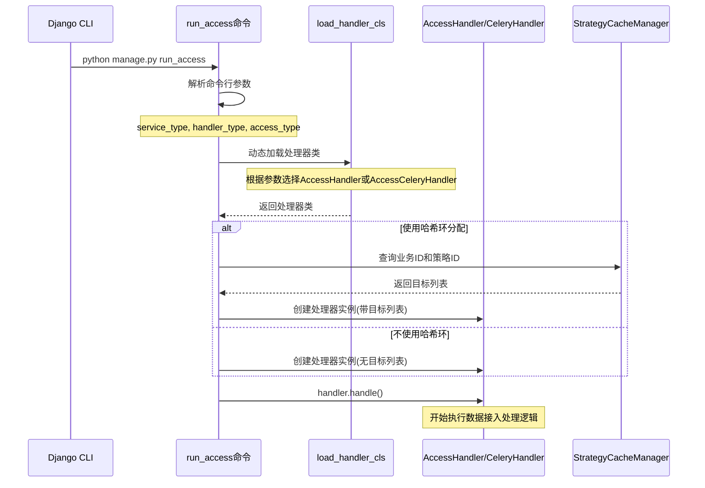

## run_access 命令的作用

[run_access.py] 是 bkmonitor 项目中的一个 **Django 管理命令**，主要用于启动和运行**数据接入服务**。根据代码分析，它的核心功能如下：

### 🎯 **主要功能**

1. **启动数据接入服务**：这是一个通用的数据接入启动器，可以根据不同参数启动不同类型的数据接入处理器

2. **支持多种接入类型**：
   - [data]：常规数据接入
   - `real_time_data`：实时数据接入  
   - [event]：事件数据接入
   - [alert]：告警数据接入
   - [incident]：故障数据接入

3. **支持两种处理模式**：
   - [process]：进程处理模式（同步处理）
   - [celery]：Celery异步处理模式

### 🔧 **核心工作机制**

#### **1. 命令参数解析**
```python
# 关键参数
--service-type      # 服务类型（由子类设置）
--handler-type      # 处理器类型：process/celery  
--access-type       # 接入类型：data/real_time_data/event/alert/incident
--hash-ring         # 是否使用哈希环分配：0/1
```

#### **2. 动态处理器加载**
```python
# 根据服务类型和处理器类型动态加载对应的处理器类
handler_cls = load_handler_cls(self._SERVICE_TYPE_, self._HANDLER_TYPE_)
```

根据项目规范，这里会加载：
- [AccessHandler]（process模式）
- [AccessCeleryHandler]（celery模式）

#### **3. 支持哈希环分配**
当 `--hash-ring=1` 时：
- 查询所有业务ID作为目标
- 根据时序策略ID进行分配
- 实现负载均衡的分布式处理

### 📊 **时序图展示启动流程**



### 🔍 **在项目架构中的位置**

这个命令在 bkmonitor 监控系统中扮演**数据接入服务启动器**的角色：

1. **与数据采集流程的关系**：
   - 启动后，会根据 [access_type] 参数执行对应的数据接入逻辑
   - 配合之前分析的 [AccessDataProcess] 等处理器工作

2. **与 Kafka 的关系**：
   - 当 `access_type=event` 时，会启动事件数据接入，从 Kafka 消费 GSE 事件
   - 当 `access_type=alert` 时，会处理告警数据的接入

3. **部署和运维**：
   - 在生产环境中，通常会启动多个不同类型的 access 服务
   - 支持分布式部署，通过哈希环实现负载均衡

### 💡 **使用示例**

```bash
# 启动数据接入服务（进程模式）
python manage.py run_access --service-type=access --handler-type=process --access-type=data

# 启动事件接入服务（Celery异步模式）
python manage.py run_access --service-type=access --handler-type=celery --access-type=event

# 启动实时数据接入（带哈希环分配）
python manage.py run_access --service-type=access --handler-type=process --access-type=real_time_data --hash-ring=1
```

### 📝 **总结**

[run_access.py] 是 bkmonitor 数据接入系统的**统一启动入口**，它：

- ✅ **统一管理**不同类型的数据接入服务启动
- ✅ **支持灵活配置**处理模式（同步/异步）和接入类型  
- ✅ **提供负载均衡**通过哈希环实现分布式处理
- ✅ **遵循规范**使用项目规定的处理器选择机制

这个命令是整个监控平台数据采集链路的重要组成部分，确保各种监控数据能够稳定、高效地接入到系统中进行后续处理。