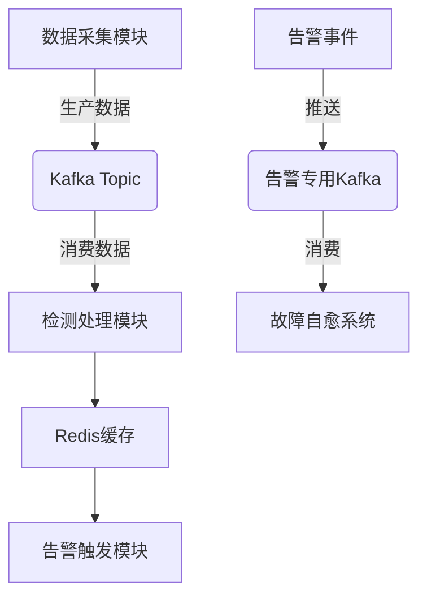

## Kafka 在 bkmonitor 项目中的作用

Kafka 在蓝鲸监控平台中扮演着**核心消息中间件**的重要角色，主要承担以下几个关键功能：

### 1. 数据采集与缓冲
- **异步数据缓冲**：作为数据接入和处理之间的缓冲层，确保系统高可用性和削峰填谷能力
- **数据采集管道**：接收来自各种数据源（GSE、自定义事件、应用性能数据等）的监控数据
- **数据保留策略**：默认保留半小时（1800000ms），确保数据的临时存储和可靠传输

### 2. 告警事件处理
- **告警事件推送**：通过 [MonitorEventAdapter.push_to_kafka()] 将告警事件推送到专用的 Kafka 集群
- **故障自愈集成**：为故障自愈（FTA）系统提供事件消费源
- **多集群支持**：支持默认集群和其他集群的 topic 区分（如 `monitor_event_kafka_topic_{cluster_name}`）

### 3. 数据流转架构

### 4. 系统架构中的关键组件
- **双Kafka集群**：
  - 通用集群：[KAFKA_HOST]（用于数据采集）
  - 告警专用集群：[ALERT_KAFKA_HOST]（用于告警事件）
- **消费者组管理**：通过 [KAFKA_CONSUMER_GROUP] 实现多消费者协同工作
- **分区策略**：支持多分区并行处理，提高吞吐量

### 5. 核心实现类
- **KafkaQueue**：传统的 Kafka 客户端封装
- **KafkaQueueV2**：新版本的 Kafka 客户端实现
- **AlertHandler**：告警事件的 Kafka 消费者管理
- **EventPoller**：事件轮询器，从 Kafka 拉取数据

### 6. 性能优化特性
- **批量处理**：`msg_push_batch_size = 1000`，批量发送消息提高效率
- **连接管理**：自动重连机制（`KAFKA_RECONNECT_SECONDS = 60`）
- **分区优化**：`max_partition_fetch_bytes = 5MB`，提高单次拉取效率
- **压缩支持**：支持数据压缩减少网络传输

### 7. 监控与运维
- **堵塞检测**：监控消费者延迟，及时发现 Kafka 队列堵塞
- **健康检查**：通过 [KernelStory] 检查 Kafka 连接状态和数据延迟
- **偏移量管理**：结合 Redis 管理消费偏移量，支持故障恢复

### 8. 具体应用场景
- **APM 数据处理**：处理应用性能监控数据流
- **日志数据接入**：支持大规模日志数据的实时处理
- **自定义事件**：处理用户自定义的监控事件
- **系统指标采集**：处理主机、容器等基础设施监控数据

总的来说，Kafka 在 bkmonitor 中是数据流转的**核心枢纽**，确保监控数据的可靠传输、高效处理和实时告警，是整个监控平台稳定运行的关键基础设施。