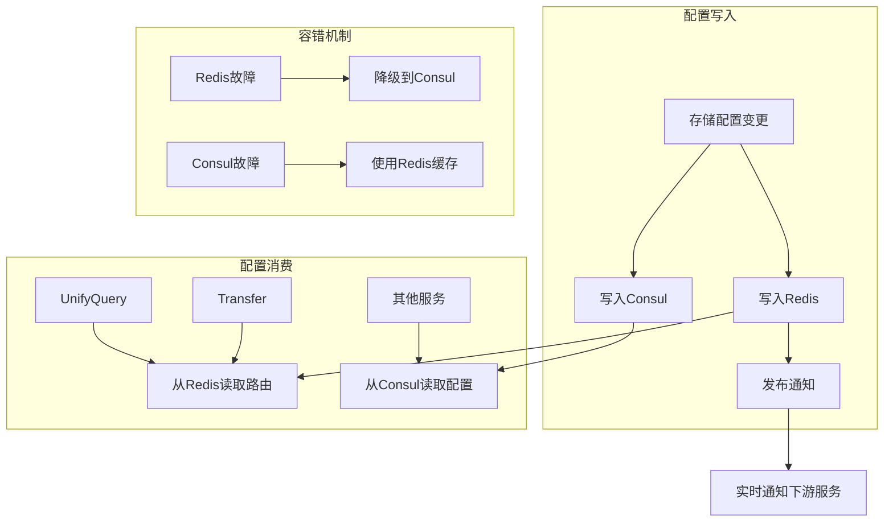

# Consul 和 Redis 双写的设计目的

### 1. **Consul 的作用 - 配置中心**

```python
hash_consul.put(key=self.consul_cluster_path, value=self.consul_cluster_config)
```

**Consul 用于：**
- **集中配置管理**：存储各种存储集群的配置信息（域名、端口、认证等）
- **服务发现**：其他服务通过 Consul 发现可用的存储集群
- **配置分发**：向下游服务（如 unify-query、transfer 等）分发配置
- **持久化存储**：作为配置的权威数据源，保证配置的持久性

### 2. **Redis 的作用 - 高性能缓存和消息通知**

```python
self.push_redis_data(is_publish)
```

**Redis 用于：**
- **高性能读取**：提供毫秒级的配置读取性能
- **实时通知**：通过 pub/sub 机制通知下游服务配置变更
- **减少 Consul 压力**：缓解频繁查询 Consul 的压力
- **路由信息缓存**：存储表路由、集群关系等高频访问的信息

### 3. **为什么需要双写？**

#### **性能考虑**
```python
# Redis 提供高性能读取
RedisTools.publish(constants.INFLUXDB_KEY_PREFIX, service_name_list)
```
- Consul：适合配置管理，但读取性能相对较低
- Redis：提供极高的读取性能，适合高频查询场景

#### **可靠性考虑**
```python
# TODO: 待推送 redis 数据稳定后，删除推送 consul 功能
```
- Consul：作为配置的权威来源，保证数据持久性
- Redis：可能因重启丢失数据，需要 Consul 作为备份

#### **功能互补**
| 特性 | Consul | Redis |
|------|--------|--------|
| **配置管理** | ✅ 强项 | ❌ 不适合 |
| **服务发现** | ✅ 强项 | ❌ 不适合 |
| **高性能读取** | ⚠️ 一般 | ✅ 强项 |
| **消息通知** | ❌ 不支持 | ✅ pub/sub |
| **数据持久化** | ✅ 持久化 | ⚠️ 易丢失 |

### 4. **实际应用场景**

#### **UnifyQuery 查询路由**
```python
# 查询服务优先从 Redis 读取路由信息
val = {
    "storageID": str(obj["storage_cluster_id"]),
    "table_id": table_id,
    "db": db,
    "vm_rt": obj["vm_result_table_id"],
    # ...
}
InfluxDBTool.push_to_redis(QUERY_VM_STORAGE_ROUTER_KEY, table_id, json.dumps(val))
```

#### **配置变更通知**
```python
# 配置变更时，通过 Redis pub/sub 实时通知
RedisTools.publish(constants.INFLUXDB_KEY_PREFIX, [key])
```

### 5. **架构演进方向**

从代码注释可以看出，这是一个**渐进式架构演进**：

```python
# TODO: 待推送 redis 数据稳定后，删除推送 consul 功能
```

**当前阶段**：Consul + Redis 双写
- 保证系统稳定性
- 逐步验证 Redis 方案的可靠性

**未来方向**：可能会简化为 Redis 为主
- 当 Redis 数据稳定后，可能会减少对 Consul 的依赖
- 但 Consul 仍可能保留作为配置管理中心

### 6. **系统架构图**



## 总结

这种双写设计是一个**典型的缓存架构模式**：

1. **Consul** = 权威数据源 + 配置中心
2. **Redis** = 高性能缓存 + 消息中心
3. **双写策略** = 性能优化 + 可靠性保证

这样的设计确保了 bk-monitor 在大规模环境下既能提供高性能的配置读取，又能保证配置的一致性和可靠性。