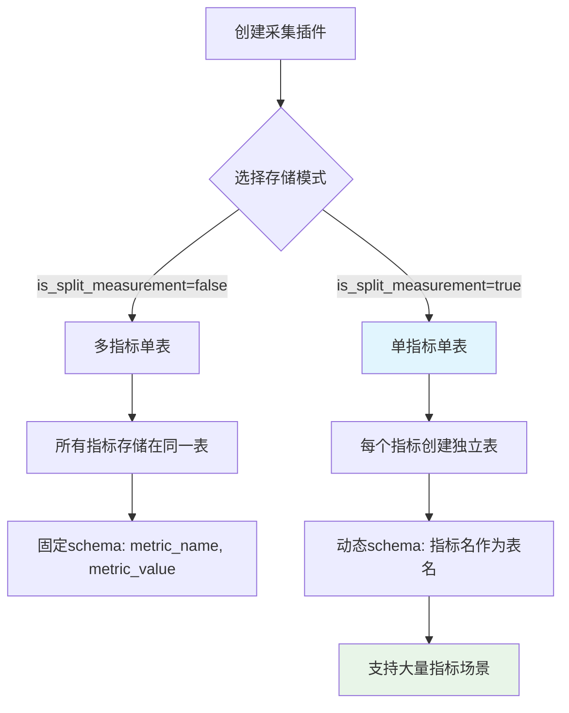
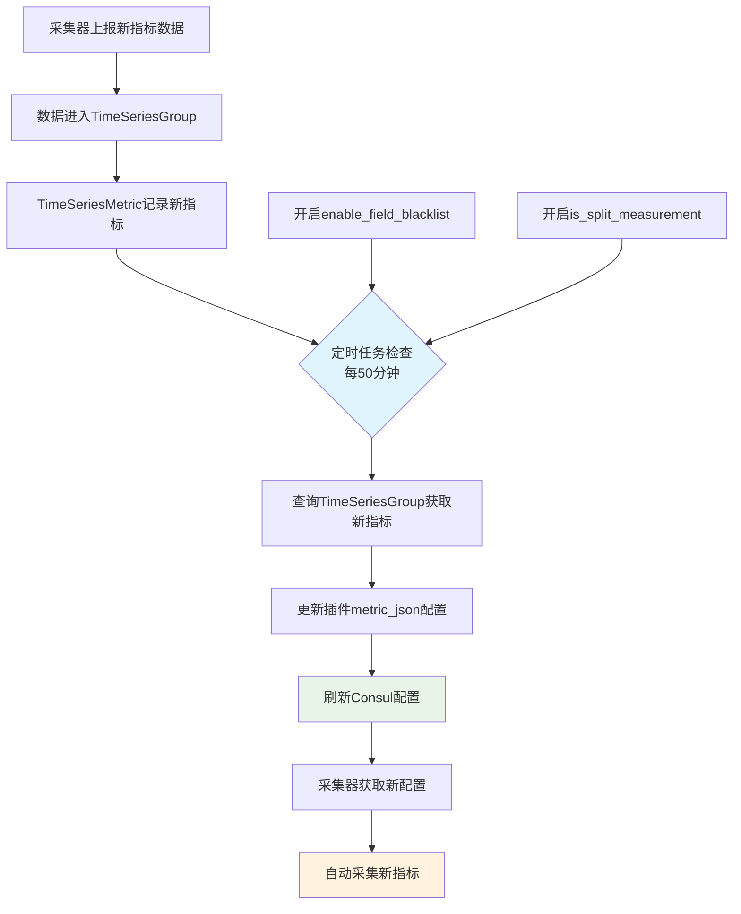

## 1、单指标单表功能详解

### 1. 基本概念

**单指标单表（is_split_measurement）**是bkmonitor项目中一个重要的数据存储优化功能，主要用于处理容器监控等大量指标的场景。

### 2. 功能原理

在创建采集插件时，有两种数据存储方式：

**多指标单表（传统模式）**：

- 所有指标数据存储在同一个结果表中
- 使用固定的[metric_name](file:///Users/wuyongping/PycharmProjects/bk-monitor/bkmonitor/metadata/service/storage_details.py#L44-L44)和`metric_value`字段
- 适合指标数量较少的场景

**单指标单表（is_split_measurement=True）**：

- 每个指标自动创建独立的结果表
- 每个表只存储一个指标的数据
- 适合容器监控等大量指标的场景

### 3. 技术实现

从代码中可以看到关键的判断逻辑：

```python
def get_measurement_type(
    schema_type: str, is_split_measurement: bool, is_disable_metric_cutter: bool, etl_config: str | None = None
) -> str:
    """获取表类型
    - 当 schema_type 为 fixed 时，为多指标单表
    - 当 schema_type 为 free 时，
        - 如果 is_split_measurement 为 True, 则为单指标单表
        - 如果 is_split_measurement 为 False
            - 如果 etl_config 为`bk_standard_v2_time_series`，
                - 如果 is_disable_metric_cutter 为 False，则为固定 metric_name，metric_value
                - 否则为自定义多指标单表
            - 否则，为固定 metric_name，metric_value
    """
```

### 4. 应用场景

**适合单指标单表的场景**：

- K8s集群监控（容器指标数量庞大）
- 自定义指标采集（大量动态指标）
- 需要高性能查询的监控场景

**BCS集群默认配置**：

```python
DATASOURCE_REGISTER_INFO = {
    DATA_TYPE_K8S_METRIC: {
        "is_split_measurement": True,  # K8s指标默认开启单指标单表
    },
    DATA_TYPE_CUSTOM_METRIC: {
        "is_split_measurement": True,  # 自定义指标默认开启单指标单表
    },
}
```

### 5. 优势特点

**性能优势**：

- 查询单个指标时性能更高
- 减少表扫描范围
- 便于指标数据的分别管理

**管理优势**：

- 每个指标有独立的存储配置
- 支持指标级别的TTL设置
- 便于指标数据的清理和迁移

### 6. 数据流程图



### 7. 配置示例

在插件配置中，通过以下参数控制：

```python
# 创建时序组时的参数
params = {
    "is_split_measurement": True,  # 开启单指标单表
    "enable_default_value": False,  # 单指标单表不需要补齐schema
    "enable_field_black_list": True,  # 启用字段白名单
}
```

总结来说，**单指标单表功能是为了适应容器监控等大量指标场景而设计的存储优化方案，通过将每个指标存储在独立的表中来提升查询性能和管理效率**。

---

这是一个很好的问题！让我搜索一下bkmonitor项目中关于自动发现新增指标的实现机制。

```toolCall::search_codebase

```


```toolCall::search_codebase

```


```toolCall::read_file

```


```toolCall::search_codebase

```

根据我搜索到的代码，现在我可以详细解释bkmonitor项目中单指标单表的自动发现机制：

## 2、单指标单表自动发现机制详解

### 1. 核心原理

**自动发现机制的工作原理**：

- 当开启单指标单表功能（`is_split_measurement=True`）并启用字段黑名单（`enable_field_blacklist=True`）时，采集器会自动发现新增的指标
- 系统通过定时任务和Consul配置刷新机制实现新指标的自动同步

### 2. 技术实现流程

#### **第1步：定时同步任务**

```python
# 每50分钟执行一次的定时任务
@shared_task(ignore_result=True)
def update_metric_json_from_ts_group():
    """
    对开启了自动发现的插件指标进行保存
    """
    def update_metric(collector_plugin):
        plugin_data_info = PluginDataAccessor(collector_plugin.current_version, get_global_user())
        # 查询TSGroup
        group_list = api.metadata.query_time_series_group(
            time_series_group_name=plugin_data_info.db_name, label=plugin_data_info.label
        )
        # 仅对有数据做处理
        if len(group_list) == 0:
            return
        collector_plugin.update_metric_json_from_ts_group(group_list)

    for collector_plugin in queryset:
        # 如果未开启黑名单或没有超过刷新周期（默认五分钟），直接返回
        if (
            not collector_plugin.current_version.info.enable_field_blacklist
            or not collector_plugin.should_refresh_metric_json(timeout=5 * 60)
        ):
            continue
        executor.submit(update_metric, collector_plugin)
```

#### **第2步：自动发现标志判断**

```python
def is_auto_discovery(self) -> bool:
    """
    判断是否是自动发现
    :return: True：是自动发现/False：不是自动发现（插件白名单模式）
    """
    return not ResultTableOption.objects.filter(
        table_id=self.table_id, 
        bk_tenant_id=self.bk_tenant_id, 
        name="enable_field_black_list", 
        value="false"
    ).exists()
```

#### **第3步：指标同步更新**

```python
def update_metric_json_from_ts_group(self, group_list):
    """
    从 TimeSeriesGroup 中更新 metric_json 数据
    """
    # 筛选符合规则的指标
    match_rule_metric_under_table, not_match_rule_metric, map_of_metric_and_tag = self.filter_metric_by_table_rule(group_list)
    
    # 对已存在的table进行扩展
    for table_fields in self.current_version.info.metric_json:
        # 添加新增的指标
        table_fields["fields"].extend(self.convert_metric_to_field_dict(match_rule_metrics, table_fields))
        
        # 更新每个指标的维度信息
        for field in table_fields["fields"]:
            if field["monitor_type"] == "metric":
                field_tag_list = map_of_metric_and_tag.get(field["name"], [])
                field["tag_list"] = field_tag_list  # 自动更新tag_list
```

### 3. 数据流向图



### 4. 关键配置参数

**启用自动发现的条件**：

```python
# 1. 开启字段黑名单功能
enable_field_blacklist = True

# 2. 开启单指标单表
is_split_measurement = True

# 3. ResultTableOption中enable_field_black_list不为false
ResultTableOption.objects.filter(
    name="enable_field_black_list", 
    value="false"
).exists() == False
```

### 5. 过期时间机制

```python
# 获取过期分界线（默认7天）
last = datetime.datetime.now() - datetime.timedelta(seconds=settings.TIME_SERIES_METRIC_EXPIRED_SECONDS)

# 自动发现模式下，只查询未过期的指标
if self.is_auto_discovery():
    time_series_metric_query = time_series_metric_query.filter(last_modify_time__gt=last)
```

### 6. Consul配置刷新

```python
def refresh_consul_config(self):
    """当检测到新指标时，自动刷新Consul配置"""
    if self.NEED_REFRESH_CONSUL:
        from metadata.models import DataSource
        DataSource.objects.get(bk_data_id=self.bk_data_id).refresh_consul_config()
```

### 7. 优势特点

**自动化优势**：

- **无需手动配置**：新增指标后无需修改插件配置
- **实时发现**：通过定时任务（50分钟）自动同步
- **动态扩展**：支持指标和维度的动态增加
- **过期清理**：自动清理长时间未上报的指标

**性能优化**：

- **批量处理**：使用线程池并发处理多个插件
- **缓存机制**：5分钟内避免重复刷新
- **增量更新**：只同步变更的指标和维度

总结来说，**bkmonitor的自动发现机制通过定时任务监控TimeSeriesGroup中的新指标，自动更新插件配置并刷新Consul，使采集器能够无需人工干预就自动采集新增的指标数据**。这是单指标单表功能的一个重要特性，大大降低了容器监控等动态场景的运维成本。