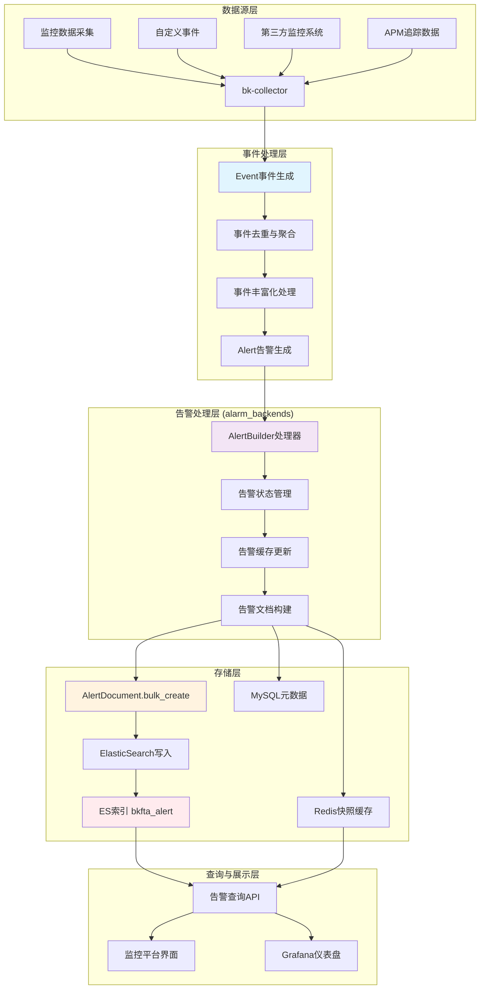
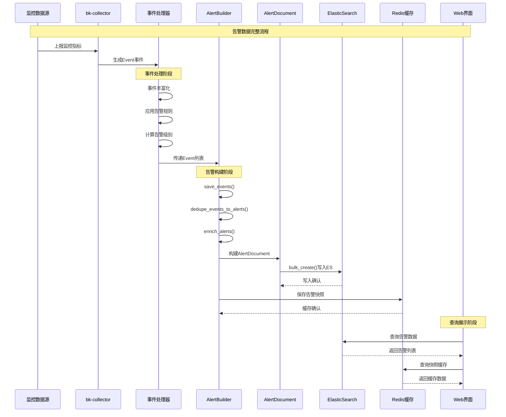

## 1、ElasticSearch 中告警数据的来源流程



## 详细的数据流转过程

### 1. **事件产生阶段**

```python
# 从监控数据生成Event对象
event = Event({
    "event_id": "unique_event_id",
    "plugin_id": "bk_monitor", 
    "alert_name": "CPU使用率过高",
    "time": timestamp,
    "severity": 2,  # 告警级别
    "tags": [{"key": "host", "value": "server01"}],
    "dedupe_keys": ["alert_name", "tags.host", "ip"]  # 去重字段
})
```

### 2. **告警构建阶段**

通过 [AlertBuilder处理器](file:///Users/wuyongping/PycharmProjects/bk-monitor/bkmonitor/alarm_backends/service/alert/builder/processor.py#L17-L36) 进行处理：

```python
class AlertBuilder(BaseAlertProcessor):
    def handle(self, events: List[Event]):
        """事件处理逻辑"""
        # 1. 事件丰富化
        events = self.enrich_events(events)
        
        # 2. 保存事件到ES
        events = self.save_events(events)
        
        # 3. 事件去重聚合成告警
        alerts = self.dedupe_events_to_alerts(events)
        
        return alerts
```

### 3. **告警文档保存阶段**

```python
def save_alerts(self, alerts: List[Alert]) -> List[Alert]:
    """将告警信息保存到ES"""
    
    # 构建AlertDocument文档
    alert_documents = [
        alert.to_document(include_all_fields=False) 
        for alert in alerts 
        if alert.should_refresh_db()  # 只保存需要刷新的告警
    ]
    
    try:
        # 批量写入ElasticSearch
        AlertDocument.bulk_create(alert_documents, action=BulkActionType.INDEX)
    except BulkIndexError as e:
        self.logger.error("save alert document error: %s", e.errors)
    
    return alerts
```

### 4. **AlertDocument模型结构**

```python
@registry.register_document
class AlertDocument(BaseDocument):
    """告警数据文档模型，用于Elasticsearch存储与检索"""
    
    # 核心字段
    id = field.Keyword(required=True)  # 告警唯一标识
    alert_name = field.Text(fields={"raw": field.Keyword()})  # 告警名称
    strategy_id = field.Keyword()  # 关联策略ID
    severity = field.Integer()  # 严重程度
    status = field.Keyword()  # 告警状态
    
    # 时间字段
    create_time = field.Long()  # 创建时间
    begin_time = field.Long()   # 开始时间
    latest_time = field.Long()  # 最新时间
    
    # 关联事件信息
    event = field.Object(enabled=False)  # 事件详情
    dimensions = field.Object(multi=True) # 维度信息
    
    class Index:
        name = "bkfta_alert"  # ES索引名称
        settings = {
            "number_of_shards": 3,
            "number_of_replicas": 1,
            "refresh_interval": "1s"
        }
```

### 5. **完整的时序图**



## 关键特性说明

### **去重与聚合机制**
```python
# 通过dedupe_keys实现告警去重
dedupe_keys = ["alert_name", "tags.host", "ip"]
# 相同dedupe_keys的事件会聚合到同一个告警中
```

### **多级存储策略**
1. **ElasticSearch**: 持久化存储，支持复杂查询和聚合
2. **Redis缓存**: 热点数据快照，提高查询性能  
3. **MySQL**: 元数据和配置信息

### **批量写入优化**
```python
# 使用bulk_create提高写入性能
AlertDocument.bulk_create(alert_documents, action=BulkActionType.INDEX)
```

### **时间分片索引**
```python
# 索引名称包含时间信息，支持按时间分片
# 格式: bkfta_alert_20231201
class Index:
    name = "bkfta_alert"
```

## 总结

ElasticSearch中的告警数据来源于：

1. **数据采集**: 通过bk-collector从各种监控数据源采集原始数据
2. **事件生成**: 基于告警策略将监控数据转换为Event事件
3. **告警构建**: AlertBuilder将相关事件聚合成Alert告警对象  
4. **文档保存**: 通过AlertDocument模型批量写入ElasticSearch
5. **索引存储**: 存储在bkfta_alert索引中，支持时间分片和复杂查询

这种架构确保了告警数据的实时性、完整性和可查询性，同时通过缓存机制提升了系统性能。