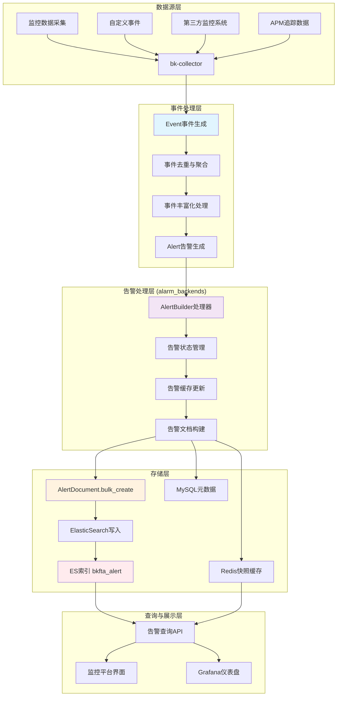
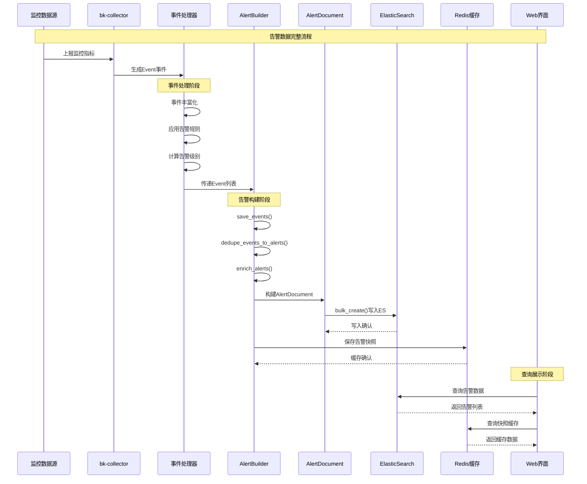
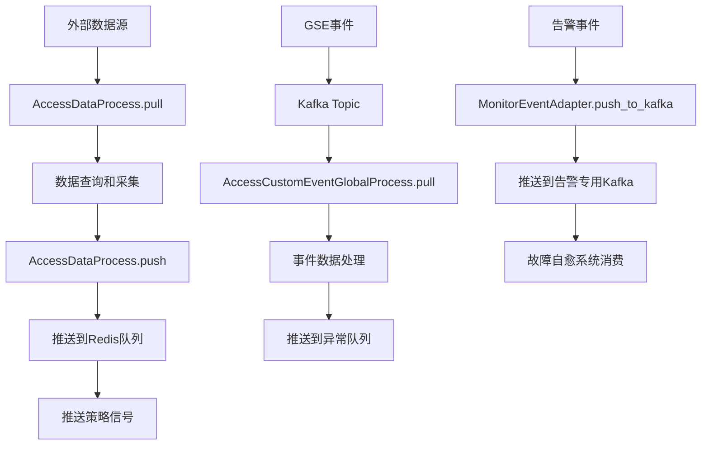

## 1、ElasticSearch 中告警数据的来源流程



## 详细的数据流转过程

### 1. **事件产生阶段**

```python
# 从监控数据生成Event对象
event = Event({
    "event_id": "unique_event_id",
    "plugin_id": "bk_monitor", 
    "alert_name": "CPU使用率过高",
    "time": timestamp,
    "severity": 2,  # 告警级别
    "tags": [{"key": "host", "value": "server01"}],
    "dedupe_keys": ["alert_name", "tags.host", "ip"]  # 去重字段
})
```

### 2. **告警构建阶段**

通过 [AlertBuilder处理器](file:///Users/wuyongping/PycharmProjects/bk-monitor/bkmonitor/alarm_backends/service/alert/builder/processor.py#L17-L36) 进行处理：

```python
class AlertBuilder(BaseAlertProcessor):
    def handle(self, events: List[Event]):
        """事件处理逻辑"""
        # 1. 事件丰富化
        events = self.enrich_events(events)
        
        # 2. 保存事件到ES
        events = self.save_events(events)
        
        # 3. 事件去重聚合成告警
        alerts = self.dedupe_events_to_alerts(events)
        
        return alerts
```

### 3. **告警文档保存阶段**

```python
def save_alerts(self, alerts: List[Alert]) -> List[Alert]:
    """将告警信息保存到ES"""
    
    # 构建AlertDocument文档
    alert_documents = [
        alert.to_document(include_all_fields=False) 
        for alert in alerts 
        if alert.should_refresh_db()  # 只保存需要刷新的告警
    ]
    
    try:
        # 批量写入ElasticSearch
        AlertDocument.bulk_create(alert_documents, action=BulkActionType.INDEX)
    except BulkIndexError as e:
        self.logger.error("save alert document error: %s", e.errors)
    
    return alerts
```

### 4. **AlertDocument模型结构**

```python
@registry.register_document
class AlertDocument(BaseDocument):
    """告警数据文档模型，用于Elasticsearch存储与检索"""
    
    # 核心字段
    id = field.Keyword(required=True)  # 告警唯一标识
    alert_name = field.Text(fields={"raw": field.Keyword()})  # 告警名称
    strategy_id = field.Keyword()  # 关联策略ID
    severity = field.Integer()  # 严重程度
    status = field.Keyword()  # 告警状态
    
    # 时间字段
    create_time = field.Long()  # 创建时间
    begin_time = field.Long()   # 开始时间
    latest_time = field.Long()  # 最新时间
    
    # 关联事件信息
    event = field.Object(enabled=False)  # 事件详情
    dimensions = field.Object(multi=True) # 维度信息
    
    class Index:
        name = "bkfta_alert"  # ES索引名称
        settings = {
            "number_of_shards": 3,
            "number_of_replicas": 1,
            "refresh_interval": "1s"
        }
```

### 5. **完整的时序图**



## 关键特性说明

### **去重与聚合机制**
```python
# 通过dedupe_keys实现告警去重
dedupe_keys = ["alert_name", "tags.host", "ip"]
# 相同dedupe_keys的事件会聚合到同一个告警中
```

### **多级存储策略**
1. **ElasticSearch**: 持久化存储，支持复杂查询和聚合
2. **Redis缓存**: 热点数据快照，提高查询性能  
3. **MySQL**: 元数据和配置信息

### **批量写入优化**
```python
# 使用bulk_create提高写入性能
AlertDocument.bulk_create(alert_documents, action=BulkActionType.INDEX)
```

### **时间分片索引**
```python
# 索引名称包含时间信息，支持按时间分片
# 格式: bkfta_alert_20231201
class Index:
    name = "bkfta_alert"
```

## 总结

ElasticSearch中的告警数据来源于：

1. **数据采集**: 通过bk-collector从各种监控数据源采集原始数据
2. **事件生成**: 基于告警策略将监控数据转换为Event事件
3. **告警构建**: AlertBuilder将相关事件聚合成Alert告警对象  
4. **文档保存**: 通过AlertDocument模型批量写入ElasticSearch
5. **索引存储**: 存储在bkfta_alert索引中，支持时间分片和复杂查询

这种架构确保了告警数据的实时性、完整性和可查询性，同时通过缓存机制提升了系统性能。

---
## 数据采集并推送到 Kafka Topic 的相关代码位置

基于您提到的 wiki 文档中"数据采集，然后推送到 kafka Topic"，相关的核心代码主要分布在以下几个位置：

### 1. 📍 **数据采集与推送的核心实现**

#### **数据接入处理器 - AccessDataProcess**
- **文件位置**: `bk-monitor\bkmonitor\alarm_backends\service\access\data\processor.py`
- **核心方法**:
  - [pull()] 方法（第295-341行）：数据采集和查询
  - [push()] 方法（第185-237行）：数据推送到队列
  - [_push()] 方法（第131-182行）：实际推送实现

#### **关键推送逻辑**
```python
def _push(self, item, record_list, output_client=None, data_list_key=None):
    """
    推送单个item的数据到检测队列或无数据待检测队列
    """
    data_list_key = data_list_key or key.DATA_LIST_KEY
    client = output_client or data_list_key.client
    output_key = data_list_key.get_key(strategy_id=item.strategy.strategy_id, item_id=item.id)
    
    # 推送到Redis队列（不是直接推送到Kafka）
    pipeline = client.pipeline(transaction=False)
    pipeline.lpush(output_key, *[json.dumps(record.data) for record in chunk_records])
    pipeline.execute()
    
    # 推送策略信号，触发后续检测
    client.lpush(key.DATA_SIGNAL_KEY.get_key(), *list(strategy_ids))
```

### 2. 📍 **事件数据采集与推送**

#### **事件处理器 - AccessCustomEventGlobalProcess**
- **文件位置**: `bk-monitor\bkmonitor\alarm_backends\service\access\event\processor.py`
- **核心功能**:
  - [pull()] 方法（第283-336行）：从 Kafka 拉取 GSE 事件数据
  - [push()] 方法（第125-170行）：推送事件到异常队列

#### **从 Kafka 拉取数据的实现**
```python
def pull(self):
    # 从Kafka Topic拉取数据
    kafka_queue = self.get_kafka_queue(topic=self.topic, group_prefix=group_prefix)
    result = kafka_queue.take(count=MAX_RETRIEVE_NUMBER, timeout=1)
    
    # 处理拉取的数据
    for m in result:
        data = json.loads(m[:-1] if m[-1] == "\x00" or m[-1] == "\n" else m)
        event_record = self._instantiate_by_event_type(data)
        if event_record and event_record.check():
            record_list.extend(event_record.flat())
```

### 3. 📍 **告警事件推送到 Kafka**

#### **监控事件适配器 - MonitorEventAdapter**
- **文件位置**: `bk-monitor\bkmonitor\alarm_backends\core\alert\adapter.py`
- **核心方法**: [push_to_kafka()] 类方法（第34-53行）

```python
@classmethod
def push_to_kafka(cls, events: list[dict]):
    """
    将事件推送到 Kafka，提供给故障自愈进行消费
    """
    messages = [json.dumps(event).encode("utf-8") for event in events]
    
    # 使用专用kafka集群推送告警事件
    kafka_queue = KafkaQueue.get_alert_kafka_queue()
    kafka_queue.set_topic(topic)
    kafka_queue.put(value=messages)  # 这里是真正推送到Kafka
```

### 4. 📍 **Kafka 操作的底层实现**

#### **Kafka 队列封装**
- **文件位置**: 
  - `bk-monitor\bkmonitor\alarm_backends\core\storage\kafka.py`（传统版本）
  - `bk-monitor\bkmonitor\alarm_backends\core\storage\kafka_v2.py`（新版本）

#### **核心推送方法**
```python
def put(self, value, topic=""):
    """批量推送消息到Kafka"""
    if not isinstance(value, list):
        value = [value]
    for i in range(0, len(value), self.msg_push_batch_size):
        batch = value[i : i + self.msg_push_batch_size]
        self._put(batch, topic)

def _put(self, value, topic=""):
    """实际的Kafka推送实现"""
    return self.get_producer().send_messages(self.topic, *value)
```

### 5. 📍 **任务调度与执行**

#### **访问任务调度**
- **文件位置**: `bk-monitor\bkmonitor\alarm_backends\service\access\tasks.py`
- **关键任务**:
  - [run_access_data()] - 数据接入任务
  - [run_access_event_handler()] - 事件处理任务

### 📊 **数据流转总结**



**重要说明**：
1. **数据采集**主要通过 [AccessDataProcess] 从各种数据源（时序数据库、日志平台等）拉取数据
2. **推送到Redis**：采集的数据首先推送到 Redis 队列，而不是直接推送到 Kafka
3. **Kafka使用场景**：主要用于 GSE 事件的接入（从Kafka拉取）和告警事件的推送（推送到Kafka）
4. **事件驱动**：通过推送策略信号触发后续的检测和处理流程

这种设计实现了数据的异步处理和系统解耦，确保监控平台的高可用性和扩展性。