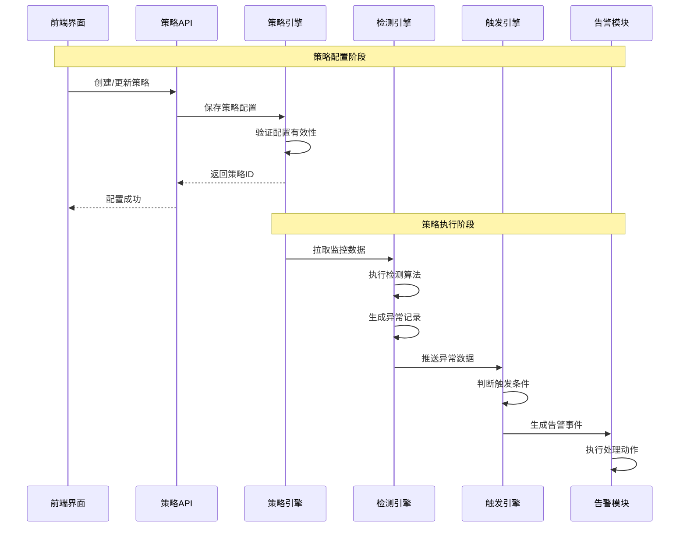
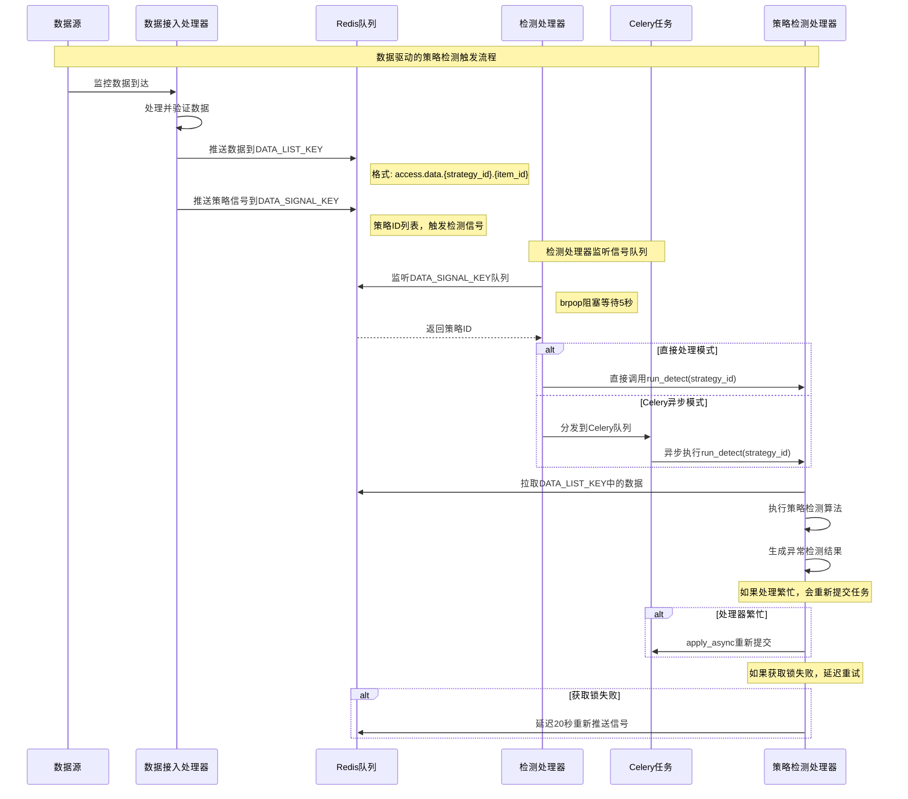
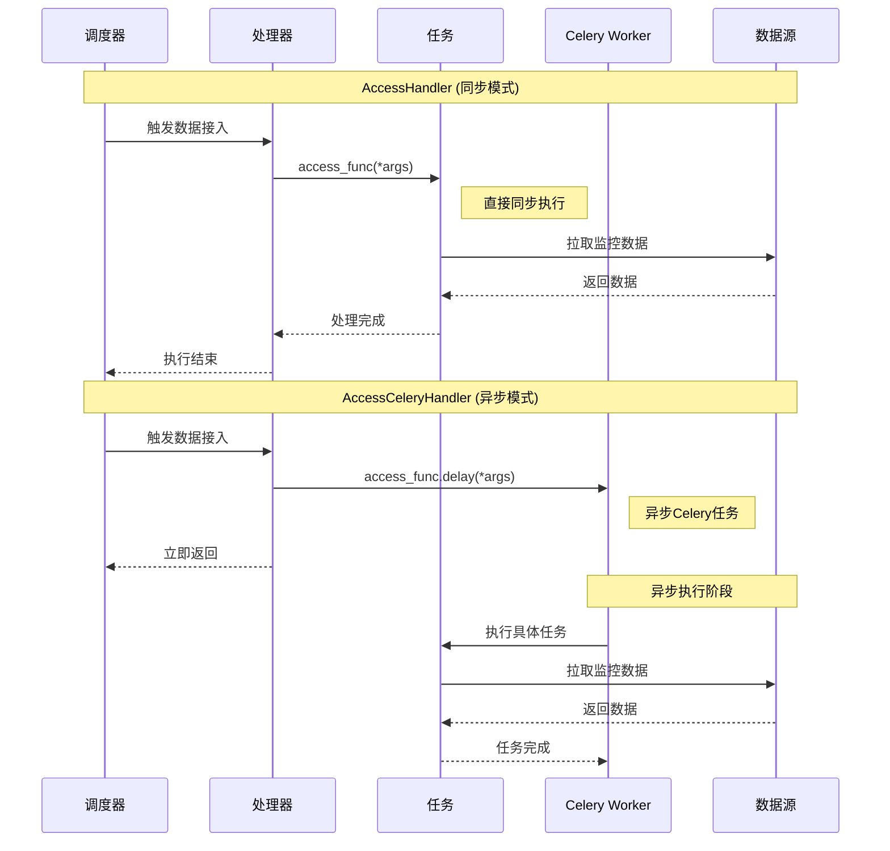

## 一、📍 **策略引擎核心代码位置**

### 🎯 **1. 策略管理和配置模块**

**主要位置：** `bkmonitor/bkmonitor/strategy/`

- **[new_strategy.py](file://d:\projects\bk-monitor\bkmonitor\bkmonitor\strategy\new_strategy.py)** - 新版策略核心实现
  - [Strategy](file://d:\projects\bk-monitor\bkmonitor\bkmonitor\strategy\new_strategy.py#L1702-L3032) 类：策略领域对象，包含完整的策略配置信息
  - [Item](file://d:\projects\bk-monitor\bkmonitor\bkmonitor\strategy\new_strategy.py#L1437-L1699) 类：监控项对象
  - [Algorithm](file://d:\projects\bk-monitor\bkmonitor\bkmonitor\strategy\new_strategy.py#L931-L1057) 类：检测算法对象
  - [QueryConfig](file://d:\projects\bk-monitor\bkmonitor\bkmonitor\strategy\new_strategy.py#L1185-L1434) 类：查询配置对象

- **[strategy.py](file://d:\projects\bk-monitor\bkmonitor\alarm_backends\core\cache\strategy.py)** - 策略配置管理（已有版本）
  - [StrategyConfig](file://d:\projects\bk-monitor\bkmonitor\bkmonitor\strategy\strategy.py#L53-L915) 类：策略配置业务逻辑处理

- **[serializers.py](file://d:\projects\bk-monitor\bkmonitor\apm\serializers.py)** - 策略配置验证和序列化

### 🎯 **2. 策略检测和执行引擎**

**主要位置：** `bkmonitor/alarm_backends/service/detect/`

- **[process.py](file://d:\projects\bk-monitor\bkmonitor\alarm_backends\service\detect\process.py)** - **策略检测处理核心**

  ```python
  class DetectProcess(BaseAbnormalPushProcessor):
      """策略检测处理器 - 策略引擎的执行核心"""
  ```

- **[handler.py](file://d:\projects\bk-monitor\bkmonitor\alarm_backends\service\trigger\handler.py)** - 检测处理器调度

- **`strategy/`** - 各种检测算法实现

  - [threshold.py](file://d:\projects\bk-monitor\bkmonitor\alarm_backends\service\detect\strategy\threshold.py) - 阈值检测
  - [intelligent_detect.py](file://d:\projects\bk-monitor\bkmonitor\bkmonitor\dataflow\task\intelligent_detect.py) - 智能检测
  - [advanced_year_round.py](file://d:\projects\bk-monitor\bkmonitor\alarm_backends\tests\service\detect\test_advanced_year_round.py) - 高级环比检测
  - 等多种检测策略

### 🎯 **3. 策略触发和告警生成**

**主要位置：** `bkmonitor/alarm_backends/service/trigger/`

- **[processor.py](file://d:\projects\bk-monitor\bkmonitor\alarm_backends\service\alert\processor.py)** - 策略触发处理器

  ```python
  class TriggerProcessor:
      """策略触发处理器 - 负责将检测结果转化为告警"""
  ```

- **[handler.py](file://d:\projects\bk-monitor\bkmonitor\alarm_backends\service\trigger\handler.py)** - 触发处理调度器

### 🎯 **4. 策略API和视图层**

**主要位置：** `bkmonitor/packages/monitor_web/strategies/`

- **`resources/v2.py`** - 策略管理API资源
  - [GetStrategyListV2Resource](file://d:\projects\bk-monitor\bkmonitor\packages\monitor_web\strategies\resources\v2.py#L106-L1582) - 获取策略列表
  - [SaveStrategyV2Resource](file://d:\projects\bk-monitor\bkmonitor\packages\monitor_web\strategies\resources\v2.py#L2365-L2435) - 保存策略配置
  - [UpdatePartialStrategyV2Resource](file://d:\projects\bk-monitor\bkmonitor\packages\monitor_web\strategies\resources\v2.py#L2438-L2963) - 批量更新策略

- **[views.py](file://d:\projects\bk-monitor\bkmonitor\apm\views.py)** - 策略管理视图集
- **`resources/v1.py`** - 兼容性API资源

### 🎯 **5. 策略数据模型**

**主要位置：** `bkmonitor/bkmonitor/models/strategy.py`

- **[StrategyModel](file://d:\projects\bk-monitor\bkmonitor\bkmonitor\models\strategy.py#L333-L422)** - 策略数据模型
- **[ItemModel](file://d:\projects\bk-monitor\bkmonitor\bkmonitor\models\strategy.py#L79-L98)** - 监控项数据模型  
- **[AlgorithmModel](file://d:\projects\bk-monitor\bkmonitor\bkmonitor\models\strategy.py#L149-L229)** - 检测算法数据模型
- **[QueryConfigModel](file://d:\projects\bk-monitor\bkmonitor\bkmonitor\models\strategy.py#L242-L285)** - 查询配置数据模型

## 🔄 **策略引擎执行流程时序图**



## 💡 **策略引擎关键组件说明**

1. **策略配置层**：负责策略的创建、更新、验证和存储
2. **策略执行层**：负责根据策略配置进行数据检测和异常识别  
3. **策略触发层**：负责将检测结果转化为具体的告警事件
4. **策略管理层**：提供策略的查询、管理和操作接口

这些模块共同构成了bkmonitor的**策略引擎**，实现了从策略配置到异常检测再到告警生成的完整流程。

---

## 二、🔍 **策略检测触发机制分析**

策略检测**不是**通过定时任务直接触发的，而是采用**事件驱动**的方式。具体流程如下：

### 📊 **策略检测触发流程时序图**



### 🔧 **核心触发机制详解**

#### **1. 数据接入触发 - 事件驱动**

- **触发源**: [AccessDataProcess](file://d:\projects\bk-monitor\bkmonitor\alarm_backends\service\access\data\processor.py#L241-L247) 数据接入处理器

- **触发条件**: 当监控数据通过数据接入模块处理完成后

- **信号推送**: 

  ```python
  # 推送数据处理信号
  if records:
      client = output_client or key.DATA_SIGNAL_KEY.client
      if strategy_ids:
          client.lpush(key.DATA_SIGNAL_KEY.get_key(), *list(strategy_ids))
  ```

#### **2. 检测处理器监听 - 消费者模式**

- **监听器**: [DetectHandler](file://d:\projects\bk-monitor\bkmonitor\alarm_backends\service\detect\handler.py#L25-L37)
- **监听方式**: Redis阻塞弹出 `brpop(data_signal_key, 5)` (5秒超时)
- **处理模式**: 支持两种处理方式
  - **直接处理**: [DetectHandler](file://d:\projects\bk-monitor\bkmonitor\alarm_backends\service\detect\handler.py#L25-L37) - 同步调用
  - **异步处理**: [DetectCeleryHandler](file://d:\projects\bk-monitor\bkmonitor\alarm_backends\service\detect\handler.py#L40-L87) - Celery任务队列

#### **3. Celery任务执行 - 异步处理**

- **任务定义**: [run_detect](file://d:\projects\bk-monitor\bkmonitor\alarm_backends\service\detect\tasks.py#L22-L46) Celery任务
- **队列配置**: `celery_service` 队列
- **异常处理**: 包含锁冲突重试、处理器繁忙重新提交等机制

### 🎯 **关键特性说明**

#### **1. 数据驱动 vs 定时驱动**

```python
# ❌ 不是这样的定时任务触发
@periodic_task(run_every=crontab(minute='*/1'))  # 这不是策略检测的方式

# ✅ 实际是事件驱动触发
def handle(self):
    ret = self.client.brpop(self.data_signal_key, 5)  # 监听队列
    if ret is None:
        return
    run_detect(ret[1])  # 处理策略检测
```

#### **2. 自适应处理机制**

```python
# 处理器繁忙时重新提交
if processor.is_busy:
    run_detect.apply_async(args=(strategy_id,))
    
# 获取锁失败时延迟重试  
except LockError:
    client.delay("lpush", data_signal_key, strategy_id, delay=20)
```

#### **3. 二次确认机制**

```python
# 在process.py中的二次确认逻辑
def double_check(self, item):
    """二次确认机制，仅针对配置了灰度的策略"""
    if int(self.strategy_id) not in settings.DOUBLE_CHECK_SUM_STRATEGY_IDS:
        return
    item.double_check(outputs=self.outputs[item.id])
```

### 💡 **总结**

策略检测的触发机制是**数据驱动的事件模式**，不是传统的定时任务：

1. **触发源**: 监控数据到达时通过数据接入处理器推送信号
2. **处理方式**: Redis队列 + 事件监听器 + Celery异步任务
3. **执行特点**: 实时响应、自适应重试、支持并发处理
4. **优势**: 减少不必要的检测执行，提高系统效率，实现按需检测

这种设计确保了策略检测能够及时响应数据变化，同时避免了定时任务可能带来的资源浪费和延迟问题。

---


## 三、🔍 **AccessCeleryHandler 在监控项目中的作用**

### 📋 **核心功能说明**

**AccessCeleryHandler** 是数据接入模块的 **Celery 异步处理器**，它继承自 [AccessHandler](file://d:\projects\bk-monitor\bkmonitor\alarm_backends\service\access\handler.py#L181-L268)，主要作用是将数据接入任务**异步化处理**。

### 🔧 **关键代码分析**

```python
class AccessCeleryHandler(AccessHandler):
    """
    AccessCeleryHandler(run by celery worker)  
    通过 Celery Worker 运行的数据接入处理器
    """

    @staticmethod
    def run_access(access_func, *args):
        """
        核心差异：将同步调用转换为异步 Celery 任务
        - AccessHandler: access_func(*args)  # 直接同步执行  
        - AccessCeleryHandler: access_func.delay(*args)  # 异步 Celery 任务
        """
        access_func.delay(*args)
```

### 🔄 **工作模式对比时序图**



### 🚀 **具体使用场景**

#### **1. 启动命令配置**

在 [supervisor 配置](file://d:\projects\bk-monitor\bkmonitor\support-files\templates\#etc#supervisor-bkmonitorv3-monitor.conf#L63-L73) 中：

```bash
# 使用 AccessCeleryHandler 的启动命令
python manage.py run_access -s access -H celery --access-type=data --hash-ring=1
```

#### **2. 处理器类型选择**

通过 [load_handler_cls](file://d:\projects\bk-monitor\bkmonitor\alarm_backends\management\base\loaders.py#L34-L44) 函数根据参数动态选择：

```python
# 自动发现处理器规则
def autodiscover_handlers():
    """
    自动发现处理器类型：
    - 以 "CeleryHandler" 结尾的类 → celery 处理器
    - 其他 Handler 类 → process 处理器
    """
    for attr, val in handler_module.__dict__.items():
        if inspect.isclass(val) and issubclass(val, base.BaseHandler):
            if attr.endswith("CeleryHandler"):
                service_handlers.setdefault(service_type, {})["celery"] = val
            else:
                service_handlers.setdefault(service_type, {})["process"] = val
```

#### **3. 异步任务执行流程**

**AccessCeleryHandler** 主要处理以下类型的异步任务：

1. **数据接入任务**: [run_access_data](file://d:\projects\bk-monitor\bkmonitor\alarm_backends\service\access\tasks.py#L31-L49)
2. **事件处理任务**: [run_access_event_handler](file://d:\projects\bk-monitor\bkmonitor\alarm_backends\service\access\tasks.py#L59-L75)
3. **实时数据处理**: 实时数据流处理
4. **告警事件处理**: 告警和异常事件处理

### 🎯 **具体应用示例**

#### **事件数据处理**

```python
def handle_event(self):
    """处理 GSE 事件数据"""
    data_ids = [
        settings.GSE_BASE_ALARM_DATAID,     # GSE 基础告警数据ID
        settings.GSE_CUSTOM_EVENT_DATAID,   # GSE 自定义事件数据ID  
        settings.GSE_PROCESS_REPORT_DATAID, # GSE 进程报告数据ID
    ]
    
    for data_id in data_ids:
        # AccessHandler: run_access_event_handler(data_id)  # 同步执行
        # AccessCeleryHandler: run_access_event_handler.delay(data_id)  # 异步执行
        self.run_access(run_access_event_handler, data_id)
```

#### **定时数据接入**

```python
def batch_access_data(self, interval_key):
    """批量运行数据接入任务"""
    strategy_group_keys = self.interval_map.get(interval_key) or []
    
    for strategy_group_key in strategy_group_keys:
        # 根据是否为 QoS 队列选择不同任务
        run_task = run_access_data_with_qos_queue if strategy_group_key in self.qos_keys else run_access_data
        
        # AccessCeleryHandler 会异步执行
        run_task.delay(strategy_group_key, interval=interval_key)
```

### 💡 **核心优势**

1. **高并发处理**: 通过 Celery 异步任务队列，支持大量数据接入任务的并发处理
2. **系统解耦**: 将数据接入任务从主调度器中分离，避免阻塞主要流程
3. **容错能力**: 任务失败时可以重试，提高系统稳定性
4. **资源优化**: 合理分配 Worker 资源，避免单点性能瓶颈
5. **扩展性**: 可以根据负载动态调整 Celery Worker 数量

### 🔧 **配置管理**

通过 [令牌桶机制](file://d:\projects\bk-monitor\bkmonitor\alarm_backends\service\access\data\token.py) 进行流量控制：

- 对耗时过长的数据源进行降级处理
- 防止数据源问题影响整个集群的处理能力
- 实现公平的资源分配和自动恢复机制

### 📊 **总结**

**AccessCeleryHandler** 是 bk-monitor 数据接入架构中的关键组件，它将传统的同步数据处理模式转换为高效的异步处理模式，确保监控系统能够：

- ✅ **大规模并发处理**多种数据源的监控数据
- ✅ **实时响应**各种监控事件和告警信号  
- ✅ **稳定运行**在高负载和异常情况下
- ✅ **动态扩展**处理能力以适应业务增长

这种设计使得 bk-monitor 能够支撑企业级的大规模监控需求，是其高性能和高可用性的重要保障。